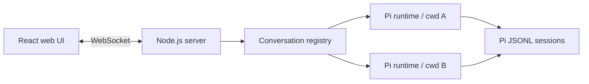

# ChatWCA

ChatWCA is a single-user web interface for the [Pi coding agent](https://pi.dev/), built with TypeScript, Node.js, React, and the `@earendil-works/pi-coding-agent` SDK.

> **Status:** Early implementation. The TypeScript application foundation is in place; see [plan.md](plan.md) for progress and [docs/design.md](docs/design.md) for the complete design.

## Planned features

- Persistent Pi conversation history
- Multiple independently running conversations
- One working directory per conversation
- Fast conversation switching
- Fork from an earlier user message
- Streaming text, thinking, tool calls, and tool results
- Pasted, dropped, and selected images
- Dark-only responsive interface
- No authentication or authorization
- Single-user operation
- LAN access by binding to `0.0.0.0`

## Architecture



Each live conversation owns an independent Pi `AgentSessionRuntime`, allowing one conversation to continue running while another is displayed. A shared `ModelRuntime` provides model and credential access. Pi's native JSONL session files are the canonical history, so sessions remain compatible with the Pi CLI.

## Network model

ChatWCA is designed for a trusted, segmented LAN and intentionally listens on all interfaces:

```text
CHATWCA_HOST=0.0.0.0
CHATWCA_PORT=8787
```

There is no login, access token, cookie, authentication, or authorization layer. Any client that can reach the listener can use the application. LAN segmentation and firewall policy provide access control outside the application.

A browser on the LAN will connect using the server's address, for example:

```text
http://192.168.20.10:8787
```

## Requirements

- Node.js 22.19 or newer
- A configured Pi installation
- At least one available model/provider credential
- Filesystem and command permissions appropriate for the workspaces Pi will operate on

Pi provider credentials will use the standard Pi credential store or provider environment variables and will remain on the server.

## Planned configuration

| Variable | Default | Description |
|---|---|---|
| `CHATWCA_HOST` | `0.0.0.0` | HTTP and WebSocket bind address |
| `CHATWCA_PORT` | `8787` | Server port |
| `CHATWCA_DEFAULT_CWD` | process CWD | Initial working directory |
| `CHATWCA_MAX_LIVE_CONVERSATIONS` | `8` | Maximum live Pi runtimes |
| `PI_CODING_AGENT_DIR` | Pi default | Pi configuration and session directory |
| `PI_OFFLINE` | unset | Use Pi's standard offline mode |

## Scope

The initial release focuses on chat and conversation management. It will not include a terminal emulator, file explorer, SCM panel, theme selector, user accounts, arbitrary file attachments, or Pi configuration screens.

## Documentation

- [Technical design](docs/design.md)
- [Validated Pi SDK integration notes](docs/pi-sdk-notes.md)

## License

A license has not yet been selected.
