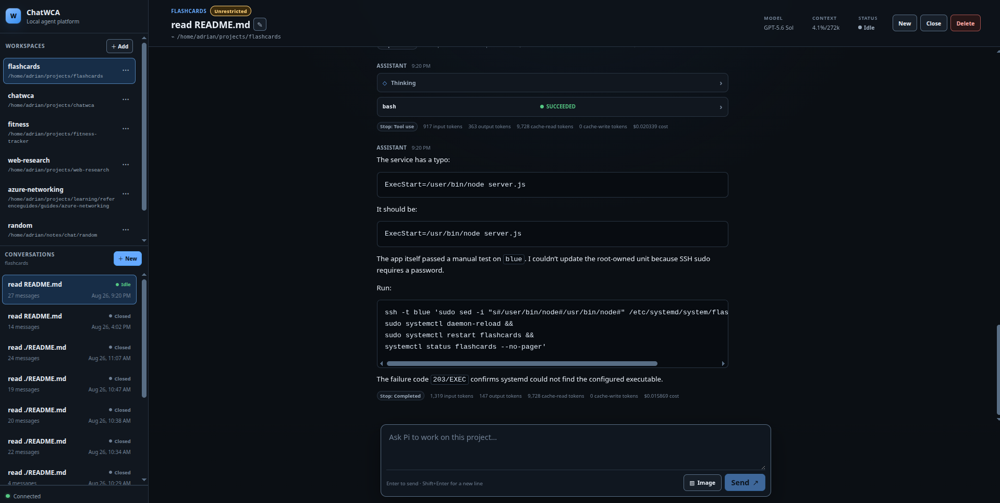

# ChatWCA

ChatWCA is a single-user, self-hosted web interface for the [Pi coding agent](https://pi.dev/). It brings workspace-based conversations, scheduled prompts, and optional sandboxing and conversation search to the browser while preserving Pi's native session format.



## Features

- **Workspace-based conversations** with persistent history, editable titles, images, forks, and rewinds.
- **Optional Linux sandboxing** with read-only or read-write mounts and administrator-defined network policies.
- **Scheduled jobs** for recurring prompts, with optional trusted pre/post scripts.
- **Conversation search** with local hybrid retrieval, optional provider reranking, and opt-in agent history tools.
- **Extensible tools** through Brave Search and per-workspace HTTP integrations.

> **Deployment model:** ChatWCA has no built-in authentication or per-client roles. Use it locally or behind an authenticated reverse proxy. Every accepted client has full application authority. Run only one ChatWCA server process per data/Pi state directory set.

## Requirements

- **Node.js 22.19.0+** and npm.
- **Stable Rust/Cargo** to build the native network helper; both `npm run dev` and `npm run build` include this step.
- A Pi-supported host with a configured model provider and credentials available to the server user.
- Read/search access to workspace directories and write access to ChatWCA data, Pi state, and any writable mounts or workspace-local session stores.
- Network access to configured remote model providers and tools.

Workspace sandboxing additionally requires Linux x86-64 or arm64, unprivileged user/network namespaces, Bubblewrap 0.6.1+, `/usr/bin/node` 22.19.0+, Bash, and ripgrep. See the [sandbox runbook](docs/bubblewrap-operations.md) and [managed-egress runbook](docs/network-sandbox-operations.md) before enabling these features. Both are disabled by default.

## Quick start

Run commands from the repository root:

```sh
npm ci
npx pi --list-models
npm run build
CHATWCA_HOST=127.0.0.1 npm start
```

Open **http://127.0.0.1:8787**. `npm start` uses the existing production build; it does not build first.

`npm ci` installs the pinned Pi SDK (**0.84.3**) and its local CLI. A global Pi installation is not required. Configure providers, credentials, and defaults through Pi; ChatWCA has no browser model or credential settings.

### Model selection

At startup, ChatWCA reads `defaultProvider` and `defaultModel` from Pi's global `settings.json`. When configured, this default takes precedence over saved-session models and workspace model overrides for new and reopened conversations, jobs, forks, and rewinds. An incomplete, unknown, or unauthenticated default fails with `model_unavailable` rather than silently switching models. If neither field is set, Pi's automatic selection remains available.

Restart ChatWCA after changing the global default. See the [SDK integration notes](docs/pi-sdk-notes.md) for compatibility details.

### Development

```sh
npm run dev
```

Open **http://127.0.0.1:5173**. This starts Vite on port `5173` and the backend on port `8787`, both bound to `0.0.0.0` by default. The Vite proxy targets `127.0.0.1:8787`; keep the backend reachable there. Use only on a trusted network.

### systemd

The supplied [service unit](systemd/chatwca.service) targets this checkout and the `adrian` user. Adjust its user and paths for your deployment, and ensure `/usr/bin/node` meets the version requirement. Build before installing:

```sh
npm ci
npm run build
sudo install -m 0644 systemd/chatwca.service /etc/systemd/system/chatwca.service
sudo systemctl daemon-reload
sudo systemctl enable --now chatwca.service
```

After updates, reinstall dependencies, rebuild, and restart the service. Inspect logs with `journalctl -u chatwca.service -f`. Validate sandbox profiles under the actual service constraints before enabling them.

## Workspaces and conversations

1. Open **Manage workspaces → Add**.
2. Enter a name and an existing directory on the **server**. An absolute path is recommended.
3. Optionally enable **Store sessions in this workspace** to use `<workspace>/.chatwca/sessions` instead of Pi's default store. This choice cannot be changed later.
4. Choose the security profile and any available mounts, network policy, or optional tools.
5. Select the workspace, then create a conversation or open one from its history.

ChatWCA does not discover workspaces automatically. Workspace definitions persist, but the browser's selected workspace resets on a full page reload. Session history is loaded for the selected workspace, not scanned globally at startup.

Use **Workspace Info** to review effective policies and access grants. Close all live conversations before changing a workspace's path, mounts, security/network policy, or tool access. Removing a workspace unregisters its metadata only; files and Pi sessions remain. Delete any scheduled jobs referencing it first.

**Fork** preserves the source conversation. **Rewind** replaces it with a fork and permanently deletes the source after successful fork creation. Closing a conversation only releases its runtime; it does not delete persisted history.

## Optional capabilities

### Scheduled jobs

Use **Jobs** to run saved prompts at fixed intervals or daily in an explicit timezone. Jobs run without connected browsers and create persistent conversations using the workspace's current policy. **Run now** does not alter the recurring schedule.

Overlapping occurrences of the same job are skipped. After restart, unfinished attempts become `interrupted`, and each overdue enabled job receives at most one catch-up attempt. Jobs share the live-conversation limit with interactive work.

Optional pre/post scripts run **outside the sandbox**, with the service user's host permissions. Scheduled prompts can disclose readable data to the model provider and incur costs unattended. See the [jobs runbook](docs/jobs-operations.md) for configuration, scheduling semantics, and troubleshooting.

### Conversation search

**Global Search** supports all-workspace or single-workspace queries, excerpts, and navigation to matching messages. It requires PostgreSQL 17 with pgvector, local Ollama embeddings, and `CHATWCA_SEARCH_MODE=optional`. Search is disabled by default; provision the database and run explicit migrations before enabling it.

Retrieval is local. Optional Pi reranking is enabled by default and may send queries and excerpts to the configured provider; turn it off to keep search requests local. Search outages do not prevent chat or job startup.

Per-workspace **Conversation history** tools are separately opt-in. They let the agent search/read cached dialogue across **all registered workspaces**, outside sandbox boundaries, and may send that dialogue to the conversation's model provider.

See the [search runbook](docs/search-operations.md) and [history-tool documentation](docs/conversation-search-tool.md).

### Web and HTTP tools

- Set `BRAVE_SEARCH_API_KEY` to enable the parent-owned `web_search` tool.
- Copy [the example HTTP catalog](tool-catalog.example.json) to `tool-catalog.json`, set `CHATWCA_TOOL_CATALOG=./tool-catalog.json`, restart, and enable selected tools in **Add/Edit Workspace**.

These tools run in the parent process and remain available to isolated workspaces. Queries or arguments can contain readable workspace content. HTTP tools use fixed catalog endpoints and default to disabled per workspace. See the [HTTP-tool design](docs/http-tools-design.md).

## Configuration

The server loads an optional `.env` from its working directory. Shell environment variables take precedence. To start from the provided template:

```sh
cp .env.example .env
```

**Review the template before starting:** it sets deployment-specific data and workspace paths, not just application defaults. Ensure those paths exist or can be created by the service user. `.env` is gitignored.

| Variable | Application default | Purpose |
|---|---|---|
| `CHATWCA_HOST` | `0.0.0.0` | HTTP/WebSocket bind address; prefer `127.0.0.1` behind a proxy. |
| `CHATWCA_PORT` | `8787` | HTTP/WebSocket port. |
| `CHATWCA_DATA_DIR` | `./data` | SQLite data directory, relative to the server's working directory. |
| `CHATWCA_MAX_LIVE_CONVERSATIONS` | `8` | Shared runtime limit; idle runtimes may be evicted, active ones are not. |
| `CHATWCA_SHUTDOWN_GRACE_MS` | `10000` | Graceful shutdown deadline, up to five minutes. |
| `CHATWCA_SANDBOX_MODE` | `disabled` | `disabled`, `optional`, or `required`. |
| `CHATWCA_MANAGED_EGRESS_MODE` | `disabled` | `disabled` or `optional`; requires sandboxing. |
| `CHATWCA_SEARCH_MODE` | `disabled` | `disabled` or `optional`. |
| `CHATWCA_TOOL_CATALOG` | unset | Path to the HTTP-tool definition catalog. |
| `BRAVE_SEARCH_API_KEY` | unset | Enables Brave Search. |
| `PI_CODING_AGENT_DIR` | `~/.pi/agent` | Pi configuration, credentials, resources, and default sessions. |
| `PI_OFFLINE` | unset | Disables Pi model network access by **presence**, even when set to `0`. Does not disable parent-owned tools. |

Configuration is startup-only. Consult [.env.example](.env.example) and the feature runbooks for full settings and validation rules. Image defaults are 8 images per prompt, 8 MiB per image, and 24 MiB total; the fixed WebSocket command limit is 40 MiB.

## Security

- **Protect the listener.** Prefer loopback binding behind a reverse proxy requiring client certificates (mTLS) for HTTP and WebSocket connections. Preserve the browser-facing `Host` header and proxy `/ws` upgrades. Same-origin checks are not authentication; direct LAN access requires firewall isolation.
- **Choose authority deliberately.** Unrestricted tools have the service user's full host authority. Sandboxing limits coding tools, not browser access or per-conversation CPU, memory, process, disk, or bandwidth usage. Accepted clients can configure mounts to non-protected directories accessible to the service user.
- **Treat mounts as data grants.** Read-only mounts disclose content to tools and models; read-write mounts also permit changes outside the workspace. Sandboxing still permits workspace and `.git` modifications.
- **Understand network boundaries.** Isolated sandbox tools have no network access. Managed egress permits only administrator-defined public destinations through filtered proxies; it is not data-loss prevention. Allowed destinations can receive readable content and return untrusted code or data.
- **Account for parent-owned capabilities.** Model requests, Brave Search, HTTP tools, history tools, and trusted job hooks operate outside the sandbox's network boundary. Sandboxed runtimes disable arbitrary Pi extensions, extension-only providers, skills, and prompt packages.
- **Avoid concurrent writers.** Do not run multiple ChatWCA processes against the same state or edit a live session through another Pi process.

Sandbox or managed-egress failures never silently fall back to unrestricted tools. Review the [sandbox](docs/bubblewrap-operations.md) and [managed-egress](docs/network-sandbox-operations.md) runbooks for rollout procedures and residual risks.

## Storage and backups

ChatWCA keeps application metadata in `CHATWCA_DATA_DIR/chatwca.sqlite`: workspaces, access selections, job definitions, scheduling state, and bounded run diagnostics. Pi's native JSONL sessions remain authoritative for conversation messages, images, and titles. PostgreSQL search data is a rebuildable cache, not a conversation store.

Sessions use Pi's default store or `<workspace>/.chatwca/sessions`. They remain compatible with the matching Pi CLI. For workspace-local history, run from that workspace:

```sh
npx pi --session-dir .chatwca/sessions -r
```

A new conversation becomes durable after its first assistant message finishes, including a terminal error or abort response. Empty and user-only conversations do not survive a server restart.

For a consistent file-copy backup, stop ChatWCA and copy:

1. The entire `CHATWCA_DATA_DIR`.
2. Pi's configured agent/session directory.
3. Every workspace-local `.chatwca/sessions` directory.
4. The deployment `.env`, HTTP-tool catalog, and any other administrator-managed configuration or scripts.

SQLite uses WAL mode: copying only `chatwca.sqlite` while running is not a safe backup. Restore while stopped. Job metadata alone cannot restore generated conversations.

`SIGINT` or `SIGTERM` initiates bounded graceful shutdown, stops job admission, aborts active work, and closes runtimes and storage. A browser disconnect does not stop server-side runs.

## Troubleshooting

| Symptom | First checks |
|---|---|
| `model_unavailable` | Run `npx pi --list-models` as the service user with the same environment; verify Pi's global default and credentials, then restart. Unset `PI_OFFLINE` for remote providers. |
| Workspace unavailable | Restore access to the registered server path, or close its live conversations and edit the path. |
| `live_runtime_limit` | Wait for or abort active work, close conversations, or raise the limit and restart. |
| WebSocket `403` or reconnects | Use the same scheme/host/port for the UI and WebSocket; preserve `Host` and upgrade headers through the proxy. |
| Database/session errors | Check permissions, disk space, session files, and concurrent writers; inspect private server logs. |
| Sandbox, network, or job failures | Follow the corresponding [sandbox](docs/bubblewrap-operations.md), [network](docs/network-sandbox-operations.md), or [jobs](docs/jobs-operations.md) runbook. |

Use `GET /api/health` to check HTTP availability. Public errors intentionally omit sensitive paths and SDK details; service logs may contain additional diagnostics.

## Development checks

Run checks locally before committing or releasing; this project does not use GitHub Actions.

```sh
npm run typecheck
npm run build
npm run test:unit
npm run test:integration
npm run test:browser
npm run test:sdk-smoke
npm run test:native
npm run test:native:architectures
# Requires a sandbox-capable Linux host:
npm run test:sandbox-real
```

`npm run test:release-gates` runs the full sequence. SDK smoke tests use temporary state and a faux provider; browser tests use a deterministic fixture server. Search database tests are separately opt-in and require a disposable pgvector database; see [search development checks](docs/search-operations.md#development-checks).

## Documentation

- [Application design](docs/design.md) and [Pi SDK integration](docs/pi-sdk-notes.md)
- [Sandbox design](docs/bubblewrap-design.md), [operations](docs/bubblewrap-operations.md), and [acceptance criteria](docs/bubblewrap-acceptance.md)
- [Managed network design](docs/network-sandbox-design.md), [operations](docs/network-sandbox-operations.md), and [acceptance criteria](docs/network-sandbox-acceptance.md)
- [Scheduled jobs design](docs/jobs-design.md) and [operations](docs/jobs-operations.md)
- [Conversation search design](docs/search-design.md), [operations](docs/search-operations.md), and [agent history tools](docs/conversation-search-tool.md)
- [HTTP tools](docs/http-tools-design.md) and [fork/rewind semantics](docs/revision-semantics.md)

## License

[MIT](LICENSE).
