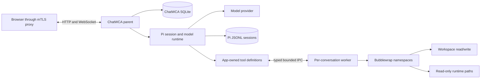

# Bubblewrap Workspace Sandboxing Design

**Status:** Implemented, including per-workspace managed-egress policy sets and the responsive workspace modal

**Platform:** Linux

**Runtime:** Node.js 22.19+, Bubblewrap 0.6.1+

**Design input:** [Optional Bubblewrap Workspace Sandboxing](bubblewrap-ticket.md)

**Related design:** [Managed Network Sandbox](network-sandbox-design.md)

## 1. Summary

ChatWCA will add a workspace security profile that routes every enabled coding tool through a per-conversation worker running inside Bubblewrap. Model calls, provider credentials, Pi JSONL persistence, SQLite, HTTP, and WebSocket handling remain in the parent server process.

The initial profile is deliberately strict:

- the selected workspace is mounted read/write at `/workspace`;
- optional workspace-specific directories are mounted read-only or read-write at `/mounts/<name>`;
- `.chatwca` is hidden behind an ephemeral mount;
- the worker has no host network namespace;
- the root filesystem is synthetic rather than a read-only host root;
- only `/usr` and administrator-approved toolchain paths are mounted read-only;
- `$HOME`, `/tmp`, and `/var/tmp` are ephemeral;
- the environment is rebuilt from a fixed allowlist;
- Pi extensions and unbrokered tools are disabled; and
- any setup, probe, worker, or protocol failure fails closed.

The profile reduces access to unrelated host files and direct network exfiltration by tools. It does not prevent harmful edits inside the workspace, disclosure to the configured model provider, or denial of service without additional cgroup controls.

## 2. Goals

- Persist a workspace security profile and display its effective value.
- Allow the server administrator to disable, permit, or require sandboxing.
- Route `read`, `write`, `edit`, `bash`, `ls`, `grep`, and `find` through one enforcement boundary.
- Ensure no sandboxed tool implementation performs model-directed host filesystem I/O in the parent.
- Keep model/provider access and session persistence in the parent process.
- Deny IPv4, IPv6, DNS, and loopback access from sandboxed processes.
- Hide ChatWCA data, Pi configuration, credentials, and all session stores.
- Preserve useful read/write/build/test workflows inside the workspace.
- Stream command output and propagate cancellation.
- Kill the worker namespace and all descendants on close, eviction, fatal worker failure, or shutdown.
- Support concurrent unrestricted and sandboxed conversations without sharing workers or tool policy.
- Fail closed whenever the requested boundary cannot be established.

## 3. Non-goals

The initial release will not provide:

- confidentiality from the configured model provider;
- protection against malicious changes within the writable workspace;
- a read-only source profile;
- a separate `.git` capability;
- direct network access from the isolated profile;
- network allowlists controlled by a model or supplied as arbitrary browser-entered destinations;
- Docker, VM, or remote-worker backends;
- arbitrary extension tools in sandboxed runtimes;
- cgroup-based per-conversation CPU, memory, disk, or process quotas;
- model-directed mount changes while a conversation is live; or
- a guarantee that an unrestricted Pi extension running in the parent cannot bypass the sandbox boundary.

The separate managed-egress profile described in [`network-sandbox-design.md`](network-sandbox-design.md) supports package installation and administrator-filtered network access without weakening the isolated namespace boundary.

Bubblewrap is not authentication. The reverse proxy, mTLS policy, backend bind address, and firewall remain separate deployment controls.

## 4. Security properties and residual risks

### 4.1 Provided properties

For a `workspace-sandboxed` conversation:

- model-selected file paths are resolved and opened inside the mount namespace;
- symlinks cannot reach unmounted host paths;
- tool processes receive no provider, cloud, proxy, SSH-agent, Pi-session, or ChatWCA variables;
- the parent server, SQLite database, Pi agent directory, and session files are not mounted;
- the network namespace has no host interfaces and loopback is not brought up;
- `/proc` contains only processes in the sandbox PID namespace;
- tool output can return to the parent only through a bounded, validated response protocol; and
- the parent accepts no worker-initiated operation that reads a host path, opens a network connection, or executes a command.

The worker is treated as untrusted. A command may tamper with or kill it because both run in the same sandbox. Compromise of the worker must not grant more authority than the namespace already has.

### 4.2 Residual risks

The profile still permits:

- arbitrary modification of the workspace, including `.git`;
- malicious source, test, hook, dependency, and build-script changes;
- reads of all files intentionally mounted in the workspace, workspace-specific mounts, or read-only toolchain mounts;
- modifications anywhere exposed by a workspace-specific read-write mount;
- workspace content entering model context and leaving through the configured provider;
- workspace content appearing in assistant responses to an authorized client;
- resource exhaustion before process-wide limits or the host intervene; and
- bypass by trusted or malicious code that already runs in the ChatWCA parent process.

A path-mounted Unix-domain socket inside the workspace may provide access to its host service even with a separate IP network namespace. The server rejects socket files during sandbox preflight, and the documentation will prohibit placing service, SSH-agent, Docker, or similar sockets in sandboxed workspaces. This check is best effort because a host process can create a socket after preflight. A later seccomp profile should deny socket connection syscalls if pathname-socket isolation becomes a hard requirement.

The UI must use wording such as **Workspace sandbox** rather than **Safe** or **Secure**, and must state that workspace content can still be sent to a remote model provider.

## 5. Architecture



A sandboxed live conversation owns exactly one `SandboxWorker`. The worker lifetime follows the existing live-runtime lifetime:

```text
create/open/fork runtime -> start and handshake worker -> construct Pi session
close/evict/shutdown      -> dispose Pi session -> terminate worker namespace
fatal worker failure      -> reject tools, mark runtime errored, never fall back
```

A source-preserving fork uses a separate temporary runtime and therefore a separate temporary worker. Promotion transfers both runtime and worker ownership into the new conversation record. The source worker is unchanged.

## 6. Security profile model

```ts
type WorkspaceSecurityProfile =
  | "unrestricted"
  | "workspace-sandboxed";

type SandboxMode = "disabled" | "optional" | "required";
```

`unrestricted` preserves current behavior.

`workspace-sandboxed` selects the strict Bubblewrap profile described here.

The database stores the workspace's requested profile. The server derives an effective profile from that value and `CHATWCA_SANDBOX_MODE`:

| Server mode | Stored `unrestricted` | Stored `workspace-sandboxed` |
|---|---|---|
| `disabled` | unrestricted | policy-blocked; never downgraded silently |
| `optional` | unrestricted | workspace-sandboxed |
| `required` | workspace-sandboxed | workspace-sandboxed |

New workspaces default to `unrestricted` in `optional` mode for compatibility. They are fixed to `unrestricted` in `disabled` mode and `workspace-sandboxed` in `required` mode.

A required-mode server does not need to rewrite existing rows. It exposes both the stored and effective values so an administrator changing the server mode does not cause an implicit database migration. Conversation state always records the effective value used to construct its runtime.

## 7. Configuration and administrative ceiling

New server configuration:

| Variable | Default | Behavior |
|---|---:|---|
| `CHATWCA_SANDBOX_MODE` | `disabled` | `disabled`, `optional`, or `required` |
| `CHATWCA_BWRAP_PATH` | `/usr/bin/bwrap` | Absolute Bubblewrap executable path |
| `CHATWCA_WORKSPACE_ROOTS` | `[]` | JSON array of canonical workspace roots |
| `CHATWCA_SANDBOX_RO_MOUNTS` | `[]` | JSON array of extra read-only host paths mounted at the same absolute guest paths |
| `CHATWCA_SANDBOX_PATH` | `/usr/bin:/bin` | Fixed guest `PATH`; entries must be covered by a read-only mount |
| `CHATWCA_SANDBOX_START_TIMEOUT_MS` | `5000` | Worker probe/handshake deadline |
| `CHATWCA_SANDBOX_COMMAND_TIMEOUT_MS` | `900000` | Hard maximum for a sandboxed shell command, even when the tool omits a timeout |
| `CHATWCA_SANDBOX_MAX_COMMAND_OUTPUT_BYTES` | `67108864` | Maximum full command output retained in the worker before termination |

JSON arrays avoid ambiguous comma or colon parsing in paths. Empty strings, relative paths, duplicate canonical paths, and non-string entries are rejected.

`CHATWCA_WORKSPACE_ROOTS` applies whenever non-empty. In `required` mode it must contain at least one root. A workspace path must be equal to or a canonical descendant of an approved root. The check is repeated on create, path update, availability resolution, and runtime creation.

The configured Bubblewrap executable must be:

- an absolute, canonical regular file;
- executable by the server user;
- owned by root; and
- not writable by group or other users.

The server requires Bubblewrap 0.6.1 or newer. `disabled` mode does not inspect or execute Bubblewrap. `optional` and `required` modes validate all sandbox configuration and run a functional probe during startup. Operators who want the server to run without a working sandbox must explicitly select `disabled`.

Extra process-wide read-only mounts are administrator trust decisions and remain separate from workspace-specific mounts. Each source is canonicalized and must not overlap a workspace, the ChatWCA data directory, the Pi agent directory, `/proc`, `/dev`, `/sys`, `/run`, `/tmp`, `/var/tmp`, `/workspace`, or the worker control paths. Documentation will warn against mounting home directories, credential stores, caches containing tokens, or service sockets.

### 7.1 Per-workspace managed-egress policy sets

The initial managed-egress implementation uses one process-wide administrator allowlist. That grants every managed workspace the union of all destinations needed by any managed workspace. The follow-on design narrows this authority with **administrator-defined named destination policy sets** selected per workspace.

The policy layers are:

```text
mandatory global enforcement
  ├── non-public/local/LAN/metadata address denial
  ├── explicit denied-domain precedence
  ├── supported protocols and resource limits
  └── global allowed-domain and allowed-port ceiling
        └── named policy set (normalized subset of that ceiling)
              └── workspace selection
                    └── immutable conversation runtime snapshot
```

The browser must never submit an arbitrary domain, IP address, port, proxy rule, or raw policy document. Administrators define named sets in server configuration. A set has a stable opaque ID, a human-readable label, normalized allowed patterns, and allowed ports. Every set entry must be an exact normalized member of the global ceiling; this intentionally avoids subtle wildcard-containment rules. Global deny precedence and non-public-address rejection cannot be relaxed by a set.

A workspace stores the selected policy-set ID independently from `networkPolicy`. The selection is effective only when the workspace is both `workspace-sandboxed` and `managed-egress`; isolated and unrestricted runtimes receive no destination policy. A missing configured set leaves a managed workspace policy-blocked without rewriting its stored selection. New and migrated rows use an administrator-configured default set so existing deployments retain a deterministic policy.

Changing a managed workspace's set can add destination authority and therefore requires the same explicit network-exposure acknowledgement as enabling managed egress. Network type or policy-set changes are rejected with `workspace_busy` while any live runtime belongs to the workspace. Create, open, fork, rewind, replacement, and promotion resolve the stored set through `WorkspaceRepository.requireUsable()`. Each `ManagedNetworkRuntime` receives an immutable compiled copy and records the stable set ID in audit decisions; it never consults mutable browser state.

`GET /api/config` may expose only selectable set IDs, labels, normalized domain patterns, and ports in addition to the existing public managed-egress disclosure. It must not expose helper paths, proxy socket paths, resolved addresses, or private diagnostics. Removing or changing a configured set requires a server restart and affects only subsequently created runtimes because live conversations retain their immutable runtime policy until closed.

## 8. Workspace persistence and protocol

### 8.1 Database migration

The schema advances to version 3:

```sql
ALTER TABLE workspaces
ADD COLUMN security_profile TEXT NOT NULL DEFAULT 'unrestricted'
  CHECK (security_profile IN ('unrestricted', 'workspace-sandboxed'));

PRAGMA user_version = 3;
```

All existing rows migrate to `unrestricted`. The migration does not create files or change Pi sessions.

### 8.2 Workspace-specific filesystem mounts

Schema version 6 adds `workspace_mounts`, keyed by workspace and bounded lowercase mount name. Each row stores a canonical directory source and `read-only` or `read-write` access. The guest destination is derived as `/mounts/<name>` and is never browser-selectable. A v5-to-v6 migration creates the child table empty.

The browser may select any existing directory accessible to the ChatWCA service user, subject to mandatory exclusions: sources cannot overlap the workspace, another mount, ChatWCA data, Pi state or session storage, helper paths, or administrator runtime mounts. Regular files are unsupported. Every mounted tree receives the same bounded no-follow Unix-socket scan as the workspace. Read-write additions or upgrades require explicit confirmation. Mount changes are rejected while the workspace owns a live runtime.

Because ChatWCA has no authentication, this deliberately gives every accepted client the ability to expose non-protected host directories to tools and the model, and to grant modifications where the service user has write access. The UI must disclose that authority clearly.

### 8.3 Workspace projections

Workspace wire objects add:

```ts
interface WorkspaceSecurityProjection {
  mounts: WorkspaceMount[];                           // Stored canonical sources and access
  securityProfile: WorkspaceSecurityProfile;          // stored preference
  effectiveSecurityProfile: WorkspaceSecurityProfile | null;
  usable: boolean;
  policyIssue:
    | "sandbox_disabled"
    | "outside_workspace_roots"
    | "protected_path_overlap"
    | null;
}
```

`available` continues to mean that the registered directory itself exists and is accessible. `usable` combines path availability with server policy. This distinction lets the UI explain whether the directory disappeared or policy blocked it.

`ConversationState` adds `securityProfile`, containing the immutable effective profile of that live runtime.

### 8.4 Commands

`workspace.create` requires `securityProfile`. `workspace.update` accepts an optional `securityProfile` in addition to name and path.

A protection-reducing update from `workspace-sandboxed` to `unrestricted` must include:

```ts
acknowledgeSecurityDowngrade: true
```

The browser obtains this only after explicit confirmation. It is a safety acknowledgement, not an authorization boundary. The server still rejects the downgrade in `required` mode.

Profile and path changes are rejected with `workspace_busy` while any live runtime belongs to the workspace. Renaming remains allowed. Fork and rewind do not accept a profile from the browser; they resolve the destination workspace again and use its current effective policy.

## 9. Workspace admission and protected paths

Before starting a sandboxed runtime, the server revalidates:

1. the workspace canonical path and approved-root membership;
2. read/write/search access for the server user;
3. that `.chatwca` is absent or a real directory, never a symlink;
4. that the workspace does not overlap the canonical ChatWCA data directory;
5. that the workspace does not overlap the canonical Pi agent directory;
6. that the workspace and per-workspace mounts do not overlap any extra process-wide read-only mount or one another;
7. that each mount remains the same canonical directory and has sufficient read/search and optional write access; and
8. that no Unix-domain socket is present in the initial workspace or mount walks.

"Overlap" means either path is equal to or an ancestor of the other. Rejecting overlap is preferable to relying on mount ordering to hide SQLite, credentials, or global sessions. In particular, a deployment checkout whose default `./data` directory is beneath it cannot itself be registered as a sandboxed workspace unless `CHATWCA_DATA_DIR` is moved outside that checkout.

Workspace-local sessions are the one intentional exception. The parent continues to use `<workspace>/.chatwca/sessions`, while the sandbox overlays the whole `<workspace>/.chatwca` guest path with ephemeral storage.

The socket walk does not follow symlinks and has a bounded entry count and deadline. Exceeding either bound rejects sandbox startup rather than skipping the check.

## 10. Bubblewrap filesystem and namespaces

The worker is launched with the equivalent of:

```text
bwrap
  --unshare-user
  --unshare-pid
  --unshare-ipc
  --unshare-uts
  --unshare-net
  --hostname chatwca-sandbox
  --cap-drop ALL
  --new-session
  --die-with-parent
  --clearenv
  --ro-bind /usr /usr
  --symlink usr/bin /bin
  --symlink usr/sbin /sbin
  --symlink usr/lib /lib
  --symlink usr/lib64 /lib64
  --proc /proc
  --dev /dev
  --tmpfs /home
  --dir /home/sandbox
  --tmpfs /tmp
  --dir /var
  --tmpfs /var/tmp
  --dir /etc
  --dir /app
  --dir /mounts
  --ro-bind <canonical-read-source> /mounts/<name>
  --bind <canonical-write-source> /mounts/<name>
  --bind <canonical-workspace> /workspace
  --tmpfs /workspace/.chatwca
  --ro-bind-data <worker-source-fd> /app/worker.mjs
  --chdir /workspace
  /usr/bin/node /app/worker.mjs
```

Arguments are assembled as an array and never through a shell. Conditional compatibility symlinks are created only when their `/usr` targets exist. Administrator mounts are inserted before the workspace mount and use their canonical source and fixed destination. Workspace-specific mounts use only derived `/mounts/<name>` destinations and the selected `--ro-bind` or `--bind` mode.

The root contains no bind of `/`, `/home`, `/etc`, `/run`, `/sys`, host `/tmp`, ChatWCA data, or the Pi agent directory. Minimal `passwd`, `group`, `hosts`, and `nsswitch.conf` files are supplied through `--ro-bind-data`; host configuration files are not copied wholesale.

The current server user's host UID is mapped inside the user namespace. The worker may appear as UID 0 inside that namespace, but all capabilities are dropped and the startup probe requires an empty effective capability set and `NoNewPrivs: 1`.

`.git` remains writable in the initial release. This preserves staging, commits, worktrees, and ordinary coding workflows. The UI and documentation will explicitly state that sandboxing does not protect repository metadata or hooks.

### 10.1 Worker code integrity

The worker artifact is loaded into parent memory during server startup. Each launch supplies that immutable process-lifetime snapshot through a dedicated data FD and `--ro-bind-data`; Bubblewrap does not bind the on-disk application checkout into the sandbox.

This prevents a sandboxed workspace that happens to contain ChatWCA source from modifying the worker used by a later conversation in the same server process. Normal software integrity before server startup remains an administrator responsibility.

## 11. Environment policy

Bubblewrap starts with `--clearenv` and sets only:

```text
HOME=/home/sandbox
TMPDIR=/tmp
PATH=<CHATWCA_SANDBOX_PATH>
LANG=C.UTF-8
LC_ALL=C.UTF-8
TERM=dumb
NO_COLOR=1
CI=1
USER=sandbox
LOGNAME=sandbox
SHELL=/bin/bash
```

The worker sets command `PWD` through its working directory rather than trusting an inherited value.

No variable is copied from `process.env`. In particular, the sandbox omits:

- provider API keys and cloud credentials;
- `HTTP_PROXY`, `HTTPS_PROXY`, and `NO_PROXY`;
- `SSH_AUTH_SOCK` and Git credential variables;
- `PI_CODING_AGENT_DIR`, `PI_CODING_AGENT_SESSION_DIR`, and all Pi session/model variables;
- ChatWCA configuration; and
- Node preload/debug variables such as `NODE_OPTIONS`.

Sandboxed bash tools are created with Pi session-environment exposure disabled. There is no initial arbitrary environment passthrough setting.

## 12. Worker protocol

### 12.1 Transport

The parent creates two dedicated pipes in the child's inherited FD table:

- request FD: parent to worker;
- response FD: worker to parent.

The worker's stdin is `/dev/null`. Its stdout and stderr are not protocol channels; stderr is captured as a bounded private diagnostic stream and stdout is closed. Command stdout/stderr are always pipes owned by the worker and are emitted as typed response frames.

Frames use a four-byte unsigned big-endian length followed by UTF-8 JSON. Limits are enforced before allocation:

- maximum frame: 1 MiB;
- maximum assembled request: 16 MiB;
- maximum concurrently active operations: 8;
- maximum pending outbound worker data: 4 MiB; and
- handshake timeout: `CHATWCA_SANDBOX_START_TIMEOUT_MS`.

Large UTF-8 writes and binary reads use ordered chunk frames. Binary data is base64 encoded. Sequence numbers, declared lengths, and final SHA-256 hashes detect omission, duplication, or corruption.

### 12.2 Message families

```ts
type ParentFrame =
  | { type: "hello"; protocol: 1; nonce: string }
  | { type: "request"; id: string; operation: Operation; arguments: unknown }
  | { type: "request.chunk"; id: string; sequence: number; encoding: "utf8" | "base64"; data: string }
  | { type: "request.end"; id: string; bytes: number; sha256: string }
  | { type: "cancel"; id: string }
  | { type: "cancel.all" }
  | { type: "shutdown" };

type WorkerFrame =
  | { type: "ready"; protocol: 1; nonce: string; probe: WorkerProbe }
  | { type: "output"; id: string; sequence: number; stream: "stdout" | "stderr"; data: string }
  | { type: "response"; id: string; result: unknown }
  | { type: "response.chunk"; id: string; sequence: number; encoding: "utf8" | "base64"; data: string }
  | { type: "response.end"; id: string; bytes: number; sha256: string; result: unknown }
  | { type: "error"; id: string; code: WorkerErrorCode }
  | { type: "shutdown.complete" };
```

Every frame is validated with a closed TypeBox schema. IDs must match a parent-created outstanding request. Unknown IDs, duplicate terminal frames, sequence gaps, oversized data, invalid JSON, invalid UTF-8, hash mismatches, unsolicited requests, or queue overflow are fatal protocol violations. The parent kills the worker and rejects all outstanding calls.

Worker errors contain stable codes only. Paths, command output, stacks, and OS messages are retained in bounded server diagnostics and are not included in WebSocket command errors.

### 12.3 Operations

The first protocol version supports these high-level operations:

- `readFile` and image signature detection;
- `writeFile` with recursive parent creation;
- atomic exact-text `editFile`;
- `listDirectory` and metadata checks;
- `grep`;
- `find`;
- `exec` with streamed output;
- cancellation; and
- worker health/namespace probes.

High-level operations avoid split read/modify/write races across IPC. The worker serializes mutations by canonical guest target. Existing files use `realpath`; new targets use a canonicalized existing ancestor plus unresolved suffix. The mount namespace, not lexical parent checks, remains the final filesystem boundary.

Tool paths are interpreted relative to `/workspace`. The worker strips one leading `@` for compatibility with Pi. Absolute paths refer to the synthetic guest root. The parent never resolves or probes a model-provided path on the host.

## 13. Process execution and cleanup

Shell commands run as `/bin/bash -lc <command>` with:

- cwd `/workspace`;
- the fixed sandbox environment;
- no inherited stdin;
- separate stdout/stderr pipes;
- the lower of the tool timeout and the configured hard timeout; and
- a worker-side total output limit.

Only one `exec` operation runs at a time in a worker. Filesystem operations may run concurrently, subject to mutation queues.

The worker places commands in a new process group. On normal completion it repeatedly inspects its private `/proc`, terminates remaining command descendants, and does not report completion until the namespace contains only the Bubblewrap init and worker. Failure to establish a clean state is fatal and causes a worker restart.

On command timeout or conversation abort, ChatWCA terminates the entire Bubblewrap worker rather than trusting process-group cleanup. The kernel then removes every process in the PID namespace. After Pi reaches idle, the runtime starts and handshakes a fresh worker before accepting another prompt. Ephemeral home and temporary state are intentionally lost after abort.

Close, LRU eviction, and shutdown send a bounded graceful worker shutdown, then `SIGTERM`, then `SIGKILL`. The parent waits for process exit and closes every IPC FD. `--die-with-parent` and systemd's control-group kill behavior provide additional crash cleanup.

If worker restart fails, the conversation enters `error`. It can be closed and reopened after the deployment problem is corrected. No operation is retried through unrestricted tools.

## 14. Pi SDK integration

### 14.1 Explicit runtime policy

The runtime factory API changes from CWD-only inputs to a trusted workspace descriptor:

```ts
interface RuntimeWorkspacePolicy {
  workspaceId: string;
  cwd: string;
  sessionDirectory: string | null;
  securityProfile: WorkspaceSecurityProfile;
}

createPersistent(policy: RuntimeWorkspacePolicy): Promise<PiConversationRuntimePort>;
openPersistent(
  policy: RuntimeWorkspacePolicy,
  sessionFile: string,
): Promise<PiConversationRuntimePort>;
```

The registry obtains this object only from `WorkspaceRepository.requireUsable()`. `openPersistent()` does not infer policy from a session CWD or accept a browser-supplied profile.

`PiConversationRuntime` owns an optional `SandboxWorker`. Its `abort()` and `dispose()` methods coordinate Pi and worker lifecycles. Runtime replacement retains the worker because profile changes are forbidden while the runtime is live.

### 14.2 App-owned tool set

Sandboxed sessions pass an explicit allowlist and `customTools` set to `createAgentSessionFromServices()`:

```text
read, write, edit, bash, ls, grep, find
```

Each definition preserves Pi's current name, schema, descriptions, output truncation, tool result details, and edit patch shape, but its `execute` method calls the worker protocol. Tool definition behavior is pinned and tested against Pi 0.84.3.

The implementation will not rely only on the SDK's low-level operation interfaces. In 0.84.3, some built-in implementations still perform host-side path probes, spawn `rg`/`fd` in the parent, omit `AbortSignal` from filesystem operation interfaces, or save full bash output in the parent's temp directory. Overriding whole `execute` functions avoids those gaps.

An SDK upgrade requires rerunning contract tests for tool schemas, result details, truncation, image handling, and edit semantics before the pinned version changes.

No built-in, custom, dynamically registered, or extension tool is enabled unless it is in the app-owned set. Unknown stored tool-call names can render from session history but cannot execute.

### 14.3 Resource and extension policy

A sandboxed runtime uses a dedicated strict resource path:

- `noExtensions: true`;
- no project or global package installation;
- no project settings capable of changing the active tool set;
- no extension commands, event handlers, providers, or custom tools;
- context files are loaded only from canonical regular files within the workspace;
- ancestor context discovery stops at the workspace root; and
- skills and prompt templates are disabled in the first release.

Static skills/templates may be restored later through an app-owned snapshot loader that validates provenance and copies content into the sandbox. They must not require mounting the Pi agent directory.

Sandboxed and unrestricted sessions use separate process-lifetime `ModelRuntime` instances. The strict instance reads the same administrator-controlled Pi credentials and model configuration but is never mutated by extension provider registration. Providers supplied only by extensions are therefore unavailable in sandboxed workspaces.

The unrestricted runtime keeps current Pi behavior. Arbitrary unrestricted extensions still execute in the parent and remain outside the Bubblewrap boundary. Administrators requiring a stronger process boundary must disable those extensions globally or run sandboxed and unrestricted workloads in separate ChatWCA processes.

### 14.4 System prompt

The sandboxed system prompt reports `/workspace` as the tool working directory and adds concise constraints:

- tools operate in a network-isolated workspace sandbox;
- host absolute paths are not available unless explicitly exposed under `/mounts`;
- every additional mount and its read-only/read-write mode is listed;
- `/workspace/.chatwca` is ephemeral and must not be used;
- package downloads and external services are unavailable; and
- command temporary files disappear after abort, close, or eviction.

The browser continues to show the canonical host path for operator clarity, but the model-facing tool path is `/workspace`.

## 15. Startup and runtime probes

In `optional` and `required` modes startup performs a real Bubblewrap launch using the same argument builder as conversations and a temporary workspace.

The worker handshake reports:

- namespace inode identifiers for mount, user, PID, IPC, UTS, and network;
- effective capability and `NoNewPrivs` state;
- visible root entries;
- environment variable names;
- workspace read/write result;
- visibility of a parent-only canary path; and
- IPv4, IPv6, DNS, and loopback connection results.

The parent compares namespace identifiers with its own and requires:

- all requested namespaces to differ;
- no effective capabilities;
- `NoNewPrivs: 1`;
- successful workspace read/write;
- the canary, ChatWCA data, and Pi agent paths to be absent;
- an exact environment-name allowlist; and
- all network probes to fail.

The probe is also exercised under `systemd/chatwca.service` in deployment tests. A startup probe does not replace per-worker handshakes: every conversation launch verifies the protocol nonce, namespace state, mount identity, and expected worker version.

## 16. Failure handling

New stable public error codes:

| Code | Meaning |
|---|---|
| `sandbox_disabled` | The workspace requests sandboxing but server mode disables it |
| `sandbox_configuration_error` | Server sandbox configuration is invalid |
| `sandbox_unavailable` | Bubblewrap or a required kernel capability is unavailable |
| `sandbox_workspace_rejected` | The workspace violates roots, overlap, socket, or mask rules |
| `sandbox_worker_start_failed` | A conversation worker could not start or handshake |
| `sandbox_worker_failed` | The active worker exited or violated protocol |
| `sandbox_operation_failed` | A brokered operation failed safely |

Configuration errors and startup probe failures prevent server startup when sandbox mode is `optional` or `required`. Conversation-specific mount or worker failures reject create/open/fork without registering a runtime.

A tool-operation failure becomes a normal failed tool result when the worker remains healthy. A protocol violation or unexpected worker exit invalidates the worker, rejects all pending operations, and transitions the conversation to `error` after Pi settles.

Public errors never contain worker stderr, host paths, Bubblewrap arguments, command output, or stacks. Server logs include a conversation ID, workspace ID, operation ID, stable phase, exit status, and redacted private cause.

## 17. Browser behavior

Workspace creation shows a **Security profile** control:

- **Unrestricted** — current Pi behavior, full server-user access;
- **Workspace sandbox** — workspace read/write with either isolated networking or managed egress, restricted host filesystem.

The control is hidden or fixed when the server mode permits only one choice. In optional mode it defaults to unrestricted.

### 17.1 Add and edit modal

The workspace add/edit form is displayed in a responsive modal dialog rather than inline in the narrow sidebar. Workspace list, selection, and action triggers remain in the sidebar. The modal provides enough width for path, filesystem mounts, security profile, sandbox network type, and managed-egress policy-set controls and disclosures without compressing the conversation list.

The dialog must use native or equivalent accessible modal semantics: `role="dialog"`, `aria-modal="true"`, an accessible title, initial focus, contained Tab/Shift+Tab navigation, Escape cancellation when submission is not pending, background interaction suppression, and focus restoration to the button that opened it. Small viewports use an inset full-height sheet while retaining a visible title and actions. Validation and server errors remain associated with the relevant controls; opening a confirmation must not close or reset the underlying form.

Editing path, filesystem mounts, security profile, network type, or destination policy set is allowed only after all live conversations in that workspace are closed. The name remains editable independently. Reducing the security profile requires a confirmation stating that tools will again run with the ChatWCA server user's host permissions. Enabling managed egress or changing its destination set requires a separate workspace-disclosure confirmation and server acknowledgement.

When **Managed egress** is selected, the form offers only administrator-defined named policy sets returned by `/api/config`. It shows the selected set's normalized domains and ports as read-only details; it does not provide domain or port text inputs and no one-time approval action. A configured set that is no longer available remains visible as unavailable so the operator can deliberately choose a valid replacement or switch to isolated networking.

Workspace Info shows:

- stored and effective security profile;
- stored and effective network type and named destination policy set;
- whether the server requires sandboxing;
- workspace and session paths;
- the selected set's normalized allowed domains and ports;
- mandatory local/private denial and protocol/TLS properties;
- `.git` writable status;
- configured process-wide read-only runtime mounts and workspace-specific mount sources, guest paths, and access; and
- the workspace-egress and remote-model disclosure warnings.

The conversation header shows an always-visible **Sandboxed · Network isolated**, **Sandboxed · Managed egress**, or **Unrestricted** badge derived from immutable `ConversationState`, not current form state. Managed conversation details also show the immutable destination policy-set label or ID. A policy-blocked workspace remains visible but cannot create or open a conversation.

`GET /api/config` adds only client-safe sandbox data: mode, selectable profiles, selectable named destination sets and their normalized public rules, warning text, and whether the functional probe succeeded. It does not expose Bubblewrap/helper paths, approved roots, process-wide read-only mounts, protected paths, proxy sockets, resolved addresses, or private diagnostics. Workspace objects do expose their own browser-configured mount sources and modes.

## 18. Resource controls

The first release includes:

- a hard command deadline;
- bounded IPC frames, assembled payloads, queues, diagnostics, and command output;
- a maximum of eight concurrent worker operations;
- one shell command at a time per worker; and
- unconditional namespace teardown on abort and disposal.

It does not claim protection against CPU, memory, process, or workspace-disk exhaustion. Bubblewrap tmpfs mounts are ephemeral but not independently quota-controlled.

A later hardening phase should place each worker in a delegated cgroup v2 scope with `MemoryMax`, `CPUQuota`, `TasksMax`, and temporary-storage limits. The provided systemd unit may add a process-wide `TasksMax` as defense in depth, but that is not per-conversation isolation.

## 19. Source layout

```text
src/server/
├── sandbox/
│   ├── config.ts               # sandbox mode, roots, mounts, limits
│   ├── bwrap.ts                # secure executable validation and argv builder
│   ├── probe.ts                # startup and per-worker functional probes
│   ├── protocol.ts             # closed frame schemas and codecs
│   ├── worker-client.ts        # parent-side lifecycle, flow control, cancellation
│   ├── worker-entry.ts         # dependency-free worker artifact
│   ├── worker-fs.ts            # guest path handling and mutation queues
│   └── tools.ts                # Pi-compatible app-owned tool definitions
├── pi-runtime.ts               # explicit RuntimeWorkspacePolicy
├── conversation-registry.ts    # worker ownership through runtime port
├── workspace-repository.ts     # profile persistence and root policy
└── config.ts                   # top-level environment parsing
```

The worker artifact uses Node built-ins only so it needs no `node_modules` mount.

## 20. Testing strategy

### 20.1 Unit tests

- schema version 2-to-3 migration defaults existing workspaces to unrestricted;
- profile CRUD, mode ceiling, downgrade acknowledgement, and live-runtime rejection;
- JSON configuration parsing and secure Bubblewrap executable checks;
- canonical root containment and protected-path overlap in both directions;
- mount argument construction with no host root, data, agent, or session mounts;
- fixed environment construction and credential omission;
- IPC framing, chunk sequencing, hashes, limits, malformed input, and backpressure;
- worker request correlation and fatal unsolicited-message behavior;
- tool schemas and result shapes against Pi 0.84.3;
- exact edit behavior, mutation alias serialization, and output truncation; and
- fork/open APIs always receiving explicit workspace policy.

### 20.2 Linux integration tests

Using temporary data, Pi agent, session, workspace, and unrelated directories, verify that a sandboxed runtime:

- reads, writes, edits, lists, greps, finds, and executes inside `/workspace`;
- preserves Pi-compatible edit diffs and unified patches;
- reads supported workspace images;
- cannot read or write an unrelated directory through relative paths, `..`, absolute paths, or symlinks;
- cannot access ChatWCA SQLite, WAL/SHM files, Pi credentials, global sessions, or workspace-local sessions;
- sees an empty ephemeral `.chatwca`;
- sees only the environment allowlist and cannot recover parent environment through `/proc`;
- cannot connect through IPv4, IPv6, DNS, or loopback;
- fails socket admission for a workspace containing a Unix-domain socket;
- can use `/usr` and configured read-only toolchains but cannot modify them;
- cannot execute an extension, dynamic tool, unbrokered built-in, or parent `pi.exec` path;
- continues to call a remote faux/model provider through the parent;
- streams output with bounded memory and handles slow parent reads;
- kills descendants and recreates an empty worker after abort;
- kills all processes on close, LRU eviction, worker crash, and shutdown;
- rejects malformed or spoofed worker IPC;
- fails closed when Bubblewrap, a namespace, mount, handshake, or required tool is unavailable; and
- runs unrestricted and sandboxed workspaces concurrently without sharing workers, tools, model runtimes, or policy.

Tests must run both directly and under the provided systemd unit constraints. Unsupported CI kernels skip only when the test job is explicitly marked non-sandbox-capable; the dedicated sandbox job must fail rather than skip.

### 20.3 Browser tests

- create workspaces under each server mode;
- open add/edit in an accessible focus-trapped modal and restore trigger focus on close;
- preserve form state across network-exposure confirmations and render responsively at narrow widths;
- show stored/effective profiles, network types, named destination sets, and policy-blocked reasons;
- offer only administrator-defined sets and never arbitrary destination inputs;
- prevent path, profile, network, and destination-set changes while a runtime is live;
- confirm and acknowledge a downgrade, managed-egress enablement, and managed set change;
- show the effective profile and immutable set in the conversation header;
- preserve profile and destination set through restart, fork, and rewind;
- explain no-network/toolchain compatibility limits; and
- display the workspace-egress and remote-model disclosure warnings.

## 21. Implementation sequence

1. **Policy storage** — schema v3, shared types, repository enforcement, server modes, UI projection.
2. **Bubblewrap probe** — executable validation, roots/mounts, synthetic root, startup diagnostics.
3. **Worker transport** — framed IPC, handshake, limits, cancellation, lifecycle cleanup.
4. **Filesystem tools** — read/write/edit/ls with guest-only path resolution and contract tests.
5. **Search and shell** — grep/find/bash streaming, hard deadlines, output retention, descendant cleanup.
6. **Pi integration** — explicit runtime policy, strict resources, separate model runtime, app-owned allowlist.
7. **Lifecycle integration** — fork/rewind, abort restart, close, LRU eviction, graceful shutdown.
8. **UI and documentation** — profile controls, badges, warnings, deployment and compatibility guidance.
9. **Hardening tests** — escape attempts, malformed IPC, systemd operation, concurrent profiles.
10. **Named destination sets** — schema v5, administrator ceiling/subset validation, workspace selection, immutable runtime/audit identity, and cross-workspace isolation tests.
11. **Workspace modal** — move add/edit out of the sidebar with accessible focus management, responsive layout, policy-set disclosure, and command-payload tests.
12. **Workspace filesystem mounts** — schema v6, canonical directory admission, `/mounts/<name>` bindings, writable acknowledgement, immutable runtime snapshots, UI, and real-profile tests.
13. **Follow-on hardening** — migration compatibility, unavailable-set fail-closed behavior, operations guidance, and acceptance mapping.

## 22. Acceptance criteria

The feature is complete when:

- workspace rows persist a requested security profile and expose the effective profile;
- browser commands cannot exceed `CHATWCA_SANDBOX_MODE` or approved workspace roots, while explicitly configured workspace mounts remain constrained by mandatory protected-path, overlap, directory, permission, and socket checks;
- required mode applies sandboxing to every usable conversation;
- every enabled sandboxed tool executes through the per-conversation worker;
- no model-directed path is opened and no model-directed process is spawned in the parent;
- sandboxed runtimes load no arbitrary Pi extension or unapproved tool;
- tool processes receive no parent credentials or Pi session variables;
- the synthetic root mounts only the workspace, `/usr`, explicit process-wide read-only paths, and the workspace's validated `/mounts/<name>` directories;
- ChatWCA data, Pi state, and all canonical session stores remain outside the namespace;
- `.chatwca` is hidden and `.git` is explicitly documented as writable;
- IPv4, IPv6, DNS, and loopback probes fail inside the worker;
- setup, protocol, and runtime failures never select unrestricted tools;
- abort, close, eviction, crash, and shutdown remove workers and descendants;
- forks and rewinds use the destination workspace's freshly resolved policy;
- concurrent profiles do not share workers, tool sets, or extension-mutated model runtimes;
- every managed workspace selects an administrator-defined named destination set that is an exact normalized subset of the global ceiling;
- browser commands cannot submit arbitrary destinations or relax global deny, address, protocol, or resource controls;
- a missing selected set policy-blocks the workspace without silent substitution, while live conversations retain immutable set snapshots;
- managed workspaces with different sets cannot use one another's additional destination grants;
- workspace add/edit uses a responsive keyboard-accessible modal with focus containment and restoration; and
- the UI and operator documentation accurately state both the protection and its residual workspace, extension, model-provider, and denial-of-service risks.
