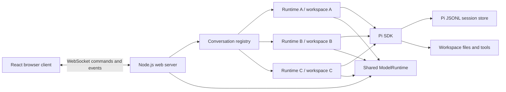
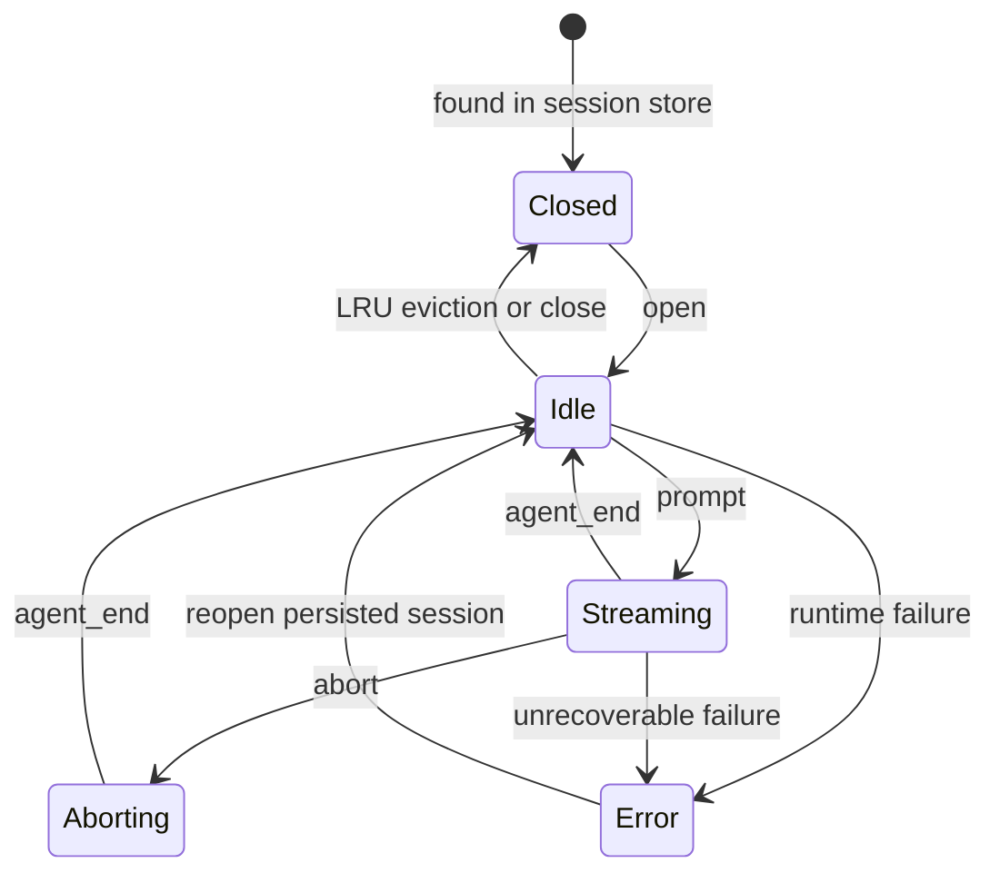
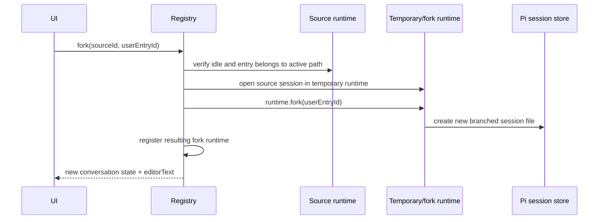

# ChatWCA Design

**Status:** Proposed

**Runtime:** Node.js 22.19+, TypeScript

**Audience:** Implementers and maintainers

## 1. Summary

ChatWCA is a single-user, dark-only web interface for the Pi coding agent. A Node.js server runs the Pi SDK in-process and serves a React application to browsers on the local network.

The server intentionally binds to `0.0.0.0` and has no authentication or authorization. It is intended to run inside a trusted, segmented LAN. Network access control is an infrastructure concern and is outside the application.

Each conversation:

- is persisted using Pi's native JSONL session format;
- owns an independent `AgentSessionRuntime` while open;
- has its own working directory;
- can continue running while the user views another conversation;
- can be forked from an earlier user message into a new conversation; and
- supports text and image prompts.

## 2. Goals

- Provide a responsive browser-based Pi chat interface.
- Preserve compatibility with sessions created by the Pi CLI.
- List, open, switch, create, and delete persisted conversations.
- Keep multiple conversations alive concurrently.
- Associate every conversation with an explicit working directory.
- Stream assistant text, thinking, tool calls, and tool results.
- Support pasted, dropped, and selected images.
- Fork a conversation from an earlier user message without changing the source.
- Recover cleanly after browser disconnects.
- Use a dark-only interface on desktop and laptop-sized screens.
- Bind to all interfaces so the application is reachable from the trusted LAN.

## 3. Non-goals

The first version will not include:

- Authentication, authorization, accounts, or multi-user isolation
- Internet-facing deployment hardening
- A light theme or theme selector
- A terminal emulator
- A file explorer or source-control panel
- Pi package, skill, extension, or model configuration screens
- Arbitrary file attachments other than images
- A secondary-model "vision bridge" for text-only models
- Horizontal scaling or multiple server processes sharing active runtimes
- In-place visualization of every branch in Pi's session tree

Pi resources already configured on the host—models, credentials, context files, skills, and extensions—remain available through the SDK.

## 4. Deployment assumptions

- One trusted operator uses the application.
- The server and workspaces are on the same machine.
- Browsers may run on another machine in the same segmented LAN.
- The LAN controls which devices can reach the configured port.
- The Node.js process has the same filesystem permissions as the operator.
- There is one ChatWCA server process. A restart interrupts active model requests, but completed session history remains persisted by Pi.
- The application is not a sandbox. Pi tools can read, write, edit, and execute commands in the selected workspace with the server process's permissions.

Default listener:

```text
http://0.0.0.0:8787
```

A browser connects using the server's LAN address, for example:

```text
http://192.168.20.10:8787
```

## 5. System architecture



### 5.1 Technology choices

| Area | Choice |
|---|---|
| Language | TypeScript with strict mode |
| Server runtime | Node.js 22.19+ |
| HTTP server | Express |
| Streaming transport | `ws` WebSocket server attached to the HTTP server |
| Frontend | React and Vite |
| Runtime validation | TypeBox schemas shared by client and server |
| Markdown | `react-markdown` and `remark-gfm` |
| State management | React reducer/context initially |
| Unit tests | Vitest |
| Browser tests | Playwright |
| Agent integration | `@earendil-works/pi-coding-agent` SDK |

The Pi SDK runs in the web server process. RPC mode and child Pi processes are unnecessary.

## 6. Server ownership model

The server is the source of truth for conversation state. Browser state is a projection and can always be rebuilt from an authoritative server snapshot.

The server owns one global `ConversationRegistry`. It is not created per browser connection. Multiple browser tabs therefore observe the same running conversations rather than accidentally creating duplicate Pi runtimes.

"Selected conversation" is browser-local. Every command includes a `conversationId`; changing the selection in one tab does not change another tab's selection.

### 6.1 Shared services

The server creates one `ModelRuntime` and reuses it across all conversations. This centralizes:

- provider credentials;
- model catalogs;
- model availability; and
- model refresh state.

CWD-bound Pi services and resources are created separately for each runtime.

### 6.2 Conversation registry

```ts
interface ConversationRecord {
  id: string;                    // Pi session UUID
  sessionFile: string;
  cwd: string;
  title: string;
  runtime: AgentSessionRuntime;
  session: AgentSession;
  status: "idle" | "streaming" | "aborting" | "error";
  createdAt: number;
  lastActiveAt: number;
  revision: number;
  unsubscribe: () => void;
}
```

The registry maintains indexes by session ID and canonical session-file path. Opening a session that is already live returns the existing record instead of opening a second writer for the same JSONL file.

### 6.3 Live-runtime limit

A runtime retains model state, resources, event subscriptions, and possibly child tool processes. The server therefore defaults to eight live conversations.

When the limit is reached, the registry disposes the least recently used conversation that is idle. Its persisted session remains in history and can be reopened. Streaming or aborting conversations are never evicted.

The limit is configurable with `CHATWCA_MAX_LIVE_CONVERSATIONS`.

## 7. Pi SDK integration

### 7.1 Runtime factory

Every live conversation is created through `createAgentSessionRuntime()`. The runtime factory uses `createAgentSessionServices()` and `createAgentSessionFromServices()` so CWD-bound resources are rebuilt correctly when a session operation changes the effective working directory.

Conceptually:

```text
createConversation(cwd, sessionManager)
  create AgentSessionRuntime
    create cwd-bound Pi services
    create AgentSession from services
  subscribe to session events
  register by Pi session ID
```

New conversations use:

```ts
SessionManager.create(cwd)
```

Existing conversations use:

```ts
SessionManager.open(sessionFile)
```

History is discovered with `SessionManager.list()` and `SessionManager.listAll()`. The application does not parse or rewrite Pi JSONL directly.

### 7.2 Runtime replacement

Pi runtime operations such as `switchSession()` and `fork()` replace `runtime.session`. Event subscriptions belong to the old `AgentSession`, so every replacement must:

1. unsubscribe from the old session;
2. update the registry's `session` reference;
3. subscribe to the new session;
4. refresh the record's session ID, file, CWD, and title; and
5. emit a new authoritative state snapshot.

### 7.3 Working directories

A new conversation request contains a working directory. The server:

1. resolves it to an absolute path;
2. canonicalizes it with `realpath` where possible;
3. verifies that it exists and is a directory; and
4. passes it explicitly to the runtime and `SessionManager`.

There is intentionally no workspace allowlist. The selected directory is shown prominently in the header and conversation list.

A reopened session uses the CWD stored in its Pi session header. If that directory no longer exists, the history remains visible but the conversation cannot run until the directory is restored.

## 8. Session persistence and history

Pi's session store is canonical. It already contains messages, images, tool calls, usage, compactions, tree relationships, model changes, the session name, and the working directory.

ChatWCA will not maintain a second message database. This avoids synchronization bugs and keeps sessions interoperable with the Pi CLI.

History summaries contain:

```ts
interface ConversationSummary {
  id: string;
  sessionFile: string;
  title: string;
  cwd: string;
  modifiedAt: number;
  messageCount: number;
  status: "closed" | "idle" | "streaming" | "error";
}
```

The first non-empty user prompt becomes the default title. A later naming feature can persist an explicit name through Pi's session metadata.

Deleting history is allowed only for files returned by Pi's session-listing APIs. A live session cannot be deleted until its runtime has been disposed.

## 9. Conversation lifecycle



### 9.1 Creating

- Validate and canonicalize the CWD.
- Create a persistent `SessionManager`.
- Create and register a runtime.
- Return a full empty conversation state.

### 9.2 Opening

- Resolve the requested item from the server-generated history list.
- Return an existing live runtime if present.
- Otherwise open it with `SessionManager.open()` and register it.

### 9.3 Switching

Switching is a frontend selection change, not a runtime replacement. The browser requests a full state for the selected conversation. Other conversations continue running.

### 9.4 Closing and eviction

Closing disposes the event subscription and runtime but does not delete the Pi session file. A streaming conversation must be aborted or allowed to finish before it can be closed.

### 9.5 Shutdown

On `SIGINT` or `SIGTERM`, the server:

1. stops accepting new prompts;
2. closes WebSocket connections;
3. asks active sessions to abort;
4. waits for a bounded grace period;
5. disposes all runtimes; and
6. closes the HTTP server.

Completed messages already written by Pi remain durable. In-progress responses may be persisted as aborted depending on how far the SDK run progressed.

## 10. Forking

The primary fork operation creates a new Pi session file from an earlier user-message entry. The source conversation and its runtime remain unchanged.

The UI must retain Pi session entry IDs in its serialized user messages. Timestamp-derived or array-index IDs are not sufficiently robust in branched and compacted histories.



Fork rules:

- The selected entry must be a user message on the source's current branch.
- The source must be idle.
- The fork inherits the source CWD and current model where available.
- `runtime.fork(entryId)` creates/replaces the temporary runtime's active session; it does not replace the source registry record.
- The SDK's returned `editorText` pre-fills the composer, matching Pi's `/fork` behavior.
- The user may edit and submit that prompt in the new conversation.
- If fork creation fails, the temporary runtime is disposed and the source is untouched.

An optional later command can expose `fork(entryId, { position: "at" })` as “Clone through here.” In-place tree navigation with `navigateTree()` is not part of v1.

## 11. Prompt and image handling

### 11.1 Text

When idle:

```ts
await session.prompt(text, { images });
```

When streaming, the UI offers explicit delivery choices:

- **Steer:** send after the current assistant turn's tool calls settle.
- **Follow up:** send after the current run finishes.

These map to Pi's `streamingBehavior: "steer" | "followUp"` semantics. A normal submit while streaming does not silently choose one.

### 11.2 Images

The composer supports:

- clipboard paste;
- drag and drop; and
- file selection.

Accepted v1 formats are PNG, JPEG, and WebP. The browser corrects image orientation, downsizes large images to a maximum 2048-pixel edge, and encodes a preview before upload. The server validates MIME type, decoded size, image count, and aggregate request size before converting payloads to Pi `ImageContent` values.

Defaults:

| Limit | Value |
|---|---:|
| Images per prompt | 8 |
| Decoded bytes per image | 8 MiB |
| Aggregate decoded bytes | 24 MiB |
| Maximum browser-side edge | 2048 px |

If the selected model does not support image input, submission is rejected with a clear message. Automatic transcription through another model is deferred.

Images are persisted as part of Pi's user messages. No separate application upload store is required for v1.

## 12. Event streaming

The server normalizes Pi events rather than exposing SDK objects directly. This keeps the browser protocol stable if Pi types change.

Important mappings:

| Pi event | Browser event |
|---|---|
| `message_start` | `message.started` |
| text/thinking `message_update` | `message.delta` |
| `message_end` | `message.completed` |
| `tool_execution_start` | `tool.started` |
| `tool_execution_update` | `tool.updated` |
| `tool_execution_end` | `tool.completed` |
| `queue_update` | `conversation.queue` |
| `agent_start` | `conversation.status` = streaming |
| `agent_end` | `conversation.status` = idle |
| retry/compaction events | typed status notices |

Every event includes:

```ts
interface EventEnvelope<T> {
  type: string;
  conversationId: string;
  revision: number;
  payload: T;
}
```

Revisions are monotonic per conversation. If the browser detects a gap, reconnects, or switches conversations, it requests `conversation.state` and replaces its local projection.

Streaming text deltas are high-priority messages. Full history is sent only on open, switch, reconnect, fork, or explicit resynchronization. The server does not serialize the complete conversation on every token.

Tool output sent to the browser is bounded and may be visually truncated. Pi remains responsible for the canonical persisted result and model context.

## 13. WebSocket protocol

The HTTP server provides static assets and two operational endpoints:

```text
GET /api/health
GET /api/config
WS  /ws
```

Representative client commands:

```ts
type ClientCommand =
  | { type: "history.list" }
  | { type: "conversation.create"; cwd: string }
  | { type: "conversation.open"; conversationId: string }
  | { type: "conversation.state"; conversationId: string }
  | { type: "conversation.close"; conversationId: string }
  | { type: "conversation.delete"; conversationId: string }
  | { type: "conversation.fork"; conversationId: string; entryId: string }
  | { type: "prompt.submit"; conversationId: string; text: string; images: UiImage[] }
  | { type: "prompt.steer"; conversationId: string; text: string; images: UiImage[] }
  | { type: "prompt.followUp"; conversationId: string; text: string; images: UiImage[] }
  | { type: "conversation.abort"; conversationId: string };
```

Representative server messages:

```ts
type ServerMessage =
  | { type: "ready"; serverVersion: string }
  | { type: "history"; conversations: ConversationSummary[] }
  | { type: "state"; conversation: ConversationState }
  | EventEnvelope<MessageDelta>
  | EventEnvelope<ToolUpdate>
  | EventEnvelope<StatusUpdate>
  | { type: "error"; requestId?: string; code: string; message: string };
```

Commands include a client-generated `requestId` in the concrete schema so responses and errors can be correlated. TypeBox validates every incoming message before dispatch.

## 14. Network behavior

The default host is deliberately:

```text
CHATWCA_HOST=0.0.0.0
```

There is no login page, token, cookie, API key, or authorization check. ChatWCA trusts any client that can reach the listener.

The server serves the frontend and WebSocket endpoint from the same authority. It does not enable broad CORS. Browser WebSocket upgrades must have an `Origin` whose authority matches the request `Host`; this prevents unrelated web pages from driving the socket and does not add user authentication. Direct non-browser clients without `Origin` are accepted.

Reverse proxies are optional. HTTP is sufficient for the intended segmented LAN deployment.

## 15. Frontend design

### 15.1 Layout

```text
<App>
├── <ConversationSidebar>
│   ├── New conversation
│   ├── Working-directory filter
│   └── Conversation rows with status
└── <ConversationPage>
    ├── <ConversationHeader> title, cwd, model, status
    ├── <MessageTimeline>
    │   ├── User messages and images
    │   ├── Assistant markdown
    │   ├── Collapsible thinking blocks
    │   └── Collapsible tool-call cards
    └── <Composer>
        ├── Image previews
        ├── Multiline editor
        └── Submit / steer / follow-up / abort
```

The sidebar groups conversations by working directory and distinguishes persisted closed sessions from live idle or streaming sessions. Switching to a closed session lazily opens its runtime.

### 15.2 Dark-only styling

The application exposes one dark palette through CSS custom properties. It does not inspect `prefers-color-scheme` and does not persist a theme preference.

Minimum UI requirements:

- readable code and diff colors;
- visible keyboard focus states;
- WCAG AA contrast for primary text and controls;
- responsive sidebar collapse;
- reduced-motion support;
- no raw HTML rendering from model output; and
- bounded, scrollable tool output.

### 15.3 Message rendering

Messages are rendered from a normalized UI model, not directly from provider-specific SDK objects. The serializer preserves:

- Pi entry ID;
- role;
- text blocks;
- thinking blocks;
- image blocks;
- tool calls and matching results;
- timestamp;
- stop reason; and
- error state.

Only user messages with valid Pi entry IDs show the Fork action.

## 16. Error handling

Errors use stable codes and human-readable messages. Important cases include:

- invalid or missing working directory;
- no configured/available model;
- image sent to a text-only model;
- malformed or oversized image payload;
- prompt submitted to a missing conversation;
- fork target not on the current branch;
- fork attempted while the source is streaming;
- live-runtime limit with no idle eviction candidate;
- WebSocket revision gap;
- Pi runtime creation or replacement failure; and
- session file removed outside the application.

An accepted prompt's later model failure is represented in the message/event stream, not as a failed command acknowledgement.

## 17. Configuration

| Variable | Default | Purpose |
|---|---|---|
| `CHATWCA_HOST` | `0.0.0.0` | HTTP/WebSocket bind address |
| `CHATWCA_PORT` | `8787` | Listener port |
| `CHATWCA_DEFAULT_CWD` | server process CWD | Initial new-conversation directory |
| `CHATWCA_MAX_LIVE_CONVERSATIONS` | `8` | Maximum retained runtimes |
| `CHATWCA_MAX_IMAGES` | `8` | Images allowed per prompt |
| `CHATWCA_MAX_IMAGE_BYTES` | `8388608` | Decoded bytes per image |
| `CHATWCA_MAX_TOTAL_IMAGE_BYTES` | `25165824` | Aggregate decoded image bytes per prompt |
| `PI_CODING_AGENT_DIR` | Pi default | Pi configuration and session root |
| `PI_OFFLINE` | unset | Use Pi's existing offline behavior |

Provider credentials continue to use Pi's standard credential store and environment variables. ChatWCA never sends provider credentials to the browser.

## 18. Proposed source layout

```text
src/
├── server/
│   ├── index.ts                 # HTTP/WS startup and shutdown
│   ├── config.ts                # environment parsing
│   ├── protocol.ts              # command dispatch
│   ├── conversation-registry.ts # live runtime ownership and eviction
│   ├── pi-runtime.ts            # SDK runtime factory
│   ├── session-history.ts       # Pi session listing/deletion
│   ├── serialize.ts             # SDK messages to UI messages
│   └── images.ts                # image validation/conversion
├── shared/
│   ├── protocol.ts              # TypeBox wire schemas and TS types
│   └── errors.ts                # stable error codes
└── web/
    ├── App.tsx
    ├── api/
    │   ├── socket.ts
    │   └── reducer.ts
    ├── components/
    │   ├── ConversationSidebar.tsx
    │   ├── ConversationHeader.tsx
    │   ├── MessageTimeline.tsx
    │   ├── Message.tsx
    │   ├── ThinkingBlock.tsx
    │   ├── ToolCallCard.tsx
    │   └── Composer.tsx
    └── styles/
        └── app.css
```

## 19. Testing strategy

### Unit tests

- protocol validation and unknown-message rejection;
- message serialization for text, thinking, images, and tools;
- conversation registry indexing and idle eviction;
- CWD canonicalization;
- image MIME and size limits;
- revision sequencing; and
- history deletion guardrails.

### Integration tests

Use in-memory or temporary Pi sessions and a fake model/provider to verify:

- create, prompt, persist, dispose, and reopen;
- simultaneous independent conversations;
- switching while a background conversation streams;
- fork creation without source mutation;
- event re-subscription after runtime replacement;
- abort behavior; and
- reconnect/full-state reconciliation.

### Browser tests

- create and switch conversations;
- LAN-style host access against a server bound to `0.0.0.0`;
- streaming text rendering;
- pasted and dropped images;
- fork and edit the prefilled prompt;
- collapse thinking and tool output;
- reconnect after WebSocket interruption; and
- responsive dark-only layout.

## 20. Implementation sequence

1. **Foundation** — workspace, TypeScript, Vite, Express, WebSocket, shared protocol, health endpoint.
2. **Pi runtime** — shared `ModelRuntime`, runtime factory, persistent create/open/list, diagnostics.
3. **Core chat** — prompt, abort, event normalization, state snapshots, text streaming.
4. **Conversation registry** — multiple live runtimes, switching, background status, LRU disposal.
5. **Rich rendering** — markdown, thinking, tools, errors, usage metadata.
6. **Images** — paste/drop/select, resizing, validation, Pi image prompts.
7. **Forking** — entry IDs, temporary fork runtime, prefilled editor, source-preservation tests.
8. **Hardening** — reconnect revisions, backpressure, shutdown, payload bounds, browser tests.

## 21. Acceptance criteria

The initial release is complete when:

- the server listens on `0.0.0.0` by default and is usable from another LAN machine;
- no authentication or authorization flow exists;
- a user can create a persistent conversation for any valid local directory;
- history survives browser and server restarts;
- a user can switch conversations while another continues streaming;
- text, thinking, tool calls, and tool results render incrementally;
- PNG, JPEG, and WebP prompts work with vision-capable models;
- a user can fork from an earlier user message and edit the copied prompt;
- the source conversation remains unchanged and switchable;
- the UI is dark-only and works at common laptop resolutions; and
- sessions remain readable by the Pi CLI.
