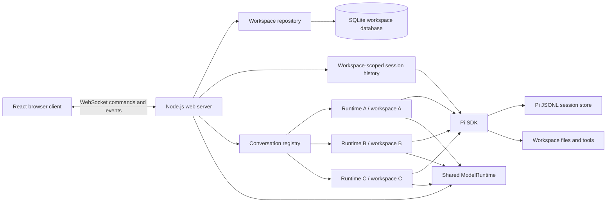
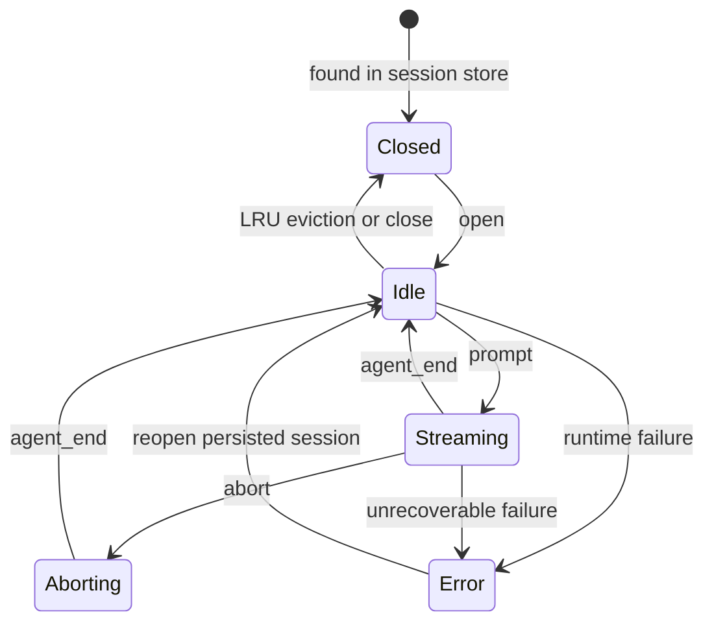
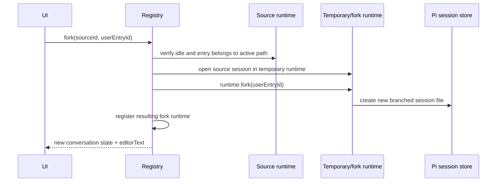

# ChatWCA Design

**Status:** Implemented

**Runtime:** Node.js 22.19+, TypeScript

**Audience:** Implementers and maintainers

## 1. Summary

ChatWCA is a single-user, dark-only web interface for the Pi coding agent. A Node.js server runs the Pi SDK in-process and serves a React application to browsers on the local network.

The server intentionally binds to `0.0.0.0` and has no authentication or authorization. It is intended to run inside a trusted, segmented LAN. Network access control is an infrastructure concern and is outside the application.

A workspace is a user-named, canonical path to a directory with an immutable session-storage policy. ChatWCA stores workspace definitions in its own SQLite database. The server does not scan Pi's global session history during startup or browser connection; it lists Pi sessions only for a workspace selected by the browser.

Each conversation:

- belongs to one registered workspace;
- is persisted using Pi's native JSONL session format;
- owns an independent `AgentSessionRuntime` while open;
- uses its workspace directory as its working directory;
- can continue running while the user views another conversation;
- can be forked from an earlier user message into a new conversation; and
- supports text and image prompts.

## 2. Goals

- Provide a responsive browser-based Pi chat interface.
- Preserve compatibility with sessions created by the Pi CLI.
- Create, rename, update, list, and remove named workspaces.
- Optionally store a workspace's Pi sessions under `<workspace>/.chatwca/sessions`.
- List, open, switch, create, rename, and delete persisted conversations within a selected workspace.
- Avoid scanning sessions belonging to unselected workspaces.
- Keep multiple conversations alive concurrently.
- Associate every conversation with a registered workspace and explicit working directory.
- Stream assistant text, thinking, tool calls, and tool results.
- Show Pi's active context usage percentage and model context-window size.
- Support pasted, dropped, and selected images.
- Fork a conversation from an earlier user message without changing the source, or rewind by replacing the source with that fork.
- Recover cleanly after browser disconnects.
- Use a dark-only interface on desktop and laptop-sized screens.
- Bind to all interfaces so the application is reachable from the trusted LAN.

## 3. Non-goals

The first version will not include:

- Authentication, authorization, accounts, or multi-user isolation
- Internet-facing deployment hardening
- A light theme or theme selector
- A terminal emulator
- A file explorer or source-control panel
- Pi package, skill, extension, or model configuration screens
- Arbitrary file attachments other than images
- A secondary-model "vision bridge" for text-only models
- Horizontal scaling or multiple server processes sharing active runtimes
- In-place visualization of every branch in Pi's session tree
- Automatic discovery or import of workspaces by scanning all Pi sessions
- Migration from the pre-workspace, global-history design

Pi resources already configured on the host—models, credentials, context files, skills, and extensions—remain available through the SDK.

## 4. Deployment assumptions

- One trusted operator uses the application.
- The server and workspaces are on the same machine.
- Browsers may run on another machine in the same segmented LAN.
- The LAN controls which devices can reach the configured port.
- The Node.js process has the same filesystem permissions as the operator.
- The process can create and write the configured ChatWCA data directory (`./data` by default) containing the SQLite database, plus any workspace configured for local session storage.
- There is one ChatWCA server process. A restart interrupts active model requests, but completed session history remains persisted by Pi.
- The application is not a sandbox. Pi tools can read, write, edit, and execute commands in the selected workspace with the server process's permissions.

Default listener:

```text
http://0.0.0.0:8787
```

A browser connects using the server's LAN address, for example:

```text
http://192.168.20.10:8787
```

## 5. System architecture



### 5.1 Technology choices

| Area | Choice |
|---|---|
| Language | TypeScript with strict mode |
| Server runtime | Node.js 22.19+ |
| HTTP server | Express |
| Streaming transport | `ws` WebSocket server attached to the HTTP server |
| Frontend | React and Vite |
| Runtime validation | TypeBox schemas shared by client and server |
| Workspace metadata | SQLite through `better-sqlite3` |
| Markdown | `react-markdown` and `remark-gfm` |
| State management | React reducer/context initially |
| Unit tests | Vitest |
| Browser tests | Playwright |
| Agent integration | `@earendil-works/pi-coding-agent` SDK |

The Pi SDK runs in the web server process. RPC mode and child Pi processes are unnecessary.

## 6. Server ownership model

The server is the source of truth for workspace definitions and conversation state. Workspace definitions are persisted in SQLite; browser state is a projection and can always be rebuilt from authoritative server snapshots.

The server owns one global `WorkspaceRepository` and one global `ConversationRegistry`. They are not created per browser connection. Multiple browser tabs therefore observe the same workspaces and running conversations rather than accidentally creating duplicate Pi runtimes.

"Selected workspace" and "selected conversation" are browser-local. Workspace-scoped commands include a `workspaceId`, and conversation commands include a `conversationId`. Changing either selection in one tab does not change another tab's selection. The selected workspace is not stored in SQLite.

### 6.1 Shared services

The server creates one `ModelRuntime` and reuses it across all conversations. This centralizes:

- provider credentials;
- model catalogs;
- model availability; and
- model refresh state.

CWD-bound Pi services and resources are created separately for each runtime.

### 6.2 Workspace repository and database

```ts
interface Workspace {
  id: string;                    // ChatWCA UUID
  name: string;
  path: string;                  // Canonical absolute directory path
  sessionStorage: "pi-default" | "workspace";
  sessionDirectory: string | null; // Derived local path; null for Pi default
  createdAt: number;
  updatedAt: number;
}

interface WorkspaceSummary extends Workspace {
  available: boolean;            // Current path exists and is a directory
}
```

The workspace repository stores metadata in `./data/chatwca.sqlite`, resolved relative to the server process's current working directory. The entire `/data/` directory is gitignored, including SQLite journal, WAL, and shared-memory files. `CHATWCA_DATA_DIR` may override the directory for deployments and tests.

The server creates the data directory and initializes the database during startup. `better-sqlite3` is used because workspace operations are small and serialized, and it avoids relying on Node's experimental `node:sqlite` API. The connection enables foreign keys, a bounded busy timeout, and WAL mode, and is closed during graceful shutdown. Operational backups should stop ChatWCA before a plain file copy so `chatwca.sqlite` and any WAL/shared-memory sidecars are captured consistently; Pi's agent/session directory and every workspace-local `.chatwca/sessions` directory must be backed up separately.

Current schema:

```sql
CREATE TABLE IF NOT EXISTS workspaces (
  id         TEXT PRIMARY KEY,
  name       TEXT NOT NULL,
  path       TEXT NOT NULL UNIQUE,
  session_storage TEXT NOT NULL DEFAULT 'pi-default'
    CHECK (session_storage IN ('pi-default', 'workspace')),
  created_at INTEGER NOT NULL,
  updated_at INTEGER NOT NULL
);

PRAGMA user_version = 2;
```

Workspace names must be non-empty. A path is resolved, verified as a directory, and canonicalized before insertion or update; canonical paths are unique. Creation selects an immutable `pi-default` or `workspace` session-storage policy, with `pi-default` used when migrating version-one rows. Workspace-local storage resolves to `<workspace>/.chatwca/sessions`; registering the workspace does not create that directory. The Pi SDK creates it when the first local runtime is created. A registered workspace remains visible if its directory later disappears, but it is marked unavailable and cannot list, create, or open conversations until the path is restored.

Removing a workspace deletes only its database row. It never deletes the directory or any Pi session. Removal and path changes are rejected while that workspace owns a live runtime; renaming remains allowed. The session-storage policy is not accepted by workspace updates and cannot change after creation. Database version two migrates existing rows to `pi-default`; it does not move Pi sessions.

### 6.3 Conversation registry

```ts
interface ConversationRecord {
  id: string;                    // Pi session UUID
  workspaceId: string;           // ChatWCA workspace UUID
  sessionFile: string;
  cwd: string;
  title: string;
  runtime: AgentSessionRuntime;
  session: AgentSession;
  status: "idle" | "streaming" | "aborting" | "error";
  createdAt: number;
  lastActiveAt: number;
  revision: number;
  unsubscribe: () => void;
}
```

The registry maintains indexes by session ID and canonical session-file path. Opening a session that is already live returns the existing record instead of opening a second writer for the same JSONL file.

### 6.4 Live-runtime limit

A runtime retains model state, resources, event subscriptions, and possibly child tool processes. The server therefore defaults to eight live conversations.

When the limit is reached, the registry disposes the least recently used conversation that is idle. Its persisted session remains in history and can be reopened. Streaming or aborting conversations are never evicted.

The limit is configurable with `CHATWCA_MAX_LIVE_CONVERSATIONS`.

## 7. Pi SDK integration

### 7.1 Runtime factory

Every live conversation is created through `createAgentSessionRuntime()`. The runtime factory uses `createAgentSessionServices()` and `createAgentSessionFromServices()` so CWD-bound resources are rebuilt correctly when a session operation changes the effective working directory.

Conceptually:

```text
createConversation(workspaceId, workspacePath, sessionManager)
  create AgentSessionRuntime
    create cwd-bound Pi services
    create AgentSession from services
  subscribe to session events
  register by Pi session ID
```

New conversations use Pi's default session location or the workspace-local directory selected at workspace creation:

```ts
SessionManager.create(cwd, workspace.sessionDirectory ?? undefined)
```

Existing conversations use:

```ts
SessionManager.open(sessionFile)
```

History for a selected workspace is discovered with `SessionManager.list(workspace.path, workspace.sessionDirectory ?? undefined)`. Normal startup, browser connection, workspace listing, and history refresh paths must never call `SessionManager.listAll()`. The application does not parse or rewrite Pi JSONL directly.

### 7.2 Runtime replacement

Pi runtime operations such as `switchSession()` and `fork()` replace `runtime.session`. Event subscriptions belong to the old `AgentSession`, so every replacement must:

1. unsubscribe from the old session;
2. update the registry's `session` reference;
3. subscribe to the new session;
4. refresh the record's session ID, file, CWD, and title; and
5. emit a new authoritative state snapshot.

### 7.3 Workspaces and working directories

A new conversation request contains a `workspaceId`, not an arbitrary working-directory or session-directory path. The server:

1. resolves the workspace through SQLite;
2. verifies that its stored canonical path still exists and is a directory;
3. derives the immutable session directory from the stored policy and uses it with `SessionManager.create()`; and
4. records the workspace ID on the live conversation record.

The workspace registry is the working-directory allowlist for browser commands. The selected workspace name and path are shown prominently in the UI.

A reopened session is resolved from a fresh listing for the workspace's configured session directory before its file is opened. Its Pi session header must identify the same canonical CWD as the workspace. A session ID or path discovered in one workspace cannot be used to open or delete a session through another workspace. If the workspace directory no longer exists, the workspace remains visible but its conversations cannot be listed or run until the same path is restored.

## 8. Session persistence and history

Pi's session store is canonical for conversations. It already contains messages, images, tool calls, usage, compactions, tree relationships, model changes, the session name, and the working directory.

ChatWCA's SQLite database is canonical only for workspace definitions and their storage policies. It does not contain messages, conversation summaries, session-file copies, or the browser's selected workspace. This separation avoids synchronization bugs and keeps sessions interoperable with the Pi CLI.

The server does not list Pi sessions at process startup or merely because a browser connects. After a browser selects a workspace, it requests that workspace's history, and the server calls `SessionManager.list()` with the workspace path and configured session directory. Selecting another workspace replaces the browser's history projection with a separately scoped result. No automatic global discovery or migration scan is performed.

History summaries contain:

```ts
interface ConversationSummary {
  id: string;
  workspaceId: string;
  sessionFile: string;
  title: string;
  cwd: string;
  modifiedAt: number;
  messageCount: number;
  status: "closed" | "idle" | "streaming" | "error";
}
```

The first non-empty user prompt becomes the default title. The user can replace it with an explicit name, persisted as Pi-native session metadata through `SessionManager.appendSessionInfo()`.

Deleting history is allowed only for files returned by a fresh Pi listing for the specified workspace. A live session cannot be deleted until its runtime has been disposed.

## 9. Conversation lifecycle



### 9.1 Creating

- Resolve and validate the selected workspace from SQLite.
- Create a persistent `SessionManager` using the workspace's canonical path.
- Create and register a runtime with the workspace ID.
- Return a full empty conversation state.

### 9.2 Opening

- Resolve the requested item from a fresh Pi history listing scoped to the specified workspace.
- Verify that the listed session CWD matches the workspace path.
- Return an existing live runtime if present.
- Otherwise open it with `SessionManager.open()` and register it with the workspace ID.

### 9.3 Switching

Switching workspaces or conversations is a frontend selection change, not a runtime replacement. Selecting a workspace requests only that workspace's history. Selecting a conversation requests its full state. Other conversations continue running.

### 9.4 Closing and eviction

Closing disposes the event subscription and runtime but does not delete the Pi session file. A streaming conversation must be aborted or allowed to finish before it can be closed.

### 9.5 Shutdown

On `SIGINT` or `SIGTERM`, the server:

1. stops accepting new prompts;
2. closes WebSocket connections;
3. asks active sessions to abort;
4. waits for a bounded grace period;
5. disposes all runtimes and listeners;
6. closes the SQLite connection; and
7. closes the HTTP server.

The total graceful phase is bounded by `CHATWCA_SHUTDOWN_GRACE_MS` (10 seconds by default, capped at 5 minutes). At the deadline, remaining WebSockets and HTTP connections are forcibly closed and runtime disposal is invoked without waiting on a stalled SDK promise. Repeated signals share the same shutdown operation. Completed messages already written by Pi remain durable. In-progress responses may be persisted as aborted depending on how far the SDK run progressed.

## 10. Forking

The primary fork operation creates a new Pi session file from an earlier user-message entry. The source conversation and its runtime remain unchanged.

The UI must retain Pi session entry IDs in its serialized user messages. Timestamp-derived or array-index IDs are not sufficiently robust in branched and compacted histories.



Fork rules:

- The selected entry must be a user message on the source's current branch.
- The source must be idle.
- The fork inherits the source workspace, CWD, and current model where available.
- `runtime.fork(entryId)` creates/replaces the temporary runtime's active session; it does not replace the source registry record.
- The SDK's returned `editorText` pre-fills the composer, matching Pi's `/fork` behavior.
- The user may edit and submit that prompt in the new conversation.
- If fork creation fails, the temporary runtime is disposed and the source is untouched.

**Rewind** uses the same target validation and fork construction, but is destructive. After the distinct fork has been created successfully, the server closes and deletes the source Pi session, returns the fork state and copied editor text, and the browser selects the fork. The source is not deleted when fork construction fails. The UI requires explicit confirmation and states that the source conversation cannot be recovered through ChatWCA.

An optional later command can expose `fork(entryId, { position: "at" })` as “Clone through here.” In-place tree navigation with `navigateTree()` is not part of v1.

## 11. Prompt and image handling

### 11.1 Text

When idle:

```ts
await session.prompt(text, { images });
```

When streaming, the UI offers explicit delivery choices:

- **Steer:** send after the current assistant turn's tool calls settle.
- **Follow up:** send after the current run finishes.

These map to Pi's `streamingBehavior: "steer" | "followUp"` semantics. A normal submit while streaming does not silently choose one.

### 11.2 Images

The composer supports:

- clipboard paste;
- drag and drop; and
- file selection.

Accepted v1 formats are PNG, JPEG, and WebP. The browser corrects image orientation, downsizes large images to a maximum 2048-pixel edge, and encodes a preview before upload. The server validates MIME type, decoded size, image count, and aggregate request size before converting payloads to Pi `ImageContent` values.

Defaults:

| Limit | Value |
|---|---:|
| Images per prompt | 8 |
| Decoded bytes per image | 8 MiB |
| Aggregate decoded bytes | 24 MiB |
| Maximum browser-side edge | 2048 px |

If the selected model does not support image input, submission is rejected with a clear message. Automatic transcription through another model is deferred.

Images are persisted as part of Pi's user messages. No separate application upload store is required for v1.

## 12. Event streaming

The server normalizes Pi events rather than exposing SDK objects directly. This keeps the browser protocol stable if Pi types change.

Important mappings:

| Pi event | Browser event |
|---|---|
| `message_start` | `message.started` |
| text/thinking `message_update` | `message.delta` |
| `message_end` | `message.completed` |
| `tool_execution_start` | `tool.started` |
| `tool_execution_update` | `tool.updated` |
| `tool_execution_end` | `tool.completed` |
| `queue_update` | `conversation.queue` |
| `agent_start` | `conversation.status` = streaming |
| `agent_end` | `conversation.status` = idle |
| retry/compaction events | typed status notices |

Every event includes:

```ts
interface EventEnvelope<T> {
  type: string;
  workspaceId: string;
  conversationId: string;
  revision: number;
  payload: T;
}
```

Revisions are monotonic per conversation. If the browser detects a gap, reconnects, or switches conversations, it requests `conversation.state` and replaces its local projection.

Streaming text deltas are high-priority messages. Workspace-scoped history is sent only on workspace selection, reconnect, fork, or explicit resynchronization. A `history.list` command establishes that socket's current workspace-history subscription; subsequent history updates are sent only for that workspace and include its `workspaceId`. The server does not serialize the complete conversation on every token and never performs a global history scan to produce an update.

Tool-result text sent to the browser is bounded and may be visually truncated. Supported image blocks in canonical tool-result entries are represented by same-origin image URLs rather than copied into WebSocket snapshots; the HTTP handler resolves only an image on the open conversation's active branch, validates its encoded data and signature, and returns it with `Cache-Control: private, no-store`. Markdown destinations for supported image formats are rewritten to a separate conversation-scoped endpoint that resolves relative paths against the workspace and admits absolute, `file:`, or `sandbox:` paths only when their real canonical target remains inside that workspace. It rejects symlink escapes, unsupported formats, oversized files, and invalid signatures. Pi remains responsible for the canonical persisted result and model context; ChatWCA does not expose a general workspace file server.

## 13. WebSocket protocol

The HTTP server provides static assets and two operational endpoints:

```text
GET /api/health
GET /api/config
GET /api/conversations/:conversationId/messages/:entryId/images/:imageIndex
GET /api/conversations/:conversationId/workspace-images?path=<image-path>
WS  /ws
```

Representative client commands:

```ts
type ClientCommand =
  | { type: "workspace.list" }
  | { type: "workspace.create"; name: string; path: string; sessionStorage: "pi-default" | "workspace" }
  | { type: "workspace.update"; workspaceId: string; name?: string; path?: string }
  | { type: "workspace.delete"; workspaceId: string }
  | { type: "history.list"; workspaceId: string }
  | { type: "conversation.create"; workspaceId: string }
  | { type: "conversation.open"; workspaceId: string; conversationId: string }
  | { type: "conversation.state"; conversationId: string }
  | { type: "conversation.rename"; conversationId: string; title: string }
  | { type: "conversation.close"; conversationId: string }
  | { type: "conversation.delete"; workspaceId: string; conversationId: string }
  | { type: "conversation.fork"; conversationId: string; entryId: string }
  | { type: "conversation.rewind"; conversationId: string; entryId: string }
  | { type: "prompt.submit"; conversationId: string; text: string; images: UiImage[] }
  | { type: "prompt.steer"; conversationId: string; text: string; images: UiImage[] }
  | { type: "prompt.followUp"; conversationId: string; text: string; images: UiImage[] }
  | { type: "conversation.abort"; conversationId: string };
```

Representative server messages:

```ts
type ServerMessage =
  | { type: "ready"; serverVersion: string }
  | { type: "workspaces"; workspaces: WorkspaceSummary[] }
  | { type: "history"; workspaceId: string; conversations: ConversationSummary[] }
  | { type: "state"; conversation: ConversationState }
  | EventEnvelope<MessageDelta>
  | EventEnvelope<ToolUpdate>
  | EventEnvelope<StatusUpdate>
  | { type: "error"; requestId?: string; code: string; message: string };
```

Commands include a client-generated `requestId` in the concrete schema so responses and errors can be correlated. TypeBox validates every incoming message before dispatch. Workspace CRUD broadcasts a fresh authoritative workspace list. History responses and notifications always include `workspaceId`; the browser discards a response that no longer matches its selected workspace.

## 14. Network behavior

The default host is deliberately:

```text
CHATWCA_HOST=0.0.0.0
```

There is no login page, token, cookie, API key, or authorization check. ChatWCA trusts any client that can reach the listener.

The server serves the frontend and WebSocket endpoint from the same authority. It does not enable broad CORS. Browser WebSocket upgrades must have an `Origin` whose authority matches the request `Host`; this prevents unrelated web pages from driving the socket and does not add user authentication. Direct non-browser clients without `Origin` are accepted.

Reverse proxies are optional. HTTP is sufficient for the intended segmented LAN deployment.

## 15. Frontend design

### 15.1 Layout

```text
<App>
├── <WorkspaceSidebar>
│   ├── Workspace selector
│   ├── Add / rename / edit / remove workspace
│   └── <ConversationList>
│       ├── New conversation
│       └── Selected-workspace conversation rows with status
└── <ConversationPage>
    ├── <ConversationHeader> workspace, editable title, cwd, model, context usage, status
    ├── <MessageTimeline>
    │   ├── User messages and images
    │   ├── Assistant markdown
    │   ├── Collapsible thinking blocks
    │   └── Collapsible tool-call cards
    └── <Composer>
        ├── Image previews
        ├── Multiline editor
        └── Submit / steer / follow-up / abort
```

The sidebar initially renders workspace definitions without requesting Pi history. Within each browser session, it orders workspaces by most recently selected while preserving the server order for workspaces not yet selected. Selecting a workspace requests only that workspace's conversations and establishes the socket's workspace-history subscription. The conversation list distinguishes persisted closed sessions from live idle or streaming sessions, and switching to a closed session lazily opens its runtime. If no workspace is selected, no history request is made and conversation creation is disabled.

Workspace creation uses explicit fields for name and path plus a default-disabled **Store sessions in this workspace** checkbox. The selection is not shown as an editable field later. **Workspace Info** shows the authoritative storage policy and the resolved local session directory when applicable. Removing a workspace requires confirmation and clearly states that files and Pi sessions are retained. The browser keeps workspace and conversation selection in memory; reconnecting re-lists workspaces and then re-requests history only for the workspace already selected in that browser instance.

### 15.2 Dark-only styling

The application exposes one dark palette through CSS custom properties. It does not inspect `prefers-color-scheme` and does not persist a theme preference.

Minimum UI requirements:

- readable code and diff colors;
- visible keyboard focus states;
- WCAG AA contrast for primary text and controls;
- responsive sidebar collapse;
- reduced-motion support;
- no raw HTML rendering from model output; and
- bounded, scrollable tool text output and responsive inline tool-result images.

### 15.3 Message rendering

Messages are rendered from a normalized UI model, not directly from provider-specific SDK objects. The serializer preserves:

- Pi entry ID;
- role;
- text blocks;
- thinking blocks;
- image blocks;
- tool calls and matching results;
- timestamp;
- stop reason; and
- error state.

Only user messages with valid Pi entry IDs show the Fork action. The header displays the SDK's active-context estimate in Pi's compact form (for example, `5.2%/272k`). The estimate is refreshed with completed messages; immediately after compaction, the unknown percentage is shown as `?/272k` until the next reliable model response.

## 16. Error handling

Errors use stable codes and human-readable messages. Important cases include:

- invalid, duplicate, missing, or unavailable workspace;
- invalid workspace name or directory path;
- workspace update or removal while it owns a live runtime;
- SQLite open, initialization, or write failure;
- a session requested through the wrong workspace;
- no configured/available model;
- image sent to a text-only model;
- malformed or oversized image payload;
- prompt submitted to a missing conversation;
- blank or oversized conversation title;
- fork target not on the current branch;
- fork attempted while the source is streaming;
- live-runtime limit with no idle eviction candidate;
- WebSocket revision gap;
- Pi runtime creation or replacement failure; and
- session file removed outside the application.

An accepted prompt's later model failure is represented in the message/event stream, not as a failed command acknowledgement.

## 17. Configuration

| Variable | Default | Purpose |
|---|---|---|
| `CHATWCA_HOST` | `0.0.0.0` | HTTP/WebSocket bind address |
| `CHATWCA_PORT` | `8787` | Listener port |
| `CHATWCA_DATA_DIR` | `./data` | Directory containing `chatwca.sqlite`; relative values resolve from the server process CWD |
| `CHATWCA_MAX_LIVE_CONVERSATIONS` | `8` | Maximum retained runtimes |
| `CHATWCA_MAX_IMAGES` | `8` | Images allowed per prompt |
| `CHATWCA_MAX_IMAGE_BYTES` | `8388608` | Decoded bytes per image |
| `CHATWCA_MAX_TOTAL_IMAGE_BYTES` | `25165824` | Aggregate decoded image bytes per prompt |
| `CHATWCA_SHUTDOWN_GRACE_MS` | `10000` | Bounded graceful shutdown period (maximum 300000 ms) |
| `PI_CODING_AGENT_DIR` | Pi default | Pi configuration and session root |
| `PI_OFFLINE` | unset | Use Pi's existing offline behavior |

Provider credentials continue to use Pi's standard credential store and environment variables. ChatWCA never sends provider credentials to the browser.

## 18. Proposed source layout

```text
src/
├── server/
│   ├── index.ts                 # HTTP/WS startup and shutdown
│   ├── config.ts                # environment parsing
│   ├── database.ts              # SQLite open/schema/close lifecycle
│   ├── workspace-repository.ts  # persistent workspace CRUD
│   ├── protocol.ts              # command dispatch
│   ├── conversation-registry.ts # live runtime ownership and eviction
│   ├── pi-runtime.ts            # SDK runtime factory
│   ├── session-history.ts       # workspace-scoped Pi listing/deletion
│   ├── serialize.ts             # SDK messages to UI messages
│   └── images.ts                # image validation/conversion
├── shared/
│   ├── protocol.ts              # TypeBox wire schemas and TS types
│   └── errors.ts                # stable error codes
└── web/
    ├── App.tsx
    ├── api/
    │   ├── socket.ts
    │   └── reducer.ts
    ├── components/
    │   ├── WorkspaceSidebar.tsx
    │   ├── WorkspaceForm.tsx
    │   ├── ConversationList.tsx
    │   ├── ConversationHeader.tsx
    │   ├── MessageTimeline.tsx
    │   ├── Message.tsx
    │   ├── ThinkingBlock.tsx
    │   ├── ToolCallCard.tsx
    │   └── Composer.tsx
    └── styles/
        └── app.css
```

## 19. Testing strategy

### Unit tests

- protocol validation and unknown-message rejection;
- SQLite schema initialization and workspace CRUD;
- workspace name validation, path canonicalization, uniqueness, availability, immutable storage policy, and version-one database migration;
- message serialization for text, thinking, images, and tools;
- conversation registry workspace ownership, indexing, and idle eviction;
- image MIME and size limits;
- revision sequencing;
- workspace-scoped history and deletion guardrails; and
- startup, browser connection, and workspace listing never invoking `SessionManager.listAll()`.

### Integration tests

Use temporary SQLite databases, temporary Pi sessions, and a fake model/provider to verify:

- startup loads workspace rows without scanning Pi sessions;
- selecting one workspace lists only that workspace's sessions;
- cross-workspace open and delete requests are rejected;
- create, prompt, persist, dispose, and reopen within a workspace;
- simultaneous independent conversations across workspaces;
- switching workspaces while a background conversation streams;
- fork creation without source mutation;
- event re-subscription after runtime replacement;
- abort behavior; and
- reconnect/full-state reconciliation.

### Browser tests

- create default and workspace-local workspaces, inspect storage policy, rename, update, select, and remove workspaces;
- verify that no conversation history is requested before workspace selection;
- create and switch conversations within selected workspaces;
- LAN-style host access against a server bound to `0.0.0.0`;
- streaming text rendering;
- pasted and dropped images;
- fork and edit the prefilled prompt;
- collapse thinking and tool output;
- reconnect after WebSocket interruption; and
- responsive dark-only layout.

## 20. Implementation sequence

1. **Foundation** — TypeScript, Vite, Express, WebSocket, shared protocol, health endpoint.
2. **Workspace storage** — gitignored data directory, SQLite lifecycle, workspace repository, CRUD protocol and UI.
3. **Scoped Pi history** — selected-workspace listing with `SessionManager.list()`, scoped authorization, and no `listAll()` startup path.
4. **Pi runtime** — shared `ModelRuntime`, workspace-bound runtime factory, persistent create/open, diagnostics.
5. **Core chat** — prompt, abort, event normalization, state snapshots, text streaming.
6. **Conversation registry** — workspace ownership, multiple live runtimes, switching, background status, LRU disposal.
7. **Rich rendering** — markdown, thinking, tools, errors, usage metadata.
8. **Images** — paste/drop/select, resizing, validation, Pi image prompts.
9. **Forking** — entry IDs, temporary fork runtime, prefilled editor, source-preservation tests.
10. **Hardening** — reconnect revisions, scoped history broadcasts, backpressure, shutdown, payload bounds, browser tests.

## 21. Acceptance criteria

The initial release is complete when:

- the server listens on `0.0.0.0` by default and is usable from another LAN machine;
- no authentication or authorization flow exists;
- workspace definitions and immutable session-storage policies persist in `./data/chatwca.sqlite` and the data directory is gitignored;
- a user can create, edit, inspect, select, and remove a named workspace for any valid local directory;
- workspace creation can select default-disabled workspace-local session storage, and that selection cannot later be changed;
- the server does not call `SessionManager.listAll()` during startup, browser connection, or normal history refresh;
- no Pi conversations are listed until the browser selects a workspace;
- selecting a workspace lists only sessions associated with that workspace path;
- a user can create a persistent conversation in the selected workspace;
- a user can edit a conversation title and the Pi-native name survives browser and server restarts;
- workspace definitions and Pi history survive browser and server restarts;
- a user can switch workspaces or conversations while another conversation continues streaming;
- text, thinking, tool calls, and tool results render incrementally;
- PNG, JPEG, and WebP prompts work with vision-capable models;
- a user can fork from an earlier user message and edit the copied prompt;
- a user can rewind from an earlier user message, replacing the source only after fork creation succeeds;
- a normal fork leaves the source conversation unchanged and switchable;
- the UI is dark-only and works at common laptop resolutions; and
- sessions remain readable by the Pi CLI.
