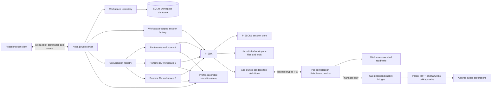
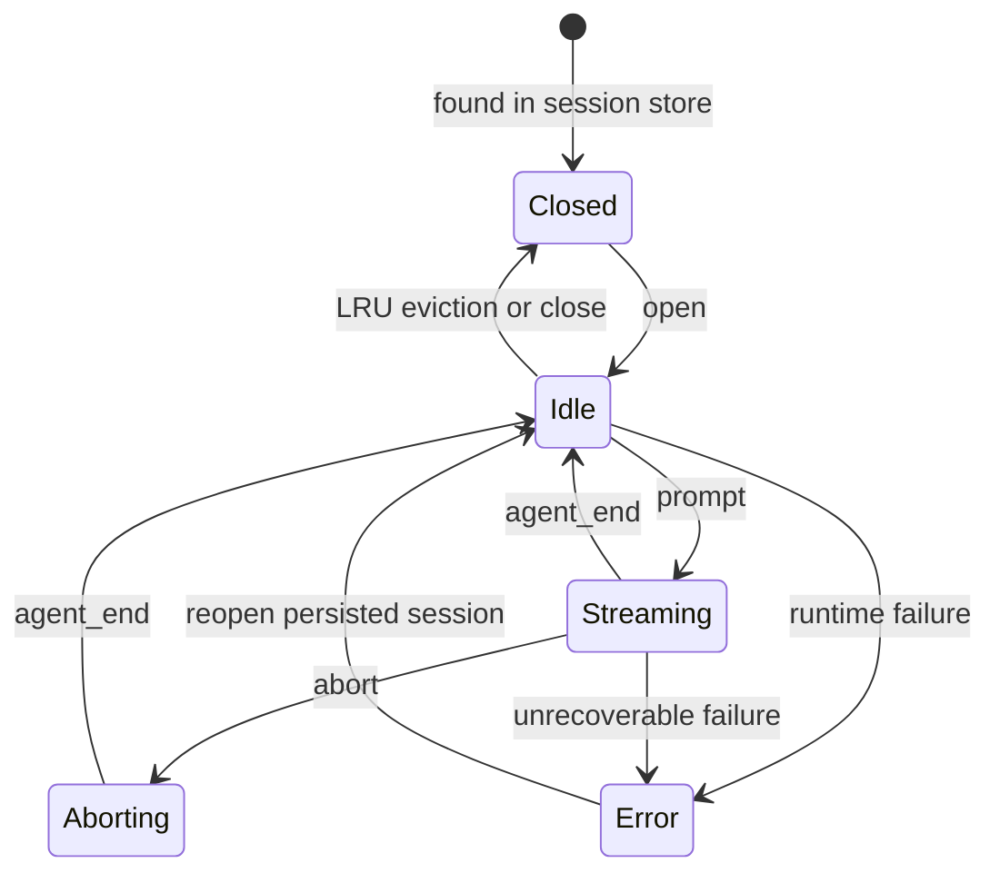
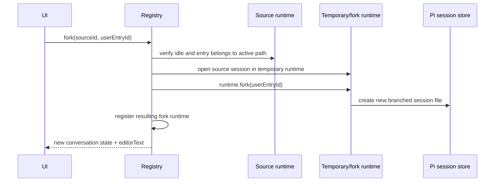

# ChatWCA Design

**Status:** Implemented

**Runtime:** Node.js 22.19+, TypeScript

**Audience:** Implementers and maintainers

## 1. Summary

ChatWCA is a single-operator, dark-only web interface for the Pi coding agent. A Node.js server runs the Pi SDK in-process and serves a React application to browsers through an authenticated reverse proxy or a tightly isolated local network.

The server defaults to `0.0.0.0` for compatibility and has no authentication or authorization. The recommended deployment binds ChatWCA to loopback behind an mTLS reverse proxy; direct LAN binding requires host/network firewall isolation. Every client accepted by that infrastructure has full ChatWCA authority.

On Linux, a workspace can use the Bubblewrap security profile specified in [`bubblewrap-design.md`](bubblewrap-design.md). Sandboxed tools can remain network-isolated or use the administrator-filtered managed-egress path specified in [`network-sandbox-design.md`](network-sandbox-design.md). These boundaries constrain coding tools; they do not authenticate clients, isolate the parent model runtime, or prevent workspace content from being sent to the configured model provider.

A workspace is a user-named, canonical path to a directory with an immutable session-storage policy and optional named directory mounts exposed to sandboxed tools under `/mounts`. ChatWCA stores workspace definitions in its own SQLite database. The server does not scan Pi's global session history during startup or browser connection; it lists Pi sessions only for a workspace selected by the browser.

Each conversation:

- belongs to one registered workspace;
- is persisted using Pi's native JSONL session format;
- owns an independent `AgentSessionRuntime` while open;
- uses its workspace directory as its working directory;
- can continue running while the user views another conversation;
- can be forked from an earlier user message into a new conversation; and
- supports text and image prompts.

## 2. Goals

- Provide a responsive browser-based Pi chat interface.
- Preserve compatibility with sessions created by the Pi CLI.
- Create, rename, update, list, and remove named workspaces.
- Optionally store a workspace's Pi sessions under `<workspace>/.chatwca/sessions`.
- List, open, switch, create, rename, and delete persisted conversations within a selected workspace.
- Avoid scanning sessions belonging to unselected workspaces.
- Keep multiple conversations alive concurrently.
- Associate every conversation with a registered workspace and explicit working directory.
- Stream assistant text, thinking, tool calls, and tool results.
- Show Pi's active context usage percentage and model context-window size.
- Support pasted, dropped, and selected images.
- Fork a conversation from an earlier user message without changing the source, or rewind by replacing the source with that fork.
- Recover cleanly after browser disconnects.
- Use a dark-only interface on desktop and laptop-sized screens.
- Support configurable loopback or LAN binding; direct LAN reachability requires external isolation.
- Support unrestricted and Bubblewrap-sandboxed workspace profiles under an administrator-controlled policy ceiling.
- Persist per-workspace directory mounts with read-only or read-write access at named `/mounts/<name>` guest paths.
- Keep sandboxed tools network-isolated by default, with optional administrator-filtered managed egress.
- Select managed-egress destinations through immutable, administrator-defined per-workspace policy sets.

## 3. Non-goals

The implemented design does not include:

- Authentication, authorization, accounts, or multi-user isolation
- Internet-facing deployment hardening
- A light theme or theme selector
- A terminal emulator
- A file explorer or source-control panel
- Pi package, skill, extension, or model configuration screens
- Arbitrary file attachments other than images
- A secondary-model "vision bridge" for text-only models
- Horizontal scaling or multiple server processes sharing active runtimes
- In-place visualization of every branch in Pi's session tree
- Automatic discovery or import of workspaces by scanning all Pi sessions
- Migration from the pre-workspace, global-history design
- Browser-authored network destinations or interactive one-time egress approvals
- Confidentiality from the configured model provider
- Protection against harmful changes within a writable workspace
- Per-conversation cgroup CPU, memory, process, disk, or bandwidth quotas

Pi resources already configured on the host remain available to unrestricted runtimes through the SDK. Strict sandboxed runtimes share administrator-controlled credentials and model configuration through a separate model runtime, but disable extensions, skills, prompt templates, unapproved tools, project/global packages, and context discovery outside the workspace.

## 4. Deployment assumptions

- One trusted operator uses the application.
- The server and workspaces are on the same machine.
- Browsers may run on another machine through an authenticated mTLS reverse proxy, or in the same segmented trusted LAN.
- The reverse proxy, host firewall, and network firewall control which clients can reach the configured port; every accepted client has full authority.
- The Node.js process has the same filesystem permissions as the operator.
- The process can create and write the configured ChatWCA data directory (`./data` by default) containing the SQLite database, plus any workspace configured for local session storage.
- There is one ChatWCA server process. A restart interrupts active model requests, but completed session history remains persisted by Pi.
- Unrestricted workspaces run Pi tools with the server process's permissions. Workspace-sandboxed conversations use the Bubblewrap boundary, with the residual risks documented in `bubblewrap-design.md`.
- Sandboxed workspaces default to no tool network access. Managed egress, when enabled by the administrator and selected by the workspace, remains inside the isolated namespace and reaches only destinations admitted by the selected named policy set and mandatory global controls.
- Model-provider requests, Pi session persistence, SQLite, HTTP, and WebSocket handling always remain in the parent process.

Default listener:

```text
http://0.0.0.0:8787
```

For remote access, prefer `CHATWCA_HOST=127.0.0.1` with an mTLS reverse proxy. If direct LAN binding is explicitly accepted, a browser connects through a firewall-restricted server address such as `http://192.168.20.10:8787`.

## 5. System architecture



### 5.1 Technology choices

| Area | Choice |
|---|---|
| Language | TypeScript with strict mode |
| Server runtime | Node.js 22.19+ |
| HTTP server | Express |
| Streaming transport | `ws` WebSocket server attached to the HTTP server |
| Frontend | React and Vite |
| Runtime validation | TypeBox schemas shared by client and server |
| Workspace metadata | SQLite through `better-sqlite3` |
| Markdown | `react-markdown` and `remark-gfm` |
| State management | React reducer/context initially |
| Unit tests | Vitest |
| Browser tests | Playwright |
| Agent integration | `@earendil-works/pi-coding-agent` SDK |

The Pi SDK runs in the web server process. RPC mode and child Pi processes are unnecessary.

## 6. Server ownership model

The server is the source of truth for workspace definitions and conversation state. Workspace definitions are persisted in SQLite; browser state is a projection and can always be rebuilt from authoritative server snapshots.

The server owns one global `WorkspaceRepository` and one global `ConversationRegistry`. They are not created per browser connection. Multiple browser tabs therefore observe the same workspaces and running conversations rather than accidentally creating duplicate Pi runtimes.

"Selected workspace" and "selected conversation" are browser-local. Workspace-scoped commands include a `workspaceId`, and conversation commands include a `conversationId`. Changing either selection in one tab does not change another tab's selection. The selected workspace is not stored in SQLite.

### 6.1 Shared services

The server creates separate process-lifetime unrestricted and strict `ModelRuntime` instances from the same administrator-controlled credential/model paths. This prevents unrestricted extension provider registration from mutating strict sessions while retaining centralized credentials, catalogs, availability, and refresh state.

CWD-bound Pi services and resources are created separately for each runtime.

### 6.2 Workspace repository and database

```ts
interface Workspace {
  id: string;                    // ChatWCA UUID
  name: string;
  path: string;                  // Canonical absolute directory path
  sessionStorage: "pi-default" | "workspace";
  sessionDirectory: string | null; // Derived local path; null for Pi default
  securityProfile: "unrestricted" | "workspace-sandboxed";
  networkPolicy: "isolated" | "managed-egress";
  networkPolicySetId: string;    // Administrator-defined stable ID
  mounts: WorkspaceMount[];      // Canonical directories mounted at /mounts/<name>
  createdAt: number;
  updatedAt: number;
}

interface WorkspaceSummary extends Workspace {
  available: boolean;            // Current path exists and is a directory
  usable: boolean;               // Availability plus effective server policy
  effectiveSecurityProfile: "unrestricted" | "workspace-sandboxed" | null;
  effectiveNetworkPolicy: "isolated" | "managed-egress" | null;
  effectiveNetworkPolicySetId: string | null;
  policyIssue:
    | "sandbox_disabled"
    | "outside_workspace_roots"
    | "protected_path_overlap"
    | "mount_unavailable"
    | null;
  networkPolicyIssue:
    | "managed_egress_disabled"
    | "managed_egress_policy_set_unavailable"
    | null;
}
```

The workspace repository stores metadata in `./data/chatwca.sqlite`, resolved relative to the server process's current working directory. The entire `/data/` directory is gitignored, including SQLite journal, WAL, and shared-memory files. `CHATWCA_DATA_DIR` may override the directory for deployments and tests.

The server creates the data directory and initializes the database during startup. `better-sqlite3` is used because workspace operations are small and serialized, and it avoids relying on Node's experimental `node:sqlite` API. The connection enables foreign keys, a bounded busy timeout, and WAL mode, and is closed during graceful shutdown. Operational backups should stop ChatWCA before a plain file copy so `chatwca.sqlite` and any WAL/shared-memory sidecars are captured consistently; Pi's agent/session directory and every workspace-local `.chatwca/sessions` directory must be backed up separately.

Current schema (with bounded lowercase slug constraints abridged) is version 6. Mount rows cascade with their parent workspace:

```sql
CREATE TABLE IF NOT EXISTS workspaces (
  id         TEXT PRIMARY KEY,
  name       TEXT NOT NULL,
  path       TEXT NOT NULL UNIQUE,
  session_storage TEXT NOT NULL DEFAULT 'pi-default'
    CHECK (session_storage IN ('pi-default', 'workspace')),
  created_at INTEGER NOT NULL,
  updated_at INTEGER NOT NULL,
  security_profile TEXT NOT NULL DEFAULT 'unrestricted'
    CHECK (security_profile IN ('unrestricted', 'workspace-sandboxed')),
  network_policy TEXT NOT NULL DEFAULT 'isolated'
    CHECK (network_policy IN ('isolated', 'managed-egress')),
  network_policy_set_id TEXT NOT NULL DEFAULT 'default'
    CHECK (/* bounded lowercase ASCII slug */)
);

CREATE TABLE workspace_mounts (
  workspace_id TEXT NOT NULL REFERENCES workspaces(id) ON DELETE CASCADE,
  name TEXT NOT NULL,
  source_path TEXT NOT NULL,
  access TEXT NOT NULL CHECK (access IN ('read-only', 'read-write')),
  PRIMARY KEY (workspace_id, name),
  UNIQUE (workspace_id, source_path)
);

PRAGMA user_version = 6;
```

Workspace names must be non-empty. A path is resolved, verified as a directory, and canonicalized before insertion or update; canonical paths are unique. Creation selects an immutable `pi-default` or `workspace` session-storage policy, with `pi-default` used when migrating version-one rows. Workspace-local storage resolves to `<workspace>/.chatwca/sessions`; registering the workspace does not create that directory. The Pi SDK creates it when the first local runtime is created. A registered workspace remains visible if its directory later disappears, but it is marked unavailable and cannot list, create, or open conversations until the path is restored.

Mount sources must be existing canonical directories. Names are unique bounded lowercase slugs and map to `/mounts/<name>`. Sources may be anywhere accessible to the service user except paths overlapping the workspace, another mount, ChatWCA data, Pi state/session storage, helper paths, or administrator runtime mounts. Mounted trees are socket-scanned without following symlinks. Read-write sources require write access and explicit confirmation.

Removing a workspace deletes only its database row. It never deletes the directory or any Pi session. Removal and path, filesystem-mount, security-profile, network-policy, or destination-policy-set changes are rejected while that workspace owns a live runtime; renaming remains allowed. The session-storage policy is not accepted by workspace updates and cannot change after creation. Protection-reducing or network-exposing changes require explicit safety acknowledgements and remain subject to the administrator's server modes.

Database version two migrated existing rows to `pi-default`; version three added requested security profiles defaulted to `unrestricted`; version four added network policies defaulted to `isolated`; version five added destination-policy-set IDs defaulted to `default`; and version six added the initially empty mount child table. Migrations are transactional and do not move Pi sessions. A missing configured destination set leaves a managed workspace policy-blocked without rewriting its stored selection.

### 6.3 Conversation registry

```ts
interface ConversationRecord {
  id: string;                    // Pi session UUID
  workspaceId: string;           // ChatWCA workspace UUID
  sessionFile: string;
  cwd: string;
  title: string;
  runtime: AgentSessionRuntime;
  session: AgentSession;
  status: "idle" | "streaming" | "aborting" | "error";
  createdAt: number;
  lastActiveAt: number;
  revision: number;
  securityProfile: "unrestricted" | "workspace-sandboxed"; // Effective, immutable
  networkPolicy: "isolated" | "managed-egress";            // Stored runtime snapshot
  networkPolicySetId: string;                               // Stored runtime snapshot
  effectiveNetworkPolicy: "isolated" | "managed-egress" | null;
  effectiveNetworkPolicySetId: string | null;
  unsubscribe: () => void;
}
```

The registry maintains indexes by session ID and canonical session-file path. Opening a session that is already live returns the existing record instead of opening a second writer for the same JSONL file.

### 6.4 Live-runtime limit

A runtime retains model state, resources, event subscriptions, and possibly child tool processes. The server therefore defaults to eight live conversations.

When the limit is reached, the registry disposes the least recently used conversation that is idle. Its persisted session remains in history and can be reopened. Streaming or aborting conversations are never evicted.

The limit is configurable with `CHATWCA_MAX_LIVE_CONVERSATIONS`.

## 7. Pi SDK integration

### 7.1 Runtime factory

Every live conversation is created through `createAgentSessionRuntime()` using a trusted workspace policy freshly resolved by `WorkspaceRepository.requireUsable()`. The policy contains the workspace ID, canonical CWD, session directory, effective security profile, immutable mount snapshot, effective network policy, and compiled destination-policy-set snapshot where applicable. Browser-supplied runtime policy objects are never accepted; workspace mount commands are canonicalized and admitted by the repository.

The runtime factory uses `createAgentSessionServices()` and `createAgentSessionFromServices()` so CWD-bound resources are rebuilt correctly when a session operation changes the effective working directory. Unrestricted sessions use Pi's ordinary tools. Sandboxed sessions disable extensions and unapproved resources, use an app-owned `read`, `write`, `edit`, `bash`, `ls`, `grep`, and `find` tool set, and route every tool implementation through a per-conversation Bubblewrap worker. Managed-egress runtimes additionally own private parent HTTP/SOCKS5 proxies and native bridge processes; model-provider traffic remains in the parent.

Conceptually:

```text
createConversation(workspaceId)
  resolve trusted workspace and immutable effective policy
  start optional managed proxies and native bridges
  start optional Bubblewrap worker and verify handshake
  create AgentSessionRuntime
    create profile-specific cwd-bound Pi services and tools
    create AgentSession from services
  subscribe to session events
  register by Pi session ID only after every required boundary is ready
```

New conversations use Pi's default session location or the workspace-local directory selected at workspace creation:

```ts
SessionManager.create(cwd, workspace.sessionDirectory ?? undefined)
```

Existing conversations use:

```ts
SessionManager.open(sessionFile)
```

History for a selected workspace is discovered with `SessionManager.list(workspace.path, workspace.sessionDirectory ?? undefined)`. Normal startup, browser connection, workspace listing, and history refresh paths must never call `SessionManager.listAll()`. The application does not parse or rewrite Pi JSONL directly.

### 7.2 Runtime replacement

Pi runtime operations such as `switchSession()` and `fork()` replace `runtime.session`. Event subscriptions belong to the old `AgentSession`, so every replacement must retain the runtime's immutable worker/network policy and:

1. unsubscribe from the old session;
2. update the registry's `session` reference;
3. subscribe to the new session;
4. refresh the record's session ID, file, CWD, and title; and
5. emit a new authoritative state snapshot.

### 7.3 Workspaces and working directories

A new conversation request contains a `workspaceId`, not an arbitrary working-directory, session-directory, security-policy, or destination-policy object. The server:

1. resolves the workspace through SQLite and derives its effective security/network policy;
2. verifies workspace and mount availability and every applicable sandbox admission rule;
3. resolves the selected named destination set beneath the global ceiling when managed egress applies;
4. derives the immutable session directory from the stored policy and uses it with `SessionManager.create()`;
5. establishes and probes every required worker, proxy, and bridge boundary; and
6. records the workspace ID and immutable effective policy on the live conversation record.

The workspace registry is the working-directory allowlist for browser commands, and its persisted mount list defines additional sandbox filesystem authority. Before runtime creation, the repository revalidates path and mount availability, approved-root membership, protected-path and mount overlap, `.chatwca`, socket-file admission across the workspace and mounts, server security mode, managed-egress mode, and selected destination-set availability as applicable. The selected workspace name and path are shown prominently in the UI.

A reopened session is resolved from a fresh listing for the workspace's configured session directory before its file is opened. Its Pi session header must identify the same canonical CWD as the workspace. A session ID or path discovered in one workspace cannot be used to open or delete a session through another workspace. If the workspace directory no longer exists, the workspace remains visible but its conversations cannot be listed or run until the same path is restored.

## 8. Session persistence and history

Pi's session store is canonical for conversations. It already contains messages, images, tool calls, usage, compactions, tree relationships, model changes, the session name, and the working directory.

ChatWCA's SQLite database is canonical only for workspace definitions and their storage policies. It does not contain messages, conversation summaries, session-file copies, or the browser's selected workspace. This separation avoids synchronization bugs and keeps sessions interoperable with the Pi CLI.

The server does not list Pi sessions at process startup or merely because a browser connects. After a browser selects a workspace, it requests that workspace's history, and the server calls `SessionManager.list()` with the workspace path and configured session directory. Selecting another workspace replaces the browser's history projection with a separately scoped result. No automatic global discovery or migration scan is performed.

History summaries contain:

```ts
interface ConversationSummary {
  id: string;
  workspaceId: string;
  sessionFile: string;
  title: string;
  cwd: string;
  modifiedAt: number;
  messageCount: number;
  status: "closed" | "idle" | "streaming" | "error";
}
```

The first non-empty user prompt becomes the default title. The user can replace it with an explicit name, persisted as Pi-native session metadata through `SessionManager.appendSessionInfo()`.

Deleting history is allowed only for files returned by a fresh Pi listing for the specified workspace. A live session cannot be deleted until its runtime has been disposed.

## 9. Conversation lifecycle



### 9.1 Creating

- Resolve the selected workspace and fresh effective policy through `requireUsable()`.
- Create a persistent `SessionManager` using the workspace's canonical path.
- Establish any required managed proxy, bridge, and Bubblewrap worker before constructing the strict Pi session.
- Register the runtime only after all required boundaries pass their handshake.
- Return a full empty conversation state containing immutable effective policy.

### 9.2 Opening

- Resolve the requested item from a fresh Pi history listing scoped to the specified workspace.
- Verify that the listed session CWD matches the workspace path.
- Return an existing live runtime if present.
- Otherwise resolve fresh effective workspace policy, establish all required boundaries, open it with `SessionManager.open()`, and register it only after complete success.

### 9.3 Switching

Switching workspaces or conversations is a frontend selection change, not a runtime replacement. Selecting a workspace requests only that workspace's history and shows its conversation picker in the main view without opening a runtime. Selecting a conversation requests its full state. Other conversations continue running.

### 9.4 Closing and eviction

Closing disposes the event subscription and runtime but does not delete the Pi session file. A streaming conversation must be aborted or allowed to finish before it can be closed. Runtime disposal also terminates the Bubblewrap worker and descendants, native bridges, managed proxy connections, and private proxy sockets owned by that conversation. Abort destroys the worker namespace; after Pi becomes idle, a sandboxed runtime must establish a fresh worker before accepting another prompt. No failure path falls back to unrestricted tools or networking.

### 9.5 Shutdown

On `SIGINT` or `SIGTERM`, the server:

1. stops accepting new prompts;
2. closes WebSocket connections;
3. asks active sessions to abort;
4. waits for a bounded grace period;
5. disposes all runtimes and listeners;
6. closes the SQLite connection; and
7. closes the HTTP server.

The total graceful phase is bounded by `CHATWCA_SHUTDOWN_GRACE_MS` (10 seconds by default, capped at 5 minutes). At the deadline, remaining WebSockets and HTTP connections are forcibly closed and runtime disposal is invoked without waiting on a stalled SDK promise. Repeated signals share the same shutdown operation. Completed messages already written by Pi remain durable. In-progress responses may be persisted as aborted depending on how far the SDK run progressed.

## 10. Forking

The primary fork operation creates a new Pi session file from an earlier user-message entry. The source conversation and its runtime remain unchanged.

The UI must retain Pi session entry IDs in its serialized user messages. Timestamp-derived or array-index IDs are not sufficiently robust in branched and compacted histories.



Fork rules:

- The selected entry must be a user message on the source's current branch.
- The source must be idle.
- The fork inherits the source workspace, CWD, and current model where available, but freshly resolves the workspace's current effective security, network, and destination-set policy.
- The temporary fork owns a distinct worker and, for managed egress, a distinct proxy runtime, private socket directory, and bridge set. Promotion transfers those resources to the new record.
- `runtime.fork(entryId)` creates/replaces the temporary runtime's active session; it does not replace the source registry record.
- The SDK's returned `editorText` pre-fills the composer, matching Pi's `/fork` behavior.
- The user may edit and submit that prompt in the new conversation.
- If fork creation fails, the temporary runtime is disposed and the source is untouched.

**Rewind** uses the same target validation and fork construction, but is destructive. After the distinct fork has been created successfully, the server closes and deletes the source Pi session, returns the fork state and copied editor text, and the browser selects the fork. The source is not deleted when fork construction fails. The UI requires explicit confirmation and states that the source conversation cannot be recovered through ChatWCA.

An optional later command can expose `fork(entryId, { position: "at" })` as “Clone through here.” In-place tree navigation with `navigateTree()` is not part of v1.

## 11. Prompt and image handling

### 11.1 Text

When idle:

```ts
await session.prompt(text, { images });
```

When streaming, the UI offers explicit delivery choices:

- **Steer:** send after the current assistant turn's tool calls settle.
- **Follow up:** send after the current run finishes.

These map to Pi's `streamingBehavior: "steer" | "followUp"` semantics. A normal submit while streaming does not silently choose one.

### 11.2 Images

The composer supports:

- clipboard paste;
- drag and drop; and
- file selection.

Accepted v1 formats are PNG, JPEG, and WebP. The browser corrects image orientation, downsizes large images to a maximum 2048-pixel edge, and encodes a preview before upload. The server validates MIME type, decoded size, image count, and aggregate request size before converting payloads to Pi `ImageContent` values.

Defaults:

| Limit | Value |
|---|---:|
| Images per prompt | 8 |
| Decoded bytes per image | 8 MiB |
| Aggregate decoded bytes | 24 MiB |
| Maximum browser-side edge | 2048 px |

If the selected model does not support image input, submission is rejected with a clear message. Automatic transcription through another model is deferred.

Images are persisted as part of Pi's user messages. No separate application upload store is required for v1.

## 12. Event streaming

The server normalizes Pi events rather than exposing SDK objects directly. This keeps the browser protocol stable if Pi types change.

Important mappings:

| Pi event | Browser event |
|---|---|
| `message_start` | `message.started` |
| text/thinking `message_update` | `message.delta` |
| `message_end` | `message.completed` |
| `tool_execution_start` | `tool.started` |
| `tool_execution_update` | `tool.updated` |
| `tool_execution_end` | `tool.completed` |
| `queue_update` | `conversation.queue` |
| session title, durability, or state-only status change | `conversation.metadata` |
| `agent_start` | `conversation.status` = streaming |
| `agent_end` | `conversation.status` = idle |
| retry/compaction events | typed status notices |
| managed-egress policy denial | `network.blocked` |

Every event includes:

```ts
interface EventEnvelope<T> {
  type: string;
  workspaceId: string;
  conversationId: string;
  revision: number;
  payload: T;
}
```

Revisions are monotonic per conversation. Every revision consumed by an authoritative snapshot is also represented by a browser event, including title/durability metadata changes, so an internal state update cannot create a false delivery gap between streaming events. If the browser detects a genuine gap, reconnects, or switches conversations, it requests `conversation.state` and replaces its local projection.

Streaming text deltas are high-priority messages. Workspace-scoped history is sent only on workspace selection, reconnect, fork, or explicit resynchronization. A `history.list` command establishes that socket's current workspace-history subscription; subsequent history updates are sent only for that workspace and include its `workspaceId`. The server does not serialize the complete conversation on every token and never performs a global history scan to produce an update.

A managed-egress policy decision is recorded as a bounded audit event with workspace/conversation and selected-set identity, protocol, normalized host, port, decision, and stable reason. Blocked decisions may emit rate-limited `network.blocked` events. Audit and browser payloads exclude URL paths, queries, headers, bodies, TLS data, credentials, command output, resolved addresses, host paths, and private diagnostics.

Tool-result text sent to the browser is bounded and may be visually truncated. Supported image blocks in canonical tool-result entries are represented by same-origin image URLs rather than copied into WebSocket snapshots; the HTTP handler resolves only an image on the open conversation's active branch, validates its encoded data and signature, and returns it with `Cache-Control: private, no-store`. Markdown destinations for supported image formats are rewritten to a separate conversation-scoped endpoint that resolves relative paths against the workspace and admits absolute, `file:`, or `sandbox:` paths only when their real canonical target remains inside that workspace. It rejects symlink escapes, unsupported formats, oversized files, and invalid signatures. Pi remains responsible for the canonical persisted result and model context; ChatWCA does not expose a general workspace file server.

## 13. WebSocket protocol

The HTTP server provides static assets and these operational routes:

```text
GET /api/health
GET /api/config
GET /api/conversations/:conversationId/messages/:entryId/images/:imageIndex
GET /api/conversations/:conversationId/workspace-images?path=<image-path>
WS  /ws
```

Representative client commands:

```ts
type ClientCommand =
  | { type: "workspace.list" }
  | { type: "workspace.create"; name: string; path: string; sessionStorage: "pi-default" | "workspace"; securityProfile: "unrestricted" | "workspace-sandboxed"; mounts?: WorkspaceMount[]; networkPolicy?: "isolated" | "managed-egress"; networkPolicySetId?: string; acknowledgeNetworkExposure?: true; acknowledgeWritableMounts?: true }
  | { type: "workspace.update"; workspaceId: string; name?: string; path?: string; securityProfile?: "unrestricted" | "workspace-sandboxed"; mounts?: WorkspaceMount[]; networkPolicy?: "isolated" | "managed-egress"; networkPolicySetId?: string; acknowledgeSecurityDowngrade?: true; acknowledgeNetworkExposure?: true; acknowledgeWritableMounts?: true }
  | { type: "workspace.delete"; workspaceId: string }
  | { type: "history.list"; workspaceId: string }
  | { type: "conversation.create"; workspaceId: string }
  | { type: "conversation.open"; workspaceId: string; conversationId: string }
  | { type: "conversation.state"; conversationId: string }
  | { type: "conversation.rename"; conversationId: string; title: string }
  | { type: "conversation.close"; conversationId: string }
  | { type: "conversation.delete"; workspaceId: string; conversationId: string }
  | { type: "conversation.fork"; conversationId: string; entryId: string }
  | { type: "conversation.rewind"; conversationId: string; entryId: string }
  | { type: "prompt.submit"; conversationId: string; text: string; images: UiImage[] }
  | { type: "prompt.steer"; conversationId: string; text: string; images: UiImage[] }
  | { type: "prompt.followUp"; conversationId: string; text: string; images: UiImage[] }
  | { type: "conversation.abort"; conversationId: string };
```

Representative server messages:

```ts
type ServerMessage =
  | { type: "ready"; serverVersion: string }
  | { type: "workspaces"; workspaces: WorkspaceSummary[] }
  | { type: "history"; workspaceId: string; conversations: ConversationSummary[] }
  | { type: "state"; conversation: ConversationState }
  | EventEnvelope<MessageDelta>
  | EventEnvelope<ToolUpdate>
  | EventEnvelope<StatusUpdate>
  | { type: "error"; requestId?: string; code: string; message: string };
```

Commands include a client-generated `requestId` in the concrete schema so responses and errors can be correlated. TypeBox validates every incoming message before dispatch. Closed workspace schemas reject arbitrary destination domains, ports, and raw policy documents. Workspace CRUD broadcasts a fresh authoritative workspace list. History responses and notifications always include `workspaceId`; the browser discards a response that no longer matches its selected workspace.

`GET /api/config` exposes only client-safe sandbox mode, selectable profiles, selectable named destination-set IDs/labels and normalized public rules, warning text, and probe availability. It does not expose helper or Bubblewrap paths, approved roots, protected paths, proxy sockets, resolved addresses, credentials, or private diagnostics.

## 14. Network behavior

The compatibility default remains `CHATWCA_HOST=0.0.0.0`, but production remote access should set `127.0.0.1` and use a reverse proxy that requires valid mTLS client certificates for HTTP and WebSocket upgrades. A direct LAN listener is acceptable only behind explicit host/network firewall isolation on a segmented trusted network.

There is no application login, token, cookie, API key, role, or authorization check. ChatWCA trusts every client accepted by the proxy or network boundary and grants each full authority.

The server serves the frontend and WebSocket endpoint from the same authority. It does not enable broad CORS. Browser WebSocket upgrades must have an `Origin` whose authority matches the request `Host`; this prevents unrelated web pages from driving the socket and does not add user authentication. Direct non-browser clients without `Origin` are accepted. A proxy must preserve the browser-facing `Host` header and WebSocket upgrade headers.

Bubblewrap's network namespace applies only to workspace tools. Parent model-provider traffic and accepted browser traffic remain outside it. Isolated workers have no usable IPv4, IPv6, DNS, or loopback path. Managed-egress workers still have no direct external route: only two designated guest-loopback endpoints are bridged to conversation-owned parent HTTP and SOCKS5 proxies. Those proxies enforce the immutable named policy set beneath global deny, domain, port, DNS-pinning, non-public-address, protocol, and resource controls.

## 15. Frontend design

### 15.1 Layout

```text
<App>
├── <WorkspaceSidebar>
│   ├── Workspace selector
│   ├── Add / rename / edit / remove workspace
│   └── <ConversationList>
│       ├── New conversation
│       └── Selected-workspace conversation rows with status
└── <ConversationPage>
    ├── <ConversationHeader> workspace, editable title, cwd, model, context usage, status, immutable security/network badge
    ├── <MessageTimeline>
    │   ├── User messages and images
    │   ├── Assistant markdown
    │   ├── Collapsible thinking blocks
    │   └── Collapsible tool-call cards
    └── <Composer>
        ├── Image previews
        ├── Multiline editor
        └── Submit / steer / follow-up / abort
```

The sidebar initially renders workspace definitions without requesting Pi history. Within each browser session, it orders workspaces by most recently selected while preserving the server order for workspaces not yet selected. Selecting a workspace requests only that workspace's conversations, establishes the socket's workspace-history subscription, and shows the ordered conversation picker in the main view without automatically opening a runtime. The conversation lists distinguish persisted closed sessions from live idle or streaming sessions, and selecting a closed session lazily opens its runtime. If no workspace is selected, no history request is made and conversation creation is disabled.

Workspace creation and editing use a portal-backed, responsive accessible modal with fields for name and path plus a default-disabled **Store sessions in this workspace** checkbox. The session-storage selection is not editable later. Depending on server policy, the modal also provides **Security profile**, **Sandbox network**, and administrator-defined **Destination policy** controls. It never accepts arbitrary destinations or ports. Enabling managed egress, changing a managed destination set, or reducing protection requires the corresponding explicit confirmation while preserving the underlying form state. Path and policy controls are locked while the workspace owns a live runtime; name editing remains available.

The modal provides dialog semantics, initial focus, contained Tab navigation, Escape cancellation while idle, background suppression, and trigger-focus restoration. Sandboxed workspace forms can add up to 32 uniquely named directory mounts, select read-only or read-write access, preview `/mounts/<name>`, and confirm newly writable sources. Small viewports use an inset full-height sheet. **Workspace Info** shows stored and effective storage, security, network, and destination-set policy; normalized managed-egress grants; mandatory restrictions; configured public disclosures; and policy-block reasons. Conversation headers show **Unrestricted**, **Sandboxed · Network isolated**, or **Sandboxed · Managed egress** from immutable live conversation state. Removing a workspace requires confirmation and clearly states that files and Pi sessions are retained. The browser keeps workspace and conversation selection in memory; reconnecting re-lists workspaces and then re-requests history only for the workspace already selected in that browser instance.

### 15.2 Dark-only styling

The application exposes one dark palette through CSS custom properties. It does not inspect `prefers-color-scheme` and does not persist a theme preference.

Minimum UI requirements:

- readable code and diff colors;
- visible keyboard focus states;
- WCAG AA contrast for primary text and controls;
- responsive sidebar collapse;
- reduced-motion support;
- no raw HTML rendering from model output; and
- bounded, scrollable tool text output and responsive inline tool-result images.

### 15.3 Message rendering

Messages are rendered from a normalized UI model, not directly from provider-specific SDK objects. The serializer preserves:

- Pi entry ID;
- role;
- text blocks;
- thinking blocks;
- image blocks;
- tool calls and matching results;
- timestamp;
- stop reason; and
- error state.

Only user messages with valid Pi entry IDs show the Fork action. The header displays the SDK's active-context estimate in Pi's compact form (for example, `5.2%/272k`). The estimate is refreshed with completed messages; immediately after compaction, the unknown percentage is shown as `?/272k` until the next reliable model response.

## 16. Error handling

Errors use stable codes and human-readable messages. Important cases include:

- invalid, duplicate, missing, or unavailable workspace;
- invalid workspace name or directory path;
- workspace update or removal while it owns a live runtime;
- SQLite open, initialization, or write failure;
- a session requested through the wrong workspace;
- no configured/available model;
- image sent to a text-only model;
- malformed or oversized image payload;
- prompt submitted to a missing conversation;
- blank or oversized conversation title;
- fork target not on the current branch;
- fork attempted while the source is streaming;
- live-runtime limit with no idle eviction candidate;
- WebSocket revision gap;
- Pi runtime creation or replacement failure;
- sandbox disabled, unavailable, misconfigured, or rejected for the workspace;
- sandbox worker startup, protocol, or operation failure;
- managed egress disabled or destination policy set unavailable;
- native helper, bridge, or parent proxy startup/runtime failure;
- destination denied by domain, port, DNS, address, or resource policy; and
- session file removed outside the application.

An accepted prompt's later model failure is represented in the message/event stream, not as a failed command acknowledgement.

## 17. Configuration

### 17.1 Core

| Variable | Default | Purpose |
|---|---|---|
| `CHATWCA_HOST` | `0.0.0.0` | HTTP/WebSocket bind address |
| `CHATWCA_PORT` | `8787` | Listener port |
| `CHATWCA_DATA_DIR` | `./data` | Directory containing `chatwca.sqlite`; relative values resolve from the server process CWD |
| `CHATWCA_MAX_LIVE_CONVERSATIONS` | `8` | Maximum retained runtimes |
| `CHATWCA_MAX_IMAGES` | `8` | Images allowed per prompt |
| `CHATWCA_MAX_IMAGE_BYTES` | `8388608` | Decoded bytes per image |
| `CHATWCA_MAX_TOTAL_IMAGE_BYTES` | `25165824` | Aggregate decoded image bytes per prompt |
| `CHATWCA_SHUTDOWN_GRACE_MS` | `10000` | Bounded graceful shutdown period (maximum 300000 ms) |
| `PI_CODING_AGENT_DIR` | Pi default | Pi configuration and session root |
| `PI_OFFLINE` | unset | Use Pi's existing offline behavior |

### 17.2 Bubblewrap sandbox

| Variable | Default | Purpose |
|---|---|---|
| `CHATWCA_SANDBOX_MODE` | `disabled` | `disabled`, `optional`, or `required` security ceiling |
| `CHATWCA_BWRAP_PATH` | `/usr/bin/bwrap` | Absolute trusted Bubblewrap executable |
| `CHATWCA_WORKSPACE_ROOTS` | `[]` | JSON array of canonical approved workspace roots |
| `CHATWCA_SANDBOX_RO_MOUNTS` | `[]` | JSON array of extra trusted read-only toolchain mounts |
| `CHATWCA_SANDBOX_PATH` | `/usr/bin:/bin` | Fixed guest executable search path |
| `CHATWCA_SANDBOX_START_TIMEOUT_MS` | `5000` | Probe and worker-handshake deadline |
| `CHATWCA_SANDBOX_COMMAND_TIMEOUT_MS` | `900000` | Hard sandbox command deadline |
| `CHATWCA_SANDBOX_MAX_COMMAND_OUTPUT_BYTES` | `67108864` | Maximum complete command output retained by a worker |

### 17.3 Managed egress

| Variable | Default | Purpose |
|---|---|---|
| `CHATWCA_MANAGED_EGRESS_MODE` | `disabled` | `disabled` or `optional` availability ceiling |
| `CHATWCA_NETWORK_HELPER_PATH` | packaged helper | Canonical native Linux network helper |
| `CHATWCA_NETWORK_ALLOWED_DOMAINS` | `[]` | JSON global domain-pattern ceiling |
| `CHATWCA_NETWORK_DENIED_DOMAINS` | `[]` | JSON explicit deny patterns; deny wins |
| `CHATWCA_NETWORK_ALLOWED_PORTS` | `[80,443]` | JSON global TCP-port ceiling |
| `CHATWCA_NETWORK_POLICY_SETS` | unset | Closed JSON named exact-subset policies; unset synthesizes `default` |
| `CHATWCA_NETWORK_MAX_CONNECTIONS` | `32` | Concurrent proxy connections per conversation |
| `CHATWCA_NETWORK_CONNECT_TIMEOUT_MS` | `10000` | DNS and connection setup deadline |
| `CHATWCA_NETWORK_IDLE_TIMEOUT_MS` | `300000` | Bidirectional idle deadline |
| `CHATWCA_NETWORK_MAX_CONNECTION_BYTES` | `1073741824` | Aggregate byte limit per connection |

Provider credentials continue to use Pi's standard credential store and environment variables. ChatWCA never sends provider credentials to the browser or sandbox. In `optional` and `required` sandbox modes, startup validates Bubblewrap configuration and performs a functional probe. Enabling managed egress also validates its policy, native helper, proxies, bridges, and profile-specific probe. Invalid enabled security configuration prevents startup rather than weakening policy.

## 18. Representative source layout

```text
src/
├── server/
│   ├── index.ts                 # HTTP/WS startup and shutdown
│   ├── config.ts                # top-level environment parsing
│   ├── database.ts              # SQLite open/schema/migration/close lifecycle
│   ├── workspace-repository.ts  # persistent workspace CRUD and effective policy
│   ├── protocol.ts              # command dispatch
│   ├── conversation-registry.ts # live runtime and worker ownership/eviction
│   ├── pi-runtime.ts            # trusted-policy SDK runtime factory
│   ├── session-history.ts       # workspace-scoped Pi listing/deletion
│   ├── serialize.ts             # SDK messages to UI messages
│   ├── images.ts                # image validation/conversion
│   ├── sandbox/                 # Bubblewrap config, worker, IPC, probes, and tools
│   └── network/                 # policies, proxies, DNS, audit, helper integration
├── shared/
│   ├── protocol.ts              # TypeBox wire schemas and TS types
│   └── errors.ts                # stable error codes
└── web/
    ├── App.tsx
    ├── api/
    │   ├── socket.ts
    │   └── reducer.ts
    ├── components/
    │   ├── WorkspaceSidebar.tsx
    │   ├── WorkspaceModal.tsx
    │   ├── ConversationList.tsx
    │   ├── ConversationHeader.tsx
    │   ├── MessageTimeline.tsx
    │   ├── Message.tsx
    │   ├── ThinkingBlock.tsx
    │   ├── ToolCallCard.tsx
    │   └── Composer.tsx
    └── styles/
        └── app.css

native/network-helper/            # Rust outer/inner helper and fixed bridges
```

## 19. Testing strategy

### Unit tests

- protocol validation and unknown-message rejection;
- SQLite schema initialization and workspace CRUD;
- workspace name validation, path canonicalization, uniqueness, availability, immutable storage policy, and schema-v1-through-v5 migrations;
- stored/effective security and network policy, server-mode ceilings, acknowledgements, busy checks, and unavailable-set fail closure;
- Bubblewrap argument/environment construction, protected-path and root checks, framed IPC, cancellation, protocol limits, and Pi tool compatibility;
- domain and port policy normalization, deny precedence, IP classification, DNS pinning, HTTP/CONNECT and SOCKS5 parsing, audit redaction, and resource limits;
- message serialization for text, thinking, images, and tools;
- conversation registry workspace ownership, indexing, and idle eviction;
- image MIME and size limits;
- revision sequencing;
- workspace-scoped history and deletion guardrails; and
- startup, browser connection, and workspace listing never invoking `SessionManager.listAll()`.

### Integration tests

Use temporary SQLite databases, temporary Pi sessions, and a fake model/provider to verify:

- startup loads workspace rows without scanning Pi sessions;
- selecting one workspace lists only that workspace's sessions;
- cross-workspace open and delete requests are rejected;
- create, prompt, persist, dispose, and reopen within a workspace;
- simultaneous independent conversations across workspaces;
- switching workspaces while a background conversation streams;
- fork creation without source mutation;
- event re-subscription after runtime replacement;
- abort behavior;
- reconnect/full-state reconciliation;
- sandbox filesystem and environment isolation, app-owned tools, worker cleanup, abort replacement, and fail-closed behavior;
- managed-egress direct-network denial, designated proxy reachability, destination enforcement, pinned connections, and lifecycle cleanup; and
- concurrent unrestricted, isolated, and differently scoped managed-egress conversations without shared workers, routes, or policy.

### Browser tests

- create default and workspace-local workspaces, inspect storage and stored/effective security/network policy, rename, update, select, and remove workspaces;
- use the accessible responsive workspace modal with focus containment/restoration and preserved state across confirmations;
- select only administrator-defined destination sets, acknowledge exposure/downgrades, and show unavailable-policy failures;
- lock path and policy controls while a runtime is live and show immutable conversation badges and blocked-network notices;
- verify that no conversation history is requested before workspace selection;
- create and switch conversations within selected workspaces;
- LAN-style host access against a server bound to `0.0.0.0`;
- streaming text rendering;
- pasted and dropped images;
- fork and edit the prefilled prompt;
- collapse thinking and tool output;
- reconnect after WebSocket interruption; and
- responsive dark-only layout.

## 20. Implementation sequence

1. **Foundation** — TypeScript, Vite, Express, WebSocket, shared protocol, health endpoint.
2. **Workspace storage** — gitignored data directory, SQLite lifecycle, workspace repository, CRUD protocol and UI.
3. **Scoped Pi history** — selected-workspace listing with `SessionManager.list()`, scoped authorization, and no `listAll()` startup path.
4. **Pi runtime** — profile-separated `ModelRuntime` instances, workspace-bound runtime factory, persistent create/open, diagnostics.
5. **Core chat** — prompt, abort, event normalization, state snapshots, text streaming.
6. **Conversation registry** — workspace ownership, multiple live runtimes, switching, background status, LRU disposal.
7. **Rich rendering** — markdown, thinking, tools, errors, usage metadata.
8. **Images** — paste/drop/select, resizing, validation, Pi image prompts.
9. **Forking** — entry IDs, temporary fork runtime, prefilled editor, source-preservation tests.
10. **Hardening** — reconnect revisions, scoped history broadcasts, backpressure, shutdown, payload bounds, browser tests.
11. **Bubblewrap workspace sandbox** — schema v3, admission policy, synthetic root, worker IPC, app-owned tools, probes, lifecycle integration, and strict resource path.
12. **Managed egress** — schemas v4/v5, destination policies and named sets, HTTP/SOCKS5 proxies, native bridges, DNS pinning, audit events, probes, and fail-closed lifecycle.
13. **Workspace policy UI** — responsive accessible modal, acknowledgements, stored/effective policy details, immutable badges, and network-blocked notices.

## 21. Acceptance criteria

The current implemented design is complete when:

- the server listens on `0.0.0.0` by default and is usable from another LAN machine;
- no authentication or authorization flow exists;
- workspace definitions and immutable session-storage policies persist in `./data/chatwca.sqlite` and the data directory is gitignored;
- a user can create, edit, inspect, select, and remove a named workspace for any valid local directory;
- workspace creation can select default-disabled workspace-local session storage, and that selection cannot later be changed;
- the server does not call `SessionManager.listAll()` during startup, browser connection, or normal history refresh;
- no Pi conversations are listed until the browser selects a workspace;
- selecting a workspace lists only sessions associated with that workspace path;
- a user can create a persistent conversation in the selected workspace;
- a user can edit a conversation title and the Pi-native name survives browser and server restarts;
- workspace definitions and Pi history survive browser and server restarts;
- a user can switch workspaces or conversations while another conversation continues streaming;
- text, thinking, tool calls, and tool results render incrementally;
- PNG, JPEG, and WebP prompts work with vision-capable models;
- a user can fork from an earlier user message and edit the copied prompt;
- a user can rewind from an earlier user message, replacing the source only after fork creation succeeds;
- a normal fork leaves the source conversation unchanged and switchable;
- schema-v6 workspace rows preserve requested security, network, named destination-set policy, and canonical directory mounts while exposing separately derived effective policy;
- server modes, approved roots, protected paths, live-runtime locks, and explicit acknowledgements prevent browser commands from silently widening authority;
- every sandboxed tool executes through a conversation-owned Bubblewrap worker with a synthetic root, fixed environment, hidden ChatWCA/Pi/session data, and no extension fallback;
- sandboxed workspaces can persist canonical directory mounts at `/mounts/<name>`, enforce exact read-only/read-write mode, require writable confirmation, lock changes while live, and fail closed when a source is unavailable;
- isolated workers have no usable network path and managed workers retain the isolated namespace with only conversation-owned HTTP/SOCKS5 proxy bridges;
- managed destinations pass the immutable selected named set plus mandatory deny, port, DNS, public-address, protocol, and resource controls before connection;
- browser commands cannot submit destinations or policy documents, and a missing set policy-blocks the workspace without silent substitution;
- abort, close, eviction, crash, rewind replacement, and shutdown clean up workers, descendants, bridges, proxies, connections, and socket files;
- unrestricted, isolated, and differently scoped managed conversations can coexist without sharing workers, extension-mutated model runtimes, network policy, or routes;
- the workspace modal is keyboard-accessible and responsive, and live headers show immutable effective security/network state and required disclosure warnings;
- the UI is dark-only and works at common laptop resolutions; and
- sessions remain readable by the Pi CLI.
