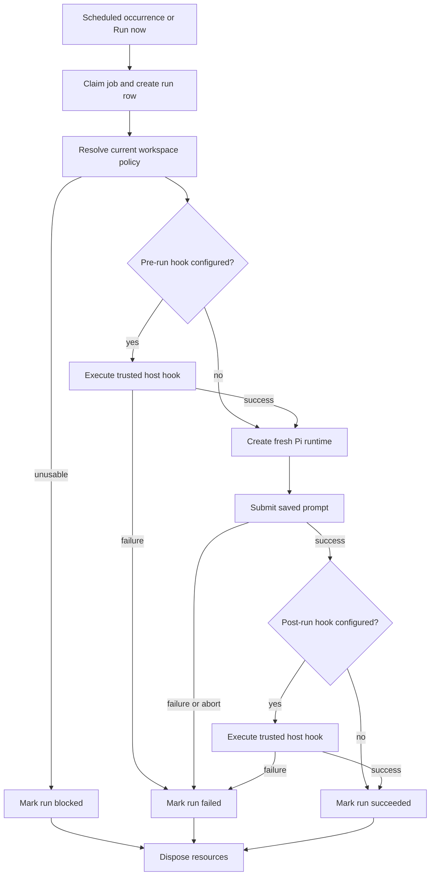
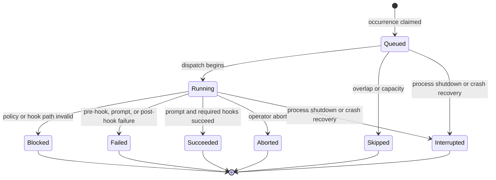

# Scheduled Jobs Design

**Status:** Proposed

**Runtime:** Node.js 22.19+, TypeScript

**Audience:** Implementers and maintainers

## 1. Summary

ChatWCA scheduled jobs run a saved prompt in the context of a registered workspace on a recurring schedule. A job may also name optional pre-run and post-run Bash scripts. Each invocation creates a fresh persistent Pi conversation, so the complete agent transcript remains inspectable through the existing conversation interface.

Jobs execute on the server without requiring a connected browser. They use the same workspace admission, Pi runtime, sandbox, mount, model, and managed-egress policies as interactive conversations. A job resolves the workspace's current effective policy at the beginning of each run rather than preserving authority from the time the job was configured.

Hook scripts are different from Pi tools. They are trusted operator automation, execute outside Bubblewrap as the ChatWCA service user, and therefore have the host authority of that user. Script files must be outside the workspace and beneath administrator-configured script roots so a sandboxed agent cannot rewrite the hook that ChatWCA will execute.

The web application gains a thin top-level navigation rail for switching between **Conversations** and **Jobs**. The Jobs page shows configured jobs in a table and provides job editing, manual execution, enable/disable controls, and run history.

## 2. Goals

- Configure a recurring prompt for a registered workspace.
- Support fixed intervals such as every four hours and calendar schedules such as daily at 07:00.
- Assign an explicit IANA timezone to calendar schedules.
- Run jobs without a connected browser.
- Create a fresh Pi conversation for every invocation.
- Apply the workspace's current effective runtime and security policy to each invocation.
- Execute optional trusted pre-run and post-run Bash scripts from outside the workspace.
- Prevent the same job from running concurrently with itself.
- Persist job definitions, scheduling state, and bounded run diagnostics in SQLite.
- Preserve generated conversations in Pi's canonical JSONL session store.
- Recover predictably from restarts, shutdowns, missed schedules, and failed runs.
- Expose job status, previous runs, next-run time, hook results, and generated conversations in the UI.
- Keep interactive and scheduled conversations within the existing global live-runtime limit.

## 3. Non-goals

The initial implementation does not include:

- User-authored cron expressions
- One-time jobs
- Weekday, monthly, or calendar-rule schedules
- Dependencies or directed graphs between jobs
- Parallel steps within a job
- Multiple prompts in one run
- Reusing conversational context from an earlier run
- Automatic retries after a failed prompt or hook
- Catching up every occurrence missed while the server was stopped
- Concurrent runs of the same job
- Running hook scripts inside Bubblewrap
- Per-job Unix users, containers, cgroups, or resource quotas
- Interactive approval before an occurrence runs
- Browser-authored shell commands or hook arguments
- A separate artifact store
- Horizontal scheduling across multiple ChatWCA processes

## 4. Terminology

- **Job definition:** Persistent configuration containing a workspace, prompt, schedule, and optional hooks.
- **Job occurrence:** A scheduled time at which a job is due.
- **Job run:** A persisted attempt started for a scheduled occurrence or by **Run now**.
- **Hook:** A trusted host-side Bash script executed before or after the Pi prompt.
- **Generated conversation:** The fresh Pi session created for one job run.
- **Misfire:** An occurrence that became due while ChatWCA was not running or could not dispatch it on time.

## 5. Execution model

Each run follows this sequence:



A pre-run failure prevents conversation creation and prompt submission. A post-run hook runs only after successful agent completion. A post-run failure marks the overall run failed, but the completed generated conversation remains available.

The runtime is disposed after the run reaches a terminal state. Its Pi session remains persisted and appears as a closed conversation in normal workspace history.

### 5.1 Fresh conversation per run

Every run creates a new persistent session using the workspace's configured session location:

```ts
SessionManager.create(workspace.path, workspace.sessionDirectory ?? undefined)
```

Runs never append to a previous job run's session. This prevents unbounded context growth, avoids accidental dependence on prior model state, and gives each occurrence an independent transcript.

The generated conversation receives a title derived from the job name and scheduled time, for example:

```text
[Job] Daily international news — 2026-03-23 07:00 EDT
```

The Pi session ID is stored on the job-run row as soon as the runtime exists. If the prompt reaches a terminal assistant response, Pi's normal persistence behavior makes the JSONL session durable. Pre-hook failures have no conversation ID.

### 5.2 Workspace policy

A job stores only `workspaceId`; it does not store a browser-supplied runtime policy. At the beginning of every run, the server calls the same trusted workspace resolution used for interactive runtime creation.

The run therefore uses current values for:

- canonical workspace path;
- session-storage policy;
- effective security profile;
- filesystem mounts;
- isolated or managed-egress network policy; and
- selected administrator-defined destination-policy set.

A job does not pin old authority. If the workspace becomes unavailable, a mount disappears, sandbox admission fails, managed egress is disabled, or a selected destination set is removed, the occurrence is recorded as blocked and no hook or prompt runs.

A run holds the resolved policy immutably after it begins. Workspace changes already prohibited by a live runtime remain prohibited while the generated conversation is live.

### 5.3 Interaction with the conversation registry

Job conversations use the global `ConversationRegistry` and count against `CHATWCA_MAX_LIVE_CONVERSATIONS`. Registry creation may evict the least-recently-used idle runtime under the existing rules. It never evicts an active runtime.

If all runtime slots are active, a scheduled occurrence is recorded as skipped with `live_runtime_limit`; it is not retried automatically. A manual run returns the same stable error without changing the recurring schedule.

A running job conversation may be observed from the Conversations section. While job-owned execution is active:

- additional prompt, steer, follow-up, fork, rewind, rename, close, and delete commands are rejected;
- abort is permitted and aborts the owning job run; and
- the conversation displays a **Scheduled job** badge and a link to its run.

After the run finishes and its runtime is disposed, the persisted conversation behaves like an ordinary closed conversation and may be opened or continued. Continuing it does not alter the already-recorded job result.

## 6. Schedule model

The initial release supports two closed schedule variants.

```ts
type JobSchedule =
  | {
      kind: "interval";
      intervalMinutes: number;
      anchorAt: number;
    }
  | {
      kind: "daily";
      localTime: string; // HH:mm, 24-hour form
      timeZone: string;  // IANA name, for example America/New_York
    };
```

### 6.1 Fixed interval

An interval schedule represents a duration rather than a wall-clock time. Examples include every four hours and every 24 hours.

- `intervalMinutes` is a positive integer within configured schema bounds.
- `anchorAt` is an epoch-millisecond instant used to avoid drift.
- Future occurrences are computed as anchor plus an integer multiple of the interval.
- Runtime duration does not shift later occurrences.
- Editing the interval establishes a new anchor and recomputes the next occurrence.

### 6.2 Daily calendar schedule

A daily schedule represents one local wall-clock time in an IANA timezone.

- `localTime` must be canonical `HH:mm` 24-hour text.
- `timeZone` must be a supported IANA timezone, not a fixed display abbreviation.
- The scheduler uses a timezone-aware library rather than adding 24 hours.
- During a daylight-saving spring gap, a nonexistent local time runs at the first valid instant after the gap.
- During a daylight-saving fallback, an ambiguous local time runs once at its earlier occurrence.

This keeps “daily at 07:00” at 07:00 local time across daylight-saving transitions.

### 6.3 Next occurrence

`next_run_at` is persisted in SQLite as an epoch-millisecond instant. It is derived from the validated schedule but stored so restart behavior is deterministic and the Jobs table can be rendered without recalculating every row.

Creating or enabling a job computes the first future occurrence. Disabling a job sets `next_run_at` to `NULL`. Editing a schedule computes a new first future occurrence and does not rewrite prior runs.

**Run now** does not modify `next_run_at` or the schedule anchor.

### 6.4 Misfires and overlap

The scheduler never creates concurrent runs of the same job.

On startup, an enabled job whose `next_run_at` is in the past produces at most one catch-up run. The scheduler then advances `next_run_at` to the first occurrence strictly after the current time. It does not replay every missed occurrence.

If an occurrence becomes due while the same job is still active, that occurrence is recorded as skipped with `job_already_running`, and the next occurrence advances normally.

Manual execution is also rejected while the job is active. It does not queue a second run.

## 7. Scheduler ownership and lifecycle

The scheduler is a process-global server service, alongside the workspace repository and conversation registry. It starts after configuration, database migration, workspace services, and runtime dependencies have initialized, but before the server reports itself ready.

The scheduler:

1. reads enabled jobs and their persisted `next_run_at` values;
2. reconciles interrupted rows from a previous process;
3. starts at most one catch-up run per overdue job;
4. arms a timer for the nearest future occurrence;
5. claims due occurrences transactionally;
6. advances `next_run_at` in the same transaction that creates the run row; and
7. dispatches claimed runs independently of browser connections.

JavaScript timer delays are bounded, so a distant occurrence is approached through capped timers and the database is checked again when each timer wakes. The scheduler compares persisted instants against the current wall clock and does not assume that a timer fired exactly on time.

ChatWCA continues to require one server process. SQLite claims prevent duplicate dispatch within that process but are not a multi-process leader-election mechanism.

### 7.1 Restart recovery

Runs left in a nonterminal state after an unclean process exit are marked `interrupted` during startup. They are not resumed because resuming could repeat hook side effects or submit the prompt twice.

The job's recurring schedule is then reconciled using the single-catch-up rule. An interrupted run and a later catch-up run remain distinct records.

### 7.2 Graceful shutdown

Graceful shutdown performs these job-specific steps before closing SQLite:

1. stop claiming scheduled or manual runs;
2. cancel scheduler timers;
3. reject new job CRUD or run commands as appropriate;
4. terminate active hook process groups;
5. request aborts for active job conversations;
6. mark unfinished runs `interrupted`; and
7. dispose generated runtimes through the conversation registry.

These steps share the existing `CHATWCA_SHUTDOWN_GRACE_MS` deadline. A browser disconnect does not stop a job.

## 8. Trusted Bash hooks

### 8.1 Trust boundary

Hook scripts are trusted operator automation. They are not model-generated tools and do not run inside the workspace Bubblewrap worker.

They execute as the ChatWCA service user and therefore may have access to host files and network resources available to that user. Workspace sandbox and managed-egress restrictions apply to Pi coding tools, not to hooks. The UI and documentation must disclose this distinction:

> Pre-run and post-run scripts run on the host with the ChatWCA service user's authority. Configure only trusted scripts.

Keeping hook files outside the workspace prevents a sandboxed agent from modifying its own hook. It does not make an untrusted script safe and does not constrain what a trusted hook can do with workspace content.

### 8.2 Administrator-configured roots

A new startup variable defines where hook files may reside:

| Variable | Default | Purpose |
|---|---:|---|
| `CHATWCA_JOB_SCRIPT_ROOTS` | `[]` | JSON array of canonical directories containing trusted hook scripts |
| `CHATWCA_JOB_HOOK_TIMEOUT_MS` | `300000` | Positive maximum runtime for one hook, capped at 3600000 ms |
| `CHATWCA_JOB_HOOK_MAX_OUTPUT_BYTES` | `1048576` | Positive aggregate stdout/stderr bound per hook |

An empty root list permits jobs without hooks but rejects any job that configures a hook.

At startup, every root must be an existing canonical directory readable and searchable by the service user. Script roots become protected paths for workspace and mount admission. A workspace or mount may not overlap a script root in either direction. This preserves the rule that Pi tools cannot rewrite configured hooks, including through a writable mount.

The browser receives only enough configuration to indicate whether hooks are available and the accepted root display paths. It does not receive unrelated protected paths or private diagnostics.

### 8.3 Path validation

A hook path is validated when a job is created or updated and again immediately before execution. It must:

- be an absolute path;
- resolve canonically beneath exactly one configured script root;
- identify a readable regular file;
- not be a symbolic link at the submitted final path;
- remain outside the selected workspace;
- remain outside every workspace mount;
- remain outside ChatWCA data, Pi state/session directories, native helper paths, and other protected runtime paths; and
- contain no NUL or other invalid path data.

If a previously valid path disappears, changes type, becomes a symlink, leaves its configured root, or conflicts with current workspace policy, the run is blocked before any hook or prompt executes.

### 8.4 Process execution

Hooks are invoked without shell-string construction:

```ts
spawn("/usr/bin/bash", ["--", canonicalScriptPath], {
  cwd: workspace.path,
  env: buildHookEnvironment(run),
  stdio: ["ignore", "pipe", "pipe"],
  detached: true,
});
```

No browser-authored arguments are accepted. Bash receives the script as a positional file argument rather than through `bash -c`, preventing prompt, workspace, or metadata values from becoming shell syntax.

The child receives a small documented environment containing normal execution essentials and job metadata:

```text
HOME
LANG
PATH
CHATWCA_JOB_ID
CHATWCA_JOB_NAME
CHATWCA_RUN_ID
CHATWCA_RUN_TRIGGER
CHATWCA_SCHEDULED_FOR
CHATWCA_WORKSPACE_ID
CHATWCA_WORKSPACE
CHATWCA_CONVERSATION_ID
CHATWCA_RUN_PHASE
CHATWCA_RUN_STATUS
```

`CHATWCA_CONVERSATION_ID` is empty during the pre-run hook because the conversation is created only after pre-run succeeds. The post-run hook receives the generated conversation ID and `CHATWCA_RUN_STATUS=succeeded` for the prompt phase.

The prompt and hook paths are not placed in environment variables. Provider credentials are not deliberately copied into the hook environment. A trusted script may use ordinary service-user files or credential mechanisms available on the host.

### 8.5 Timeouts, output, and termination

Stdout and stderr are captured separately but bounded by one aggregate byte limit. Exceeding the limit terminates the hook and records `job_hook_output_limit`. Output is retained as bounded run diagnostics and is never inserted into model context automatically.

At timeout, abort, or shutdown, ChatWCA sends termination to the hook's process group, waits a short bounded interval, and then force-kills remaining descendants. Stable public errors omit host stacks and internal process diagnostics.

Hook success requires an exit status of zero. Signal termination or a nonzero status is failure.

## 9. Persistence

SQLite remains canonical for job definitions, schedule state, and run metadata. Pi JSONL remains canonical for generated conversation messages and images.

The proposed schema advances the database to version 7.

```sql
CREATE TABLE jobs (
  id TEXT PRIMARY KEY,
  name TEXT NOT NULL,
  workspace_id TEXT NOT NULL
    REFERENCES workspaces(id) ON DELETE RESTRICT,
  prompt TEXT NOT NULL,
  schedule_kind TEXT NOT NULL
    CHECK (schedule_kind IN ('interval', 'daily')),
  interval_minutes INTEGER,
  anchor_at INTEGER,
  daily_time TEXT,
  time_zone TEXT,
  pre_run_script TEXT,
  post_run_script TEXT,
  enabled INTEGER NOT NULL DEFAULT 1
    CHECK (enabled IN (0, 1)),
  next_run_at INTEGER,
  created_at INTEGER NOT NULL,
  updated_at INTEGER NOT NULL,
  CHECK (
    (schedule_kind = 'interval'
      AND interval_minutes IS NOT NULL
      AND anchor_at IS NOT NULL
      AND daily_time IS NULL
      AND time_zone IS NULL)
    OR
    (schedule_kind = 'daily'
      AND interval_minutes IS NULL
      AND anchor_at IS NULL
      AND daily_time IS NOT NULL
      AND time_zone IS NOT NULL)
  ),
  CHECK (
    (enabled = 0 AND next_run_at IS NULL)
    OR
    (enabled = 1 AND next_run_at IS NOT NULL)
  )
);

CREATE INDEX jobs_due_idx
  ON jobs(enabled, next_run_at);

CREATE TABLE job_runs (
  id TEXT PRIMARY KEY,
  job_id TEXT NOT NULL
    REFERENCES jobs(id) ON DELETE CASCADE,
  conversation_id TEXT,
  trigger TEXT NOT NULL
    CHECK (trigger IN ('scheduled', 'manual', 'catch-up')),
  scheduled_for INTEGER NOT NULL,
  started_at INTEGER,
  finished_at INTEGER,
  status TEXT NOT NULL
    CHECK (status IN (
      'queued',
      'running',
      'succeeded',
      'failed',
      'blocked',
      'skipped',
      'aborted',
      'interrupted'
    )),
  phase TEXT
    CHECK (phase IS NULL OR phase IN ('pre-hook', 'prompt', 'post-hook')),
  error_code TEXT,
  error_message TEXT,
  pre_exit_code INTEGER,
  pre_stdout TEXT,
  pre_stderr TEXT,
  post_exit_code INTEGER,
  post_stdout TEXT,
  post_stderr TEXT,
  created_at INTEGER NOT NULL,
  updated_at INTEGER NOT NULL
);

CREATE INDEX job_runs_job_time_idx
  ON job_runs(job_id, scheduled_for DESC);

PRAGMA user_version = 7;
```

Application validation applies tighter bounds than the abbreviated SQL schema, including job-name and prompt limits, canonical daily-time formatting, supported timezone validation, safe integer timestamps, and interval bounds.

Migration from schema version 6 creates empty `jobs` and `job_runs` tables transactionally. It does not inspect Pi history, create runtimes, execute hooks, or alter workspaces.

### 9.1 Retention and deletion

Run metadata is small and hook output is bounded. Version 1 retains run rows until the parent job is deleted. A later retention policy may prune old diagnostics without deleting Pi sessions.

Deleting a job:

- is rejected while that job has an active run;
- deletes its job definition and run metadata;
- never deletes generated Pi conversations or workspace files; and
- requires confirmation that explicitly describes this behavior.

A workspace with configured jobs cannot be removed until those jobs are deleted. Renaming a workspace does not affect its jobs. Path, mount, security, or network-policy changes follow existing live-runtime locks and affect subsequent runs.

If a generated Pi session is later deleted through Conversations or externally, its run row remains. The Jobs UI reports the conversation as unavailable rather than treating the run record as corrupt.

## 10. Run states and errors



`phase` identifies the active or failed stage. Errors use stable codes, including:

- `job_not_found`
- `job_invalid`
- `job_busy`
- `job_disabled`
- `job_already_running`
- `job_script_roots_unavailable`
- `job_script_invalid`
- `job_script_unavailable`
- `job_pre_run_failed`
- `job_post_run_failed`
- `job_hook_timeout`
- `job_hook_output_limit`
- `job_prompt_failed`
- `job_aborted`
- `job_interrupted`
- `live_runtime_limit`

Existing workspace, sandbox, network-policy, model, image, session, and runtime error codes are reused where applicable. `blocked` represents an admission or configuration condition that prevented execution; `failed` represents execution that began but did not complete successfully; `skipped` represents an intentional non-start caused by overlap or runtime capacity.

An accepted prompt's provider failure is reflected both in the generated conversation and in the run as `failed` with phase `prompt`.

## 11. Server API and WebSocket protocol

Jobs use the existing authenticated-network assumption and same-origin WebSocket transport. TypeBox validates closed command schemas. Browser commands never contain shell source, shell arguments, environment-variable maps, runtime policies, network destinations, or arbitrary policy documents.

Representative commands:

```ts
type JobCommand =
  | { type: "job.list" }
  | {
      type: "job.create";
      name: string;
      workspaceId: string;
      prompt: string;
      schedule: JobSchedule;
      preRunScript?: string;
      postRunScript?: string;
      enabled: boolean;
      acknowledgeHostHooks?: true;
    }
  | {
      type: "job.update";
      jobId: string;
      name?: string;
      workspaceId?: string;
      prompt?: string;
      schedule?: JobSchedule;
      preRunScript?: string | null;
      postRunScript?: string | null;
      enabled?: boolean;
      acknowledgeHostHooks?: true;
    }
  | { type: "job.delete"; jobId: string }
  | { type: "job.run"; jobId: string }
  | { type: "job.abort"; jobId: string; runId: string }
  | { type: "job.runs"; jobId: string; cursor?: string }
  | { type: "job.run.state"; jobId: string; runId: string };
```

All concrete commands include a client-generated `requestId`.

Representative responses and events:

```ts
type JobServerMessage =
  | { type: "jobs"; jobs: JobSummary[] }
  | { type: "job.runs"; jobId: string; runs: JobRunSummary[]; nextCursor?: string }
  | { type: "job.run.state"; run: JobRunState }
  | {
      type: "job.run.updated";
      jobId: string;
      runId: string;
      revision: number;
      run: JobRunSummary;
    };
```

Job definitions and run summaries are broadcast to connected clients when their authoritative state changes. Hook output is included only in an explicitly requested run detail, not in every table update.

Run-history listing is cursor-paginated and ordered newest first. A job-run event includes a monotonic per-run revision so stale clients can replace their state through `job.run.state`.

## 12. Frontend design

### 12.1 Global navigation

A narrow icon rail introduces top-level application sections:

```text
┌────┬──────────────────────────────────────────────────────┐
│ 💬 │ Conversations                                        │
│ ⏱ │ Jobs                                                 │
│    │                                                      │
└────┴──────────────────────────────────────────────────────┘
```

The rail:

- remains visually distinct from the existing workspace sidebar;
- provides visible selected, hover, and keyboard-focus states;
- uses accessible text labels and tooltips rather than icons alone;
- collapses appropriately on narrow screens; and
- keeps the current section in browser memory only.

The Conversations section retains the existing workspace and conversation interface. Switching sections does not stop active conversations or jobs.

### 12.2 Jobs table

The Jobs page initially lists all configured jobs across workspaces:

| Name | Workspace | Schedule | Last run | Next run | Status | Enabled | Actions |
|---|---|---|---|---|---|---|---|

The page supports text search and workspace filtering without changing the Conversations section's selected workspace.

Row actions are:

- **Run now**
- **View runs**
- **Edit**
- **Enable/disable**
- **Delete**

Times are displayed in the schedule's timezone where applicable, with an exact timestamp available in accessible detail text. Status is not conveyed by color alone.

### 12.3 Job editor

A portal-backed accessible modal contains:

- job name;
- workspace selector;
- multiline prompt;
- schedule type;
- interval or daily schedule fields;
- IANA timezone selector for daily schedules;
- optional pre-run script path;
- optional post-run script path;
- enabled state;
- effective workspace security and network summary; and
- trusted-host-hook disclosure and confirmation when either hook is present.

The editor validates schedule and script paths on the server. Client checks are preliminary. The workspace selector shows unavailable and policy-blocked workspaces but does not permit saving an enabled job against one without an explicit server result.

Editing or deleting is locked while the job has an active run. Disabling an active job is allowed and prevents future occurrences but does not abort the active run. Abort remains a separate explicit action.

### 12.4 Run history and detail

The run-history view shows:

- trigger type;
- scheduled, started, and finished times;
- status and failed phase;
- duration;
- stable error message;
- pre/post exit status;
- bounded hook stdout/stderr; and
- a link to the generated conversation when available.

An active detail view updates from run events. The user may abort an active run. Hook output is rendered as escaped, bounded monospace text and never as HTML or Markdown.

## 13. Example

```text
Name:
  Daily international news

Workspace:
  News

Prompt:
  Build a Markdown file with the top 10 international news
  stories of the day.

Schedule:
  Daily at 07:00 America/New_York

Pre-run script:
  None

Post-run script:
  /home/adrian/chatwca-scripts/post-news-generation.sh
```

A successful occurrence behaves conceptually as:

```text
07:00 scheduler claims occurrence
07:00 workspace policy is resolved
07:00 fresh Pi conversation is created
07:00 configured prompt is submitted
07:04 agent completes successfully
07:04 post-news-generation.sh runs with workspace as cwd
07:04 run is marked succeeded
07:04 runtime is disposed; Pi conversation remains in history
```

## 14. Operational behavior

### 14.1 Availability and health

Scheduler initialization failure prevents server startup. An individual invalid persisted job does not prevent startup; it is exposed as blocked and cannot run until corrected.

`GET /api/health` continues to report process health. Client-safe scheduler availability and hook-root availability are added to `GET /api/config`. Private script validation errors and host diagnostics remain in server logs.

### 14.2 Backups

Job definitions and run metadata are included in the existing SQLite backup procedure. Generated conversations remain in Pi's default or workspace-local session directories and must be backed up separately as already documented.

A restore must occur while ChatWCA is stopped. On first startup after restore, nonterminal restored runs become interrupted and overdue schedules follow the one-catch-up rule.

### 14.3 Clock and timezone data

The host clock must be synchronized. Schedule calculations use persisted UTC instants plus explicit IANA timezone identifiers. Updating host timezone data may change future daily occurrence calculations; it does not rewrite historical run timestamps.

Changing the process's local timezone has no effect on a daily job with an explicit timezone.

## 15. Security considerations

- ChatWCA still has no application authentication or authorization. Every client admitted by the reverse proxy or network boundary can configure, run, disable, and delete jobs.
- A scheduled prompt may send readable workspace content to the configured model provider without an operator being present.
- A managed-egress workspace may send content to destinations allowed by its current selected policy set.
- Hook scripts bypass workspace sandbox and managed-egress restrictions and run with the ChatWCA service user's host authority.
- Only trusted, administrator-controlled script roots may contain hooks.
- Hook scripts can read or modify workspace files because they run with the workspace as their current directory and with service-user permissions.
- External script placement prevents Pi tools from rewriting hooks only when script roots remain disjoint from every workspace and mount.
- Script paths are arguments to a fixed Bash executable and are never interpolated into shell source.
- Prompt text, workspace names, paths, and model output are never evaluated as shell syntax by ChatWCA.
- Hook output may contain sensitive data. It is bounded, persisted in SQLite, and shown only to fully trusted ChatWCA clients.
- Jobs introduce unattended model usage and provider cost. The UI must display enabled state and next-run time prominently.
- The existing single-process deployment rule remains mandatory to prevent duplicate live session writers and duplicate scheduling.

## 16. Testing strategy

### 16.1 Unit tests

- closed schedule-schema validation;
- interval occurrence calculation without runtime drift;
- daily occurrence calculation across timezone and DST transitions;
- next-run calculation after create, edit, enable, disable, and manual run;
- single-catch-up behavior after multiple missed occurrences;
- same-job overlap prevention;
- schema-v6-to-v7 migration;
- job CRUD and workspace foreign-key restrictions;
- transactional occurrence claim and next-run advancement;
- interrupted-run recovery;
- hook-root configuration validation;
- canonical hook path admission and symlink rejection;
- workspace, mount, Pi state, data, and protected-path overlap rejection;
- fixed Bash argument construction without `bash -c`;
- sanitized hook environment construction;
- hook timeout, output limit, exit-code, signal, and process-group handling;
- stable run-state transitions and errors; and
- bounded serialization of hook diagnostics.

### 16.2 Integration tests

Use temporary SQLite, Pi state, workspaces, and script roots with a fake provider to verify:

- jobs run without a WebSocket client;
- every occurrence creates a distinct Pi session;
- generated conversations use the configured workspace session store;
- current workspace sandbox, mount, network, and named destination policy is resolved for every run;
- unavailable workspaces and removed policy sets block runs before hooks execute;
- pre-hook success precedes conversation creation;
- pre-hook failure prevents prompt submission;
- post-hook runs only after successful agent completion;
- post-hook failure retains the completed conversation and fails the run;
- hook cwd and documented metadata are correct;
- hook scripts execute outside Bubblewrap as the service user;
- manual runs do not move the recurring schedule;
- active job runs prevent overlap;
- runtime limits and LRU behavior match interactive conversations;
- active job conversations reject external mutation but permit abort;
- successful runs dispose runtimes while preserving Pi history;
- restart marks active runs interrupted and performs no duplicate resume;
- only one overdue catch-up run is created;
- graceful shutdown terminates hooks, aborts model runs, and records interruption; and
- deleting jobs never deletes generated Pi sessions.

### 16.3 Browser tests

- switch between Conversations and Jobs with the icon rail;
- create interval and daily jobs;
- validate and display timezone-aware next-run times;
- configure pre/post hooks and acknowledge host authority;
- list and filter jobs across workspaces;
- enable, disable, edit, run now, and delete jobs;
- lock edits during an active run;
- observe live run status and abort a run;
- inspect bounded hook output and errors;
- navigate from a run to its generated conversation;
- show a missing generated conversation without breaking run history;
- render unavailable workspace and script-policy failures;
- preserve accessible focus containment, restoration, labels, and keyboard navigation; and
- maintain the dark-only responsive layout at laptop and narrow viewport sizes.

## 17. Implementation sequence

1. **Schema and repository** — schema v7, job/run records, CRUD, validation, and migrations.
2. **Schedule calculations** — interval and daily recurrence, timezone handling, next-run persistence, and misfire rules.
3. **Hook configuration** — trusted roots, protected-path integration, canonical validation, process execution, bounds, and shutdown.
4. **Job runner** — workspace resolution, pre-hook, fresh runtime, prompt completion, post-hook, run states, and cleanup.
5. **Scheduler** — due-row claims, timers, overlap prevention, startup recovery, catch-up behavior, and graceful shutdown.
6. **Protocol** — TypeBox commands, summaries, paginated run history, revisions, and events.
7. **Navigation and table** — top-level rail, Jobs page, filters, status, and actions.
8. **Editor and run detail** — accessible forms, disclosures, hook diagnostics, abort, and conversation links.
9. **Hardening** — backpressure, path-race revalidation, process-tree cleanup, clock behavior, and complete release tests.

## 18. Acceptance criteria

The scheduled-jobs design is complete when:

- an operator can create, edit, enable, disable, manually run, and delete a job;
- a job references one registered workspace and one saved prompt;
- fixed-hour intervals and timezone-aware daily schedules calculate deterministic next occurrences;
- enabled jobs execute without a connected browser;
- every invocation uses a fresh persistent Pi conversation;
- each invocation resolves the workspace's current effective security, mount, network, and destination-set policy;
- generated conversations remain available through normal workspace history after runtime disposal;
- the same job never runs concurrently with itself;
- restart produces at most one catch-up run per overdue job and never resumes an interrupted run;
- pre-run failure prevents prompt submission;
- post-run executes only after prompt success, and post-run failure retains the conversation while failing the run;
- hook scripts are canonical regular files beneath administrator-configured roots and outside all workspaces, mounts, and protected paths;
- hooks execute through fixed Bash arguments as the ChatWCA service user, outside Bubblewrap, with bounded duration and output;
- shutdown and abort terminate hook descendants and agent work without creating duplicate runs;
- job definitions and bounded run diagnostics persist in SQLite while Pi JSONL remains canonical for messages;
- the global live-runtime limit applies consistently to job and interactive conversations;
- a thin accessible navigation rail switches between Conversations and Jobs;
- the Jobs page displays configured jobs, schedules, last and next runs, status, workspace, and enabled state;
- run details expose phase, bounded hook diagnostics, stable errors, and generated-conversation links; and
- the UI clearly warns that hooks have the ChatWCA service user's host authority and that scheduled prompts can incur unattended model usage and data disclosure.
