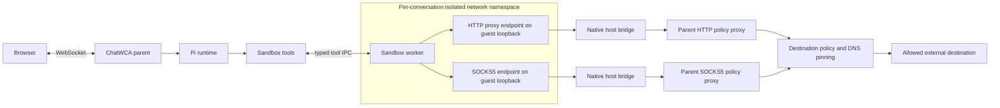

# Managed Network Sandbox Design

**Status:** Implemented, including the schema-v5 named policy-set and responsive workspace-modal amendment

**Platform:** Linux

**Runtime:** Node.js 22.19+, Bubblewrap 0.6.1+, native network helper

**Related design:** [`bubblewrap-design.md`](bubblewrap-design.md)

**Design reference:** Codex CLI managed network proxy, reviewed at commit `55e5158e18`

## 1. Summary

ChatWCA will add optional, destination-filtered egress to workspace-sandboxed conversations without giving sandboxed processes direct access to the host or external network.

The existing Bubblewrap profile remains the hard boundary. A managed-egress worker still runs in an isolated network namespace with no external interface, route, or usable DNS. A small native Linux helper makes only two guest-loopback endpoints reachable: a parent-owned HTTP proxy and a parent-owned SOCKS5 proxy dedicated to that conversation.

The initial implementation will:

- keep isolated networking as the default;
- require an administrator-configured global domain/port ceiling and an immutable named destination-policy set per managed workspace;
- deny local, private, link-local, metadata, multicast, and reserved addresses;
- support HTTP, HTTPS `CONNECT`, WebSocket-over-HTTP(S), and SOCKS5 TCP;
- leave HTTPS end-to-end encrypted and perform no TLS interception;
- resolve and validate destinations in the parent before connecting to a pinned IP;
- emit bounded security audit events without URL paths, query strings, headers, or content;
- tear down proxy and bridge resources with the conversation runtime; and
- fail closed on proxy, bridge, policy, DNS, or helper failure.

The feature is called **Managed egress** in the UI. It is not described as safe or unrestricted network access.

## 2. Motivation

The current workspace sandbox uses Bubblewrap `--unshare-net`. This correctly blocks direct IPv4, IPv6, DNS, and loopback access, but it also prevents legitimate tasks such as:

- downloading package metadata and dependencies;
- accessing an approved source-code host over HTTPS;
- fetching public API documentation;
- connecting to an approved Git remote over HTTPS; and
- running tests that contact an explicitly approved external service.

Injecting `HTTP_PROXY` alone is insufficient. Host loopback is not visible inside a new network namespace, and a process could unset proxy variables if direct networking were otherwise available.

The required invariant is:

> A managed-egress process has no direct network path. Its only external path is through a parent-owned proxy that independently enforces destination policy.

## 3. Goals

- Preserve the existing isolated network namespace as the hard boundary.
- Keep `isolated` as the default for existing and new workspaces.
- Add an explicit `managed-egress` policy for workspace-sandboxed conversations.
- Make only conversation-owned proxy endpoints reachable from the guest.
- Support common HTTP-aware development tools and package managers.
- Support SOCKS5 TCP for clients that honor `ALL_PROXY`.
- Enforce a selected administrator-defined named policy set beneath the global domain/port ceiling in the parent process.
- Prevent access to host loopback, LANs, cloud metadata services, and other non-public addresses.
- Resolve DNS in the parent and pin the validated address used by the outbound connection.
- Re-evaluate every HTTP request, HTTPS tunnel, and SOCKS connection.
- Bound connection counts, setup time, idle time, and transferred bytes.
- Stream ordinary command output without routing it through the network control protocol.
- Show the immutable effective network policy on every live conversation.
- Record allowed and blocked decisions without logging request content.
- Preserve per-conversation worker isolation and lifecycle behavior.
- Fail closed without falling back to unrestricted or isolated tools after an accepted managed-egress operation.

## 4. Non-goals

The initial release will not provide:

- unrestricted sandbox egress;
- TLS interception or a managed certificate authority;
- HTTP method or URL-path filtering inside HTTPS;
- request-body inspection or data-loss prevention;
- a guarantee that an allowed destination cannot receive workspace content;
- interactive one-time or session network approvals;
- user-editable domain rules or policy-set definitions in the browser;
- SOCKS5 UDP, arbitrary UDP, ICMP, inbound connections, or port forwarding;
- Unix-domain socket proxying;
- Git-over-SSH compatibility wrappers;
- transparent proxying for clients that ignore proxy variables;
- upstream corporate HTTP proxy chaining;
- per-destination bandwidth quotas;
- cgroup-based CPU, memory, process, or network-rate limits; or
- non-Linux implementations.

Transparent proxying is unnecessary for enforcement. A client that ignores the proxy cannot reach the external network and fails closed.

## 5. Security model

### 5.1 Trust boundaries

The following components are trusted:

- the ChatWCA parent process;
- the administrator-provided network configuration;
- the parent-owned HTTP and SOCKS5 proxy implementations;
- the native network helper loaded by the parent;
- Bubblewrap and the Linux kernel; and
- the existing Pi runtime and model-provider integration in the parent.

The following are untrusted:

- model output;
- repository files and instructions;
- sandboxed shell commands and descendants;
- the sandbox worker after launch; and
- all bytes received from proxy clients.

The native bridge transports bytes only to a fixed conversation-owned proxy endpoint. It does not evaluate model-supplied destinations or expose a general host connection API.

### 5.2 Provided properties

For a managed-egress conversation:

- Bubblewrap creates a distinct network namespace.
- The namespace has no external interface or default route.
- Guest DNS cannot reach a resolver.
- Direct connections to public, private, link-local, metadata, or host addresses fail.
- Unsetting proxy environment variables does not grant network access.
- Only guest-loopback listeners connected to the conversation proxy are reachable.
- The parent parses proxy requests and independently evaluates host and port policy.
- DNS resolution occurs outside the sandbox.
- The outbound connection uses a validated, pinned IP rather than resolving the hostname again.
- The proxy never opens a path supplied as a host filesystem path.
- A worker cannot select another conversation's proxy or policy.
- Proxy or bridge failure never enables direct networking.

### 5.3 Residual risks

Managed egress still permits:

- transmission of any readable workspace content to an allowed destination;
- exfiltration in URL paths, query strings, headers, request bodies, TLS streams, or protocol payloads;
- writes to an allowed service because the initial proxy does not restrict HTTP methods;
- malicious package metadata, dependencies, install scripts, Git content, and API responses;
- communication with any service legitimately hosted behind an allowed domain;
- compromise or misuse of an allowed destination;
- DNS changes between separate connections;
- denial of service within process-wide and connection limits; and
- bypass by code already running in the trusted ChatWCA parent process.

Allowing a package registry or source host is a data-disclosure decision, not merely a download capability. Even `GET`-only policies would not prevent content from being encoded in URLs, and enforcing methods inside HTTPS would require TLS interception.

The UI must show:

> Tools may transmit workspace content to configured destinations. Workspace content may also be sent to the configured model provider.

## 6. Architecture



A managed-egress live runtime owns:

```text
ConversationRuntime
├── PiConversationRuntime
├── SandboxController
├── SandboxWorker
├── ManagedNetworkRuntime
│   ├── HTTP policy proxy on a private host Unix socket
│   ├── SOCKS5 policy proxy on a private host Unix socket
│   ├── immutable destination policy
│   └── connection and audit state
└── native guest/host bridge processes
```

The parent proxies listen on private Unix sockets beneath the ChatWCA data directory. The native host bridges connect only to those sockets. No managed policy listener is exposed on the ChatWCA HTTP address or a host TCP port.

## 7. Policy model

```ts
type SandboxNetworkPolicy =
  | "isolated"
  | "managed-egress";

type ManagedEgressMode =
  | "disabled"
  | "optional";
```

`isolated` preserves the current behavior.

`managed-egress` retains the isolated namespace but exposes the controlled proxy route.

The administrator controls whether managed egress is available:

| Server mode | Stored `isolated` | Stored `managed-egress` |
|---|---|---|
| `disabled` | isolated | policy-blocked; never downgraded or upgraded silently |
| `optional` | isolated | managed-egress |

There is no `required` mode. Forcing every sandbox to have network access is not a security ceiling and would make the safer isolated policy unavailable.

The global administrator-owned domain and port lists are a process-wide security ceiling. Administrators may define named destination-policy sets as exact normalized subsets of that ceiling, and each managed workspace stores one set ID. Browser clients may select only those public IDs; they cannot add or widen destination rules. If no set variable is configured, the server synthesizes `default` from the complete global policy for compatibility with the original single-policy release. A missing selected set remains stored and policy-blocks the workspace rather than silently substituting another set.

## 8. Configuration

New server configuration:

| Variable | Default | Purpose |
|---|---:|---|
| `CHATWCA_MANAGED_EGRESS_MODE` | `disabled` | `disabled` or `optional` |
| `CHATWCA_NETWORK_HELPER_PATH` | packaged helper path | Canonical native Linux helper executable |
| `CHATWCA_NETWORK_ALLOWED_DOMAINS` | `[]` | JSON array of exact hosts, scoped domain wildcards, or the all-public-host `*` pattern |
| `CHATWCA_NETWORK_DENIED_DOMAINS` | `[]` | JSON array of explicit deny patterns; deny wins |
| `CHATWCA_NETWORK_ALLOWED_PORTS` | `[80,443]` | JSON array forming the global allowed TCP-port ceiling |
| `CHATWCA_NETWORK_POLICY_SETS` | unset | Closed JSON array of named exact-subset policies; unset synthesizes `default` from the complete global ceiling |
| `CHATWCA_NETWORK_MAX_CONNECTIONS` | `32` | Concurrent proxy connections per conversation |
| `CHATWCA_NETWORK_CONNECT_TIMEOUT_MS` | `10000` | DNS and connection setup deadline |
| `CHATWCA_NETWORK_IDLE_TIMEOUT_MS` | `300000` | Bidirectional connection idle deadline |
| `CHATWCA_NETWORK_MAX_CONNECTION_BYTES` | `1073741824` | Aggregate bytes allowed on one connection |

When managed egress is optional:

- `CHATWCA_NETWORK_ALLOWED_DOMAINS` must contain at least one valid allow entry;
- the native helper and architecture must validate during startup;
- every allowed port must be an integer from 1 through 65535;
- duplicate normalized domains and ports are rejected; and
- an entry present in both lists remains denied.

No parent proxy, cloud, provider, SSH-agent, or credential variable is inherited from `process.env`.

### 8.1 Named destination-policy sets

An explicit `CHATWCA_NETWORK_POLICY_SETS` value is a non-empty closed JSON array of `{id,label,allowedDomains,allowedPorts}` objects and contains exactly one `default`. IDs are bounded lowercase ASCII slugs; labels are bounded display text. IDs, normalized domains, and ports are unique within their applicable scope, and each set has non-empty domain and port lists. Every set entry must be an exact normalized member of its corresponding global ceiling: wildcard containment is not inferred. The selected set can only remove authority; global denials, non-public-address rejection, protocol restrictions, DNS pinning, and resource limits still apply.

When the variable is absent, startup synthesizes the stable `default` set from all global allowed domains and ports, preserving the original single-global-policy behavior. Configuration is immutable after startup. Each live runtime captures the selected compiled object and ID; a restart affects only runtimes created under the new process configuration.

### 8.2 Domain pattern syntax

Supported patterns are deliberately narrow:

```text
example.com       exact host only
*.example.com     subdomains only; does not include example.com
**.example.com    example.com and all subdomains
*                 every normalized host, subject to public-address and port checks
```

Arbitrary mid-label globs, URL strings, schemes, paths, query strings, credentials, and embedded ports are rejected. The all-host `*` pattern does not bypass explicit denies, DNS validation, non-public-address rejection, or the port ceiling.

Hosts are normalized by:

- trimming whitespace;
- removing one trailing DNS dot;
- converting DNS names to ASCII with IDNA processing;
- converting to lowercase;
- normalizing IPv4 and IPv6 literals; and
- rejecting empty, malformed, scoped, or ambiguous values.

An IP literal is not matched by a scoped domain wildcard. Public IP literals require an exact allow entry or the all-host `*` pattern and an allowed port. Non-public IP literals are always denied.

## 9. Persistence and protocol

### 9.1 Database migration

The original managed-egress migration advanced the workspace schema to version 4 by adding `network_policy`, defaulting every existing row to `isolated`. The named-set amendment advances it to version 5:

```sql
ALTER TABLE workspaces
ADD COLUMN network_policy_set_id TEXT NOT NULL DEFAULT 'default'
  CHECK (/* bounded lowercase ASCII slug */);

PRAGMA user_version = 5;
```

Every v1–v4 workspace migrates stepwise and transactionally to selected set `default`; v1–v3 rows also retain the established isolated-network migration. Migration does not change sessions or create helper/proxy resources.

The stored network policy is relevant only when the effective security profile is `workspace-sandboxed`. An unrestricted runtime retains unrestricted host networking under the existing trust model.

### 9.2 Workspace projection

Workspace wire objects add:

```ts
interface WorkspaceNetworkProjection {
  networkPolicy: SandboxNetworkPolicy;
  effectiveNetworkPolicy: SandboxNetworkPolicy | null;
  networkPolicySetId: string;
  effectiveNetworkPolicySetId: string | null;
  networkPolicyIssue:
    | "managed_egress_disabled"
    | "managed_egress_policy_set_unavailable"
    | null;
}
```

`effectiveNetworkPolicy` is `null` for an unrestricted effective security profile.

Workspace `usable` becomes false when it requests managed egress but the server disables it. The server never silently converts a stored managed-egress request to isolated networking.

### 9.3 Commands

`workspace.create` accepts optional `networkPolicy` and `networkPolicySetId`, defaulting to `isolated` and `default` for wire compatibility. `workspace.update` accepts optional network type/set fields and `acknowledgeNetworkExposure: true`. Enabling effective managed egress or changing the set of a managed workspace requires that acknowledgement; a smuggled acknowledgement is rejected. This is a safety acknowledgement, not an authorization boundary.

A network-policy, policy-set, security-profile, or workspace-path change is rejected with `workspace_busy` while a live runtime belongs to the workspace. Renaming remains allowed. Closed command schemas reject destination domains, ports, and raw rule documents.

Fork and rewind never accept a network policy or set from the browser. They freshly resolve the destination workspace and capture its effective compiled set.

### 9.4 Conversation state

`ConversationState` adds `networkPolicy`, stored `networkPolicySetId`, and nullable `effectiveNetworkPolicySetId`. These values are immutable for the live runtime and come from trusted workspace policy, not current browser form state.

## 10. Parent-owned proxy runtime

### 10.1 Ownership

A `ManagedNetworkRuntime` is created before its sandbox worker. It owns:

- immutable selected policy-set ID and compiled domain/port rules beneath mandatory global denials;
- one private HTTP Unix socket;
- one private SOCKS5 Unix socket;
- active outbound connections;
- connection counters and limits;
- blocked-decision observers; and
- shutdown state.

Socket paths are created in a process-private `0700` directory beneath the ChatWCA data directory. Existing socket paths cause startup to fail rather than being reused. Socket files are unlinked on bounded shutdown and cleaned as stale files during a safe server startup pass only after verifying ownership and type.

The socket directory is already outside every admitted sandbox workspace and is never mounted into Bubblewrap.

### 10.2 HTTP proxy

The HTTP proxy supports:

- absolute-form `http://` proxy requests;
- HTTPS and WebSocket tunnels through `CONNECT`; and
- ordinary HTTP methods in full mode.

For a plain HTTP request, the proxy:

1. parses the absolute target with Node's HTTP parser and URL implementation;
2. rejects credentials, unsupported schemes, malformed authority, and conflicting target metadata;
3. normalizes the destination host and selects the explicit or default port;
4. evaluates domain, port, and non-public-address policy;
5. resolves and pins a permitted IP;
6. reconstructs an origin-form outbound request;
7. strips proxy credentials and hop-by-hop headers;
8. preserves the destination `Host` header; and
9. streams the response without following redirects itself.

A client that follows a redirect creates a new proxy request, so the redirected host is independently evaluated.

For `CONNECT`, the proxy evaluates and pins the authority before opening the outbound TCP connection. It sends `200 Connection Established` only after the outbound connection succeeds, then relays opaque bytes. The proxy does not inspect TLS records or application data.

Blocked HTTP requests receive `403 Forbidden` and:

```text
x-chatwca-proxy-error: blocked-by-allowlist
x-chatwca-proxy-error: blocked-by-denylist
x-chatwca-proxy-error: blocked-local-address
x-chatwca-proxy-error: blocked-port
x-chatwca-proxy-error: policy-unavailable
```

Only one stable code is returned per response. Internal errors, resolved addresses, configuration, and host filesystem paths are not exposed.

### 10.3 SOCKS5 proxy

The SOCKS5 proxy supports:

- version 5;
- no-authentication negotiation on the private bridge;
- TCP `CONNECT` only;
- domain-name, IPv4, and IPv6 targets; and
- parent-side DNS for domain targets.

It rejects:

- username/password and custom methods;
- `BIND`;
- UDP association;
- malformed or oversized hostnames;
- scoped IPv6 addresses;
- local/private targets; and
- destinations rejected by domain or port policy.

SOCKS errors use the closest standard reply code and do not include private diagnostics.

### 10.4 Proxy environment

The native inner helper adds controlled proxy variables after Bubblewrap's `--clearenv` processing:

```text
HTTP_PROXY=http://127.0.0.1:<guest-http-port>
HTTPS_PROXY=http://127.0.0.1:<guest-http-port>
WS_PROXY=http://127.0.0.1:<guest-http-port>
WSS_PROXY=http://127.0.0.1:<guest-http-port>
ALL_PROXY=socks5h://127.0.0.1:<guest-socks-port>
NO_PROXY=
NODE_USE_ENV_PROXY=1
ELECTRON_GET_USE_PROXY=true
CHATWCA_MANAGED_EGRESS=1
```

Lowercase aliases and known npm, Yarn, Bundler, pip, and Docker proxy aliases are set to the same controlled endpoints where those tools support them.

The isolated profile receives none of these variables. The managed profile additionally mounts the host's `/etc/ssl/certs` directory read-only so standard clients can authenticate public HTTPS servers. This is a public trust store, not a ChatWCA CA; the parent proxy still never terminates TLS.

The environment variables are compatibility hints, not the enforcement boundary. Direct traffic remains impossible if they are removed or changed.

## 11. Destination and DNS policy

### 11.1 Decision order

Every requested connection is evaluated in this order:

1. Parse and normalize the host and port.
2. Reject an explicitly denied host.
3. Reject a port outside the allowed set.
4. Require an allowlist match.
5. Reject non-public IP literals unconditionally.
6. Resolve DNS names under a bounded deadline.
7. Reject resolution failure, timeout, an empty result, or any non-public result.
8. Select one validated address and connect directly to that IP.
9. Preserve the original hostname only as protocol metadata such as HTTP `Host` or opaque TLS content.

Deny rules always win and cannot be overridden by workspace state.

### 11.2 Non-public addresses

At minimum, the classifier rejects:

- IPv4 loopback, private, link-local, unspecified, multicast, broadcast, CGNAT, benchmarking, documentation, reserved, and `0.0.0.0/8` ranges;
- IPv6 loopback, unspecified, unique-local, link-local, multicast, IPv4-mapped non-public addresses, and non-routable special ranges; and
- cloud metadata destinations, including link-local metadata addresses.

The classifier is shared by HTTP, CONNECT, and SOCKS.

### 11.3 DNS rebinding defense

The proxy does not perform a policy lookup and then ask another API to resolve the hostname again. It resolves once, validates the complete answer set, chooses a validated address, and connects to that numeric address.

If any returned address is non-public, the entire connection is rejected. This avoids selecting a public answer while retaining a private answer that a retry or connection race might use.

DNS results are not trusted across connections. Each new connection is resolved and evaluated again.

## 12. Native Linux network helper

### 12.1 Why a native helper is required

Bubblewrap's new network namespace cannot reach a proxy bound on host loopback. The guest loopback interface also starts down, and enabling it requires namespace capability that must not remain available to the worker.

Node.js does not expose the complete secure descriptor-transfer, capability-drop, and seccomp APIs needed for this setup. A small native helper therefore establishes the bridge before executing the existing worker.

### 12.2 Launch sequence

The managed worker process tree is:

```text
ChatWCA parent
└── chatwca-network-helper --outer
    ├── HTTP host bridge
    ├── SOCKS host bridge
    └── bwrap
        └── chatwca-network-helper --inner
            └── node /app/worker.mjs
```

The outer helper:

1. validates its trusted, parent-supplied launch descriptor;
2. creates private Unix socket pairs for bootstrap control;
3. forks one host bridge for HTTP and one for SOCKS5;
4. closes unrelated descriptors in each bridge;
5. preserves only the required control, worker, and immutable-data descriptors;
6. supplies an immutable open copy of the helper to Bubblewrap at `/app/network-helper`;
7. inserts the inner helper as the Bubblewrap command; and
8. launches Bubblewrap without a shell.

The inner helper:

1. verifies its protocol version and expected inherited descriptors;
2. verifies it is in distinct user, PID, IPC, UTS, mount, and network namespaces;
3. brings up only the guest `lo` interface;
4. binds ephemeral HTTP and SOCKS5 listeners on guest IPv4 loopback;
5. sends each listener FD to its host bridge over the private bootstrap socket using `SCM_RIGHTS`;
6. waits for bridge acknowledgement;
7. rewrites the fixed proxy environment to the guest ports;
8. closes all bootstrap descriptors;
9. drops effective, permitted, inheritable, ambient, and bounding capabilities;
10. sets secure bits and `PR_SET_NO_NEW_PRIVS`;
11. installs the proxy-routed seccomp filter; and
12. executes the immutable sandbox worker.

A host bridge receives exactly one authenticated listener handoff. It verifies that the descriptor is a listening TCP socket bound to nonzero IPv4 loopback in the isolated namespace. For each accepted guest connection, it opens only its fixed private parent Unix socket and relays bytes bidirectionally.

No model-supplied hostname, port, path, command, or environment value reaches the native helper.

### 12.3 Helper validation and integrity

When managed egress is enabled, startup requires the helper to be:

- a canonical absolute regular file;
- executable by the server user;
- owned by root or the server user;
- not writable by group or other users;
- built for the current `x86_64` or `aarch64` Linux architecture;
- at the expected protocol and build version; and
- outside every workspace root and protected ChatWCA or Pi path.

The expected SHA-256 is recorded in the build manifest and verified during startup. The helper opens its own executable before entering Bubblewrap and supplies that open process-lifetime artifact to the guest; it does not bind a mutable application checkout into the sandbox.

A sandboxed workspace that overlaps the helper or its installation directory is rejected.

### 12.4 Seccomp policy

After bridge setup, the helper installs a filter that:

- permits `socket(AF_INET, ...)` and `socket(AF_INET6, ...)` for guest loopback clients;
- denies `socket()` for all other families, including `AF_UNIX`;
- permits only `socketpair(AF_UNIX, ...)` for process-local IPC;
- denies `ptrace`, `process_vm_readv`, and `process_vm_writev`;
- denies `io_uring_setup`, `io_uring_enter`, and `io_uring_register`; and
- returns `EPERM` for denied calls.

Inherited pipes and descriptors continue to work. The command has no capability to add interfaces, routes, or namespace peers. Additional syscall hardening may be added after compatibility testing, but proxy-only networking must not depend on seccomp inspecting a userspace `sockaddr`; the isolated namespace is the routing boundary.

## 13. Worker and tool integration

The existing app-owned tool set remains unchanged:

```text
read, write, edit, bash, ls, grep, find
```

Managed networking is available only to processes already executing through those sandbox tools. No new generic network tool or parent `connect(host, port)` IPC operation is added.

The worker inherits the controlled proxy environment and passes it unchanged to `/bin/bash -lc`. A command may alter its own environment, but direct traffic remains blocked by the namespace.

The system prompt for managed egress adds:

- network access is available only through a destination-filtered proxy;
- only administrator-configured domains and ports are reachable;
- local services, LANs, metadata services, UDP, and inbound connections are unavailable;
- allowed destinations can receive workspace content; and
- failed network access must not be worked around through tunnels or alternate endpoints.

The prompt is explanatory and is not an enforcement mechanism.

## 14. Lifecycle

### 14.1 Create and open

For a managed-egress runtime, the server:

1. resolves the workspace and immutable effective policies;
2. repeats sandbox admission and protected-path checks;
3. creates the private proxy socket directory;
4. compiles destination policy;
5. starts the parent HTTP and SOCKS5 proxies;
6. starts the native helper and Bubblewrap worker;
7. completes the nonce-bound worker and bridge probe;
8. constructs the strict Pi session; and
9. registers the conversation only after every step succeeds.

Failure disposes all partial resources and leaves no live registry record.

### 14.2 Abort and worker replacement

The existing abort behavior destroys the Bubblewrap namespace and all command descendants. Host bridges die with that worker.

The conversation-owned parent proxy may remain alive while a replacement worker starts. The replacement gets new bridge processes and guest ports connected to the same immutable proxy policy. No prompt is accepted until the replacement worker completes its handshake.

If the parent proxy itself failed, replacement is not attempted and the conversation enters `error`.

### 14.3 Fork and rewind

A temporary fork runtime gets a distinct worker, proxy runtime, private socket directory, and bridge set. It uses the freshly resolved destination workspace policy.

Promotion transfers all of those resources into the new conversation record. The source runtime and network resources remain unchanged. Rewind deletes the source only after the fork runtime and managed network have started successfully.

### 14.4 Close, eviction, and shutdown

Close and LRU eviction:

1. stop accepting new proxy connections;
2. abort or dispose the Pi runtime as required;
3. terminate Bubblewrap and bridge processes;
4. close active outbound proxy connections;
5. close and unlink private proxy sockets; and
6. remove the private socket directory.

Server shutdown performs the same steps under the existing global grace deadline. At the deadline, worker namespaces, helper processes, bridge processes, and proxy sockets are forcibly closed without waiting on stalled peers.

## 15. Probes and fail-closed behavior

### 15.1 Startup probe

When managed egress is optional, startup performs a real helper and Bubblewrap launch with temporary private proxies. It verifies:

- helper version and artifact identity;
- all requested namespaces differ from the parent;
- guest loopback is up;
- arbitrary guest loopback ports remain unreachable;
- the designated HTTP and SOCKS5 guest endpoints are reachable;
- direct public IPv4 and IPv6 connections fail;
- guest DNS resolution fails;
- the guest proxy environment exactly matches the controlled set;
- a synthetic blocked HTTP request crosses the bridge and receives the expected proxy denial;
- no effective, permitted, inheritable, ambient, or bounding capability remains;
- `NoNewPrivs` is set; and
- the worker, helper, and bridges exit cleanly.

The startup probe does not depend on public Internet availability.

### 15.2 Per-worker handshake

Every managed worker handshake verifies:

- nonce, protocol version, worker hash, and helper version;
- network namespace identity;
- expected guest proxy ports and environment;
- successful communication with both parent proxy endpoints;
- failed direct-network probes; and
- absence of bootstrap or unrelated inherited descriptors.

The arbitrary-loopback expectation differs from the isolated profile: only the two designated proxy ports may succeed.

### 15.3 Failures

New stable errors:

| Code | Meaning |
|---|---|
| `managed_egress_disabled` | Workspace requests managed egress but the server disables it |
| `network_policy_invalid` | Administrator destination policy is invalid |
| `network_helper_unavailable` | Native helper or required kernel functionality is unavailable |
| `network_proxy_start_failed` | Parent proxy could not start |
| `network_bridge_start_failed` | Guest/host bridge could not start or handshake |
| `network_proxy_failed` | Active conversation proxy failed fatally |
| `network_destination_blocked` | A destination was safely denied by policy |

Configuration, helper validation, or startup probe failures prevent server startup when managed egress is enabled.

A blocked destination is an ordinary connection failure and does not poison a healthy worker. A malformed bridge handoff, unexpected helper exit, proxy listener failure, or internal protocol violation is fatal to the managed runtime.

There is never a retry through unrestricted networking.

## 16. Audit and browser events

Every policy decision records a bounded structured event containing:

```ts
interface NetworkPolicyAuditEvent {
  timestamp: number;
  workspaceId: string;
  conversationId: string;
  policySetId: string;
  protocol: "http" | "https-connect" | "socks5-tcp";
  host: string;
  port: number;
  decision: "allow" | "deny";
  reason:
    | "allowlist"
    | "explicit_deny"
    | "not_allowed"
    | "local_address"
    | "port_not_allowed"
    | "dns_failure"
    | "limit_exceeded"
    | "proxy_unavailable";
}
```

Audit events never contain:

- URL paths or query strings;
- request or response headers;
- request or response bodies;
- TLS data;
- resolved IPs in browser messages;
- credentials;
- command output; or
- host filesystem paths.

Allowed decisions are written to structured server diagnostics. Blocked decisions additionally emit a revisioned `network.blocked` conversation event so the UI can explain a command failure. Repeated identical blocks are rate-limited and coalesced for browser display without weakening per-connection enforcement.

Persistent tamper-resistant security audit storage is deferred; initial events use the deployment's protected server logging destination.

## 17. Browser behavior

Workspace creation and editing use a portal-backed, keyboard-contained responsive modal and show a **Sandbox network** control only when the effective security profile can be workspace-sandboxed:

- **Isolated** — no tool network access;
- **Managed egress** — tools may contact administrator-configured destinations through a filtered proxy.

The managed option is hidden or disabled when the server mode is `disabled`. Enabling it requires confirmation with the disclosure warning. Managed egress also shows an administrator-defined **Destination policy** selector and read-only normalized grants. An unavailable stored set remains visible until the operator explicitly replaces it or selects Isolated. A live workspace locks path, security, network type, and set together while keeping name editing available. The modal traps focus, closes on Escape only while idle, restores exact trigger focus, and uses an inset full-height layout at narrow widths.

Workspace Info shows:

- stored and effective network policy and destination-policy set;
- whether managed egress and the stored set are available;
- allowed domain patterns and ports;
- local/private destination denial;
- HTTP/HTTPS and SOCKS5 TCP support;
- UDP and inbound denial;
- no-TLS-interception status; and
- the workspace-content disclosure warning.

The conversation header shows one of:

```text
Sandboxed · Network isolated
Sandboxed · Managed egress
Unrestricted
```

The badge is derived from `ConversationState`, not editable form state.

A blocked event shows the normalized host, port, protocol, and stable reason. It does not offer an approval button in the initial release.

## 18. Backpressure and resource limits

Each managed runtime enforces:

- a maximum concurrent connection count;
- a DNS and connect deadline;
- a bidirectional idle timeout;
- a maximum transferred-byte count per connection;
- bounded HTTP header size through Node's server limits;
- bounded SOCKS handshake size;
- bounded pending writes in both bridge directions;
- half-close propagation; and
- immediate closure on policy or framing failure.

The native bridge uses kernel and application backpressure rather than unbounded buffering. A slow guest pauses reads from the parent proxy connection; a slow external destination pauses reads from the guest.

Limits are per conversation where practical. The feature does not claim protection from all process-wide CPU, memory, descriptor, or bandwidth exhaustion.

## 19. Source layout

```text
src/server/
├── network/
│   ├── config.ts               # global ceiling, named sets, and public projection
│   ├── policy.ts               # domain patterns, ports, and decision ordering
│   ├── addresses.ts            # public/non-public IP classification
│   ├── resolver.ts             # bounded resolution and address pinning
│   ├── http-proxy.ts           # HTTP forwarding and CONNECT
│   ├── socks5-proxy.ts         # SOCKS5 TCP CONNECT
│   ├── managed-runtime.ts      # per-conversation ownership and shutdown
│   ├── audit.ts                # structured decisions and browser notifications
│   └── helper.ts               # helper validation and launch integration
├── sandbox/
│   ├── bwrap.ts                # isolated vs managed worker launch specification
│   ├── probe.ts                # profile-specific network probes
│   └── worker-entry.ts         # reports controlled proxy environment
├── pi-runtime.ts               # creates and owns ManagedNetworkRuntime
├── conversation-registry.ts    # immutable live network policy
└── workspace-repository.ts     # stored/effective policy and busy checks

native/network-helper/
├── Cargo.toml
└── src/
    ├── main.rs                 # outer/inner dispatch
    ├── bridge.rs               # listener handoff and byte relay
    ├── namespace.rs            # loopback setup and namespace verification
    ├── capabilities.rs         # capability and no_new_privs setup
    ├── seccomp.rs              # proxy-routed syscall filter
    └── protocol.rs             # closed trusted launch descriptor
```

The native helper has no network-policy logic and no third-party runtime service dependency. Release builds produce architecture-specific artifacts and a hash manifest consumed by the server.

## 20. Testing strategy

### 20.1 Unit tests

- schema version 3-to-4 migration defaults every workspace to isolated;
- workspace policy/set CRUD, exact acknowledgement semantics, unavailable-set fail closure, global ceiling, and live-runtime rejection;
- JSON configuration parsing and normalized duplicate rejection;
- exact, subdomain-only, and apex-plus-subdomain pattern semantics;
- explicit deny precedence;
- all-host wildcard semantics, non-public-address fail closure, and malformed pattern rejection;
- port allowlist validation;
- IPv4, IPv6, mapped-address, metadata, and special-range classification;
- DNS failure, timeout, mixed public/private answers, and pinned-address behavior;
- HTTP target, authority, hop-by-hop header, and CONNECT parsing;
- redirects are not followed by the proxy;
- SOCKS5 handshake, target types, and unsupported-command rejection;
- connection, timeout, byte, and backpressure limits;
- helper artifact and launch-descriptor validation;
- Bubblewrap arguments retain `--unshare-net` in managed mode;
- isolated workers receive no proxy variables; and
- browser commands cannot define destinations and audit payloads omit URLs, headers, content, addresses, and diagnostics;
- absent set configuration synthesizes a decision-equivalent `default`; and
- schema-v5 migration gives every prior row `default` without changing identity/timestamps.

### 20.2 Native helper tests

- outer and inner protocol rejects unknown fields and versions;
- only loopback TCP listener FDs are accepted;
- malformed, duplicate, and unsolicited FD handoffs fail closed;
- unrelated inherited descriptors are closed;
- loopback is brought up before capability drop;
- all capability sets and the bounding set are empty afterward;
- `NoNewPrivs` is set;
- seccomp allows IP sockets and Unix socket pairs but denies Unix socket creation;
- bridge targets cannot be changed by guest bytes;
- half-close and backpressure behavior is correct;
- parent death, Bubblewrap death, and helper death remove bridges; and
- x86_64 and aarch64 filters have equivalent policy.

### 20.3 Linux integration tests

Using temporary workspaces, proxy sockets, DNS fixtures, and faux public destinations, verify that a managed runtime:

- cannot connect directly to IPv4 or IPv6 destinations;
- cannot perform guest DNS resolution;
- cannot connect to arbitrary guest loopback ports;
- can connect only to the designated guest HTTP and SOCKS ports;
- reaches an allowed HTTP destination;
- establishes an allowed HTTPS tunnel without TLS interception;
- supports a WebSocket tunnel through CONNECT;
- supports SOCKS5 domain-name TCP connections;
- rejects denied, unlisted, wrong-port, private, loopback, link-local, and metadata targets;
- rejects a hostname with mixed public and private DNS answers;
- connects to the exact validated address without a second DNS lookup;
- re-evaluates a redirected destination;
- remains restricted after proxy variables are unset;
- cannot use a workspace Unix socket after proxy-routed seccomp is installed;
- enforces connection, timeout, and byte limits;
- kills bridge processes and sockets on abort, close, eviction, crash, and shutdown;
- restarts bridges, but not policy, after an ordinary abort;
- enters error after a fatal parent proxy failure;
- fails closed when helper, namespace, FD handoff, seccomp, or proxy setup fails;
- runs isolated, managed-egress, and unrestricted conversations concurrently without sharing policy or routes; and
- keeps model-provider traffic in the parent while tool traffic uses managed egress.

Dedicated tests run under the provided systemd unit. A sandbox-capable CI job must fail rather than skip these tests.

### 20.4 Browser tests

- existing workspaces migrate, select `default`, and display Network isolated;
- absent set configuration preserves legacy single-global-policy behavior;
- managed egress is unavailable when server mode disables it;
- enabling managed egress requires confirmation;
- network type/set cannot change while a live runtime exists;
- add/edit modal focus containment/restoration and narrow layouts remain operable;
- Workspace Info displays stored/effective set, domains, ports, and warnings;
- conversation headers show immutable effective network state;
- blocked destinations produce a concise network notice;
- fork and rewind preserve freshly resolved policy; and
- reconnect restores the effective badge and blocked-event projection.

## 21. Implementation sequence

1. **Policy storage** — schema v4, shared types, repository enforcement, public configuration, and UI projection.
2. **Destination policy** — normalization, pattern compilation, IP classification, DNS pinning, and unit tests.
3. **HTTP proxy** — plain HTTP, CONNECT, limits, private Unix socket ownership, and audit events.
4. **SOCKS5 proxy** — TCP CONNECT, parent DNS, limits, and shared policy.
5. **Native helper** — outer/inner stages, loopback, FD handoff, bridge lifecycle, capability drop, and seccomp.
6. **Worker integration** — managed Bubblewrap launch, controlled environment, startup and per-worker probes.
7. **Runtime lifecycle** — create/open, abort replacement, fork/rewind, close, LRU eviction, and shutdown.
8. **Browser behavior** — controls, confirmations, badges, policy information, warnings, and blocked notices.
9. **Hardening** — malformed traffic, DNS races, request smuggling, resource pressure, systemd, and concurrent-profile tests.
10. **Named policy sets** — schema v5, exact-subset configuration, immutable runtime selection, concurrent set isolation, and migration compatibility.
11. **Workspace modal** — portal-backed accessible add/edit flow, set disclosures, locked live controls, and responsive browser coverage.

Interactive destination approvals, upstream proxy support, browser-authored policy rules, Git SSH wrappers, and TLS method filtering remain separate follow-up designs.

## 22. Acceptance criteria

The feature is complete when:

- every pre-network-policy workspace migrates to isolated networking and every v1–v4 workspace selects `default`;
- managed egress is disabled by default and requires explicit administrator enablement;
- absent policy-set configuration preserves the single-global-policy behavior through a synthesized `default`;
- browser commands cannot create or widen destination rules;
- a managed worker remains in a distinct network namespace with no external interface, route, or DNS;
- unsetting proxy variables does not permit direct network access;
- only the two designated guest-loopback proxy endpoints are reachable;
- parent HTTP and SOCKS5 proxies are private and conversation-owned;
- every named set is an exact normalized subset of the global ceiling and all destinations still pass global deny, domain, port, DNS, and non-public-address policy before connection;
- outbound connections use a validated pinned IP;
- HTTPS remains end-to-end encrypted without a ChatWCA CA;
- SOCKS5 UDP, Unix socket proxying, inbound traffic, and direct local networking remain blocked;
- helper setup drops all capabilities, sets `NoNewPrivs`, and applies proxy-routed seccomp before the worker runs;
- setup, policy, DNS, helper, bridge, and proxy failures never select unrestricted networking;
- abort, close, eviction, crash, and shutdown remove workers, bridges, proxy connections, and socket files;
- isolated, managed, and unrestricted conversations can run concurrently without sharing proxy policy or routes;
- concurrent managed workspaces with different sets cannot use one another's additional grants;
- removing a configured set preserves the stored selection and policy-blocks affected workspaces;
- live conversations retain immutable selected-set identity and compiled policy bytes;
- browser state displays the immutable effective policy/set and disclosure warning;
- workspace add/edit remains keyboard-accessible and usable at supported narrow viewport sizes; and
- logs and browser events contain destination decisions and selected set IDs but no URL paths, queries, headers, bodies, credentials, TLS data, or private diagnostics.
