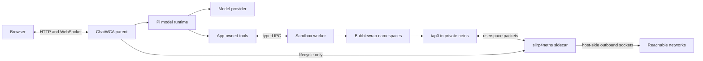

# Optional Slirp4netns Network Access Design

**Status:** Proposed

**Platform:** Linux

**Runtime:** Node.js 22.19+, Bubblewrap 0.6.1+, slirp4netns 1.0.1+

**Extends:** [Bubblewrap Workspace Sandboxing Design](bubblewrap-design.md)

## 1. Summary

ChatWCA will optionally give a Bubblewrap-sandboxed workspace unrestricted outbound IP connectivity through a per-conversation `slirp4netns` sidecar. The default remains network isolation.

The feature adds a sandbox network policy independent of the workspace security profile:

```ts
type SandboxNetworkPolicy =
  | "isolated"
  | "unrestricted-egress";
```

`isolated` preserves the implemented Bubblewrap profile: the worker has a private network namespace with no configured interfaces.

`unrestricted-egress` keeps the worker in a private network namespace but attaches a userspace NAT implemented by `slirp4netns`. Tools may initiate connections to any destination reachable by the host through slirp4netns, including public Internet, LAN, VPN, link-local, cloud metadata, and internal services. ChatWCA does not filter destinations, protocols, ports, DNS names, or resolved addresses.

The sidecar does not join the ChatWCA parent process and does not expose the host network namespace directly to the worker. No inbound host port forwarding is configured. Host loopback forwarding is disabled as a limited defense in depth, but this policy must not be described as public-Internet-only or safe for untrusted code.

Model/provider traffic continues to originate in the parent. Tool traffic originates through the slirp4netns sidecar. Filesystem, environment, extension, tool, worker-protocol, and lifecycle restrictions from `bubblewrap-design.md` remain in force except where this document explicitly changes their network-related claims.

## 2. Goals

- Preserve the current no-network sandbox as the default.
- Let an administrator decide whether sandboxed workspaces may select unrestricted egress.
- Persist and display each workspace's requested and effective sandbox network policy.
- Keep network-enabled workers out of the host network namespace.
- Support ordinary direct networking without requiring applications to honor proxy variables.
- Support common workflows such as HTTPS Git access, package downloads, API calls, and test clients.
- Provide DNS and a CA trust bundle without mounting host `/etc` wholesale.
- Start slirp4netns before the worker handshake succeeds.
- Treat Bubblewrap and slirp4netns as one fail-closed runtime unit.
- Terminate the sidecar on abort, close, eviction, worker failure, failed startup, and server shutdown.
- Configure no host-to-guest port forwarding and expose no slirp4netns control socket.
- Keep provider credentials, SSH credentials, proxy credentials, and parent environment variables out of the worker.

## 3. Non-goals

The initial release will not provide:

- RFC-1918, link-local, metadata, LAN, VPN, port, protocol, or destination filtering;
- domain allowlists or denylists;
- DNS response filtering or DNS rebinding protection;
- network traffic inspection, TLS interception, or content scanning;
- per-workspace proxy configuration or proxy credentials;
- inbound host port forwarding;
- stable guest IP addresses;
- bandwidth, packet, connection-count, or network-usage quotas;
- a guarantee that every IP protocol works through slirp4netns;
- host network namespace sharing;
- access to host SSH agents, credential helpers, or user certificate stores; or
- availability guarantees when the host network, DNS, remote service, or slirp4netns fails.

The policy is called **Unrestricted egress**, not **Internet only**. A destination being reachable does not imply that it is public or safe.

## 4. Security properties and residual risks

### 4.1 Preserved properties

For both network policies:

- the worker remains in network, user, PID, mount, IPC, and UTS namespaces distinct from the parent;
- the worker has no effective capabilities and has `NoNewPrivs: 1`;
- model-selected filesystem paths remain confined to the synthetic filesystem;
- the worker receives no provider, cloud, proxy, SSH-agent, Pi-session, or ChatWCA variables;
- no Pi extension or unapproved tool is enabled;
- slirp4netns receives no API socket and configures no host forwarding rule; and
- failure to establish the requested policy never falls back to a less restrictive profile.

A network-enabled command may bind and listen on guest addresses for local tests. Those listeners are reachable by other processes in the same sandbox namespace but are not published on host interfaces.

### 4.2 New authority granted by unrestricted egress

A network-enabled tool can:

- transmit any readable workspace content to an arbitrary reachable service;
- download and execute untrusted dependencies or scripts;
- contact private LAN and VPN addresses;
- probe internal services and DNS names;
- contact link-local and cloud metadata services if the host can route them;
- authenticate using credentials embedded in workspace files;
- run callbacks, tunnels, peer-to-peer clients, miners, scanners, or denial-of-service traffic; and
- communicate outside ChatWCA's bounded worker response protocol.

The base design's statement that tool output can return to the parent only through worker IPC does not apply to `unrestricted-egress`: tools gain a second, intentionally unbounded network output channel.

`--disable-host-loopback` prevents the normal slirp4netns mapping to services bound only to host `127.0.0.0/8`. It is not a general host-service boundary. A host service bound to a LAN, VPN, wildcard, or other non-loopback address may remain reachable. IPv6 behavior is similarly not a destination security boundary.

### 4.3 Sidecar risk

Slirp4netns and libslirp parse packets controlled by sandboxed processes and open host-side sockets on their behalf. A sidecar vulnerability may expose the server user's authority outside Bubblewrap. Operators must install vendor security updates.

ChatWCA launches slirp4netns with its own mount sandbox and seccomp support enabled. The executable must be root-owned and not writable by group or other users. The sidecar receives no ChatWCA IPC descriptors, provider credentials, database handles, workspace mount, or control API socket.

## 5. Architecture



A network-enabled live runtime owns one composite sandbox:

```text
SandboxRuntime
├── Bubblewrap worker
├── slirp4netns sidecar
├── request/response IPC pipes
├── Bubblewrap startup gate and info pipe
└── slirp readiness and exit pipes
```

The sidecar is per conversation. It is never shared between workspaces, conversations, forks, or temporary rewind runtimes.

## 6. Policy model

The filesystem security profile remains:

```ts
type WorkspaceSecurityProfile =
  | "unrestricted"
  | "workspace-sandboxed";
```

The new policy applies only when the effective security profile is `workspace-sandboxed`:

```ts
type SandboxNetworkPolicy =
  | "isolated"
  | "unrestricted-egress";
```

For an unrestricted workspace, `effectiveSandboxNetworkPolicy` is `null`; its tools already execute with the parent server user's host networking authority.

The server exposes an administrative ceiling through:

```text
CHATWCA_SANDBOX_NETWORK_POLICIES=["isolated"]
```

Allowed values are `isolated` and `unrestricted-egress`. The default permits only `isolated`. To make egress selectable:

```text
CHATWCA_SANDBOX_NETWORK_POLICIES=["isolated","unrestricted-egress"]
```

`isolated` must always be present. Empty arrays, duplicates, unknown entries, and non-string entries are configuration errors. If a workspace requests a policy no longer permitted by the server, it is policy-blocked; ChatWCA never silently substitutes `isolated` or unrestricted host tools.

New and migrated workspaces default to `isolated`. Required sandbox mode does not imply required network access.

Enabling `unrestricted-egress` is a protection-reducing update and requires:

```ts
acknowledgeNetworkExposure: true
```

The acknowledgement is a browser safety confirmation, not an authorization boundary. Network-policy changes are rejected with `workspace_busy` while a live runtime belongs to the workspace.

## 7. Configuration

New server configuration:

| Variable | Default | Behavior |
|---|---:|---|
| `CHATWCA_SANDBOX_NETWORK_POLICIES` | `["isolated"]` | Network policies an administrator permits for sandboxed workspaces |
| `CHATWCA_SLIRP4NETNS_PATH` | `/usr/bin/slirp4netns` | Absolute slirp4netns executable path |
| `CHATWCA_SANDBOX_NETWORK_MTU` | `1500` | Guest TAP MTU, from 1280 through 65521 |
| `CHATWCA_SANDBOX_ENABLE_IPV6` | `false` | Add slirp4netns IPv6 support for unrestricted-egress workers |
| `CHATWCA_SANDBOX_CA_BUNDLE` | `/etc/ssl/certs/ca-certificates.crt` | Host CA bundle snapshotted into network-enabled sandboxes |

Slirp4netns and CA-bundle configuration is inert and is not inspected when only `isolated` is permitted.

When unrestricted egress is permitted, the slirp4netns executable must be:

- an absolute, canonical regular file;
- executable by the server user;
- owned by root;
- not writable by group or other users; and
- version 1.0.1 or newer with `--configure`, `--ready-fd`, `--exit-fd`, `--disable-host-loopback`, `--enable-sandbox`, and `--enable-seccomp` support.

The linked libslirp version and distribution security patch level are logged privately. Startup performs a functional launch rather than trusting version output alone.

The CA bundle must resolve to a regular file, be root-owned, not be group/other writable, and remain below a fixed size limit. The parent reads it once at startup and supplies the immutable process-lifetime snapshot through `--ro-bind-data`. The host `/etc/ssl` directory is not mounted. Replacing the host bundle requires a ChatWCA restart.

An administrator may use a private enterprise CA bundle. This trusts that CA for network-enabled sandbox tools but does not provide client certificates or private keys.

## 8. Persistence and protocol projections

The database advances to schema version 4:

```sql
ALTER TABLE workspaces
ADD COLUMN sandbox_network_policy TEXT NOT NULL DEFAULT 'isolated'
  CHECK (sandbox_network_policy IN ('isolated', 'unrestricted-egress'));

PRAGMA user_version = 4;
```

Workspace wire objects add:

```ts
interface WorkspaceSandboxNetworkProjection {
  sandboxNetworkPolicy: SandboxNetworkPolicy;
  effectiveSandboxNetworkPolicy: SandboxNetworkPolicy | null;
}
```

`WorkspacePolicyIssue` adds:

```ts
"sandbox_network_policy_disabled"
```

`ConversationState` adds `sandboxNetworkPolicy`, containing the immutable effective policy for a sandboxed live runtime and `null` for an unrestricted runtime.

`workspace.create` requires `sandboxNetworkPolicy`. `workspace.update` accepts `sandboxNetworkPolicy` and `acknowledgeNetworkExposure`. Fork and rewind do not accept network policy from the browser; they resolve it from the destination workspace immediately before runtime creation.

`GET /api/config` exposes only selectable sandbox network policies, whether IPv6 is enabled, and warning text. It does not expose executable paths, host resolver details, CA-bundle paths, guest addresses, or private diagnostics.

## 9. Bubblewrap and slirp4netns startup

### 9.1 Isolated policy

The existing launch remains unchanged. Bubblewrap receives `--unshare-net`, no interface is configured, and no sidecar is started.

### 9.2 Unrestricted-egress policy

Bubblewrap still receives `--unshare-net`. It additionally receives dedicated inherited descriptors:

```text
--info-fd <info-fd>
--block-fd <startup-gate-fd>
```

The parent starts the composite runtime in this order:

1. Create Bubblewrap info and startup-gate pipes.
2. Create slirp4netns readiness and lifetime pipes.
3. Spawn Bubblewrap with the worker command blocked behind `--block-fd`.
4. Read and strictly validate the single bounded JSON object from `--info-fd`.
5. Extract `child-pid`, verify it identifies a descendant of the launched Bubblewrap process, and open `/proc/<child-pid>/ns/net` and `/proc/<child-pid>/ns/user` with `O_PATH`-style stable descriptors where supported.
6. Verify the child's network namespace differs from the parent and is the namespace expected for this launch.
7. Spawn slirp4netns against the child namespace with readiness and exit descriptors.
8. Wait for slirp4netns readiness within `CHATWCA_SANDBOX_START_TIMEOUT_MS`.
9. Release the Bubblewrap startup gate.
10. Perform the normal nonce-bound worker handshake and network-policy probe.
11. Register the runtime only after every step succeeds.

Equivalent sidecar arguments are:

```text
slirp4netns
  --configure
  --mtu <configured-mtu>
  --disable-host-loopback
  --enable-sandbox
  --enable-seccomp
  --ready-fd <ready-fd>
  --exit-fd <exit-fd>
  [--enable-ipv6]
  <bubblewrap-child-pid>
  tap0
```

Arguments are assembled as an array and never passed through a shell. No `--api-socket` or host-forwarding API operation is used.

If PID attachment cannot be made race-safe on a supported Bubblewrap/slirp4netns combination, the implementation must use namespace paths backed by pinned namespace descriptors. It must not proceed using an unverified reused PID.

The worker does not execute until slirp4netns reports ready. Slirp readiness alone is insufficient; the worker handshake verifies the resulting interface and route state.

## 10. Guest network and DNS

The initial IPv4 configuration uses slirp4netns defaults unless a future compatibility change requires an explicit CIDR:

```text
guest address: 10.0.2.100/24
gateway:       10.0.2.2
DNS service:   10.0.2.3
interface:     tap0
```

These are guest-side synthetic addresses and are exceptions to any intuitive reading of “private networks.” They do not constitute destination filtering.

For unrestricted egress, Bubblewrap supplies an immutable generated `/etc/resolv.conf`:

```text
nameserver 10.0.2.3
options timeout:2 attempts:2
```

The host resolver file is not mounted into the guest. Slirp4netns may use host resolver configuration internally. Consequently, sandbox DNS can resolve private names and use host-accessible split DNS.

`CHATWCA_SANDBOX_ENABLE_IPV6=false` omits `--enable-ipv6`; IPv6 connections must fail. When enabled, the startup probe requires a configured guest IPv6 address and route but does not require the deployment to have working external IPv6 connectivity. IPv6 receives the same unrestricted-destination semantics as IPv4.

Network availability is not tested by contacting a third-party Internet service during server startup. Startup verifies the local sidecar, TAP configuration, route, and synthetic DNS service. External connectivity remains dependent on deployment routing and DNS.

## 11. Environment and TLS policy

The base fixed environment remains. Network-enabled workers additionally receive:

```text
SSL_CERT_FILE=/etc/ssl/certs/ca-certificates.crt
```

This value is fixed by ChatWCA and is not copied from the parent environment. The CA snapshot is mounted read-only at that exact path.

ChatWCA does not pass through:

- `HTTP_PROXY`, `HTTPS_PROXY`, `ALL_PROXY`, or `NO_PROXY`;
- cloud provider endpoints or credentials;
- `SSH_AUTH_SOCK`;
- Git credential-helper variables;
- npm, pip, Cargo, or other registry tokens; or
- Node preload/debug variables.

Tools connect directly through slirp4netns. Workspace files may still contain credentials, registry settings, private keys, or tokens and are readable by the model-selected commands. Sandboxing does not protect such workspace-local secrets from unrestricted egress.

The initial release supports ordinary TLS server authentication. It does not mount host client certificates, user trust stores, SSH `known_hosts`, or credential stores. Applications requiring those files must use workspace-owned configuration or administrator-approved read-only mounts that remain valid under the base sandbox policy.

## 12. Lifecycle and failure handling

The Bubblewrap worker and slirp4netns sidecar form one failure domain.

- If slirp4netns exits unexpectedly, the parent kills Bubblewrap, rejects outstanding tool calls, and transitions the conversation to `error` after Pi settles.
- If Bubblewrap or the worker exits unexpectedly, the parent closes the sidecar exit pipe, waits briefly, then sends `SIGTERM` and `SIGKILL` if necessary.
- If either startup handshake fails, both processes are terminated and the runtime is never registered.
- On command timeout or conversation abort, both processes are terminated. A replacement worker receives a newly created namespace and sidecar before another prompt is accepted.
- Close, LRU eviction, temporary-runtime failure, fork failure, and shutdown dispose both processes.

The parent captures bounded, private diagnostics from Bubblewrap and slirp4netns separately. Neither diagnostic stream is a protocol channel or included in public errors.

The sidecar receives an `--exit-fd` whose parent write end is owned by the composite runtime. Closing that descriptor is the graceful stop signal. The parent then waits for exit and escalates to signals. The sidecar is also placed under the deployment's process-group or systemd cleanup boundary.

A worker restart never changes `unrestricted-egress` to `isolated`, and a sidecar failure never falls back to host-network sharing or unrestricted Pi tools.

## 13. Probes

When unrestricted egress is administratively permitted, server startup performs a real Bubblewrap-plus-slirp4netns launch in a temporary workspace.

The handshake must verify:

- the worker network namespace differs from the parent;
- `tap0` exists and is up;
- the expected IPv4 guest address and default route exist;
- loopback is up for guest-local test services;
- the synthetic DNS service responds;
- host inbound forwarding was not configured by ChatWCA;
- the environment matches the policy-specific allowlist;
- the CA snapshot is present, regular, and read-only;
- capabilities remain empty and `NoNewPrivs` remains set; and
- the existing mount, artifact, hidden-path, and toolchain probes still pass.

The probe must not claim that private, metadata, loopback, or public destinations are blocked. External Internet success is not a startup invariant.

For `isolated`, the existing IPv4, IPv6, DNS, and loopback connection-failure assertions remain unchanged.

Every conversation launch repeats namespace identity, sidecar readiness, interface, route, policy, worker version, and nonce checks.

## 14. Public errors and diagnostics

New stable public errors:

| Code | Meaning |
|---|---|
| `sandbox_network_policy_disabled` | The workspace requests a sandbox network policy not permitted by the server |
| `sandbox_network_configuration_error` | Slirp4netns, CA, MTU, IPv6, or policy configuration is invalid |
| `sandbox_network_start_failed` | The sidecar or guest network could not be configured |
| `sandbox_network_failed` | The active network sidecar exited or failed |

Public errors do not include PIDs, namespace paths, addresses, executable arguments, resolver configuration, CA paths, sidecar stderr, stacks, or remote connection details.

Private logs include conversation ID, workspace ID, network policy, stable startup phase, Bubblewrap and sidecar exit state, and a redacted bounded cause.

An ordinary command-level connection failure remains command output and does not imply sidecar failure. An unexpected sidecar exit is fatal even if no command is currently using the network.

## 15. Browser behavior

For a sandboxed workspace, the editor shows **Tool network access**:

- **Isolated** — no IPv4, IPv6, or DNS access from workspace tools.
- **Unrestricted egress** — tools can connect to public, private, LAN, VPN, metadata, and other services reachable through the server host.

The second option appears only when administratively enabled. Selecting it requires explicit confirmation:

> Sandboxed commands will be able to send workspace data to arbitrary reachable services and may access private networks, VPN services, or cloud metadata. Filesystem isolation remains enabled, but network destinations are not filtered.

The conversation header displays both the filesystem badge and network state, for example:

```text
Sandboxed · Network isolated
Sandboxed · Unrestricted egress
Unrestricted · Host network
```

Workspace Info shows stored and effective network policy, IPv6 state, no-inbound-forwarding behavior, the remote-model disclosure, and the unrestricted-egress warning. It must not use **Internet only**, **public network**, **safe network**, or equivalent wording.

## 16. Pi and system-prompt integration

The app-owned tool set is unchanged. `bash` and any subprocesses it creates automatically use the guest network; no new model tool is added.

The isolated system prompt keeps the existing no-network wording. The unrestricted-egress prompt instead states:

- tools run in a filesystem sandbox with unrestricted outbound network access;
- reachable destinations may include private networks and host infrastructure;
- no credentials are supplied automatically;
- downloaded code remains untrusted and can modify the writable workspace; and
- listeners are guest-local and are not published on the host.

Pi model/provider calls remain in the parent and do not traverse slirp4netns.

## 17. Source layout

```text
src/server/sandbox/
├── config.ts                 # allowed policies, slirp, MTU, IPv6, CA config
├── bwrap.ts                  # info/startup-gate descriptors and CA binding
├── slirp.ts                  # validation, argv construction, sidecar lifecycle
├── network-controller.ts     # composite Bubblewrap/slirp startup and teardown
├── probe.ts                  # policy-specific namespace and network probes
├── worker-client.ts          # composite-runtime failure propagation
└── worker-entry.ts           # guest interface, route, DNS, and CA probe data
```

Shared protocol, database, repository, registry, runtime-policy, and browser files also gain the persisted network-policy fields.

## 18. Testing strategy

### 18.1 Unit tests

- schema version 3-to-4 migration defaults existing workspaces to `isolated`;
- network-policy parsing, administrative ceiling, and downgrade acknowledgement;
- profile interaction and `null` effective policy for unrestricted workspaces;
- secure slirp4netns and CA-bundle validation;
- MTU and IPv6 configuration parsing;
- exact slirp4netns argv with no API socket or host forwarding;
- bounded validation of Bubblewrap `--info-fd` JSON;
- PID/namespace identity and reuse-race rejection;
- startup-gate ordering: worker cannot handshake before sidecar readiness;
- policy-specific environment and `/etc/resolv.conf` construction;
- composite close, timeout, signal escalation, and idempotency; and
- no fallback after sidecar startup or runtime failure.

### 18.2 Linux integration tests

For unrestricted egress, verify:

- the worker and parent have different network namespace inodes;
- `tap0`, loopback, the guest address, gateway, and default route are configured;
- DNS resolution works through the synthetic resolver;
- TCP and UDP can reach controlled test services through the sidecar;
- HTTPS succeeds with the snapshotted CA bundle against a controlled TLS server;
- a controlled private-address service is reachable, documenting unrestricted semantics;
- a host-loopback-only service is not reachable through the standard slirp host mapping;
- the same service bound to a non-loopback host address may be reachable;
- guest listeners are not reachable from the host without forwarding;
- no slirp API socket or host forwarding exists;
- provider, cloud, proxy, SSH, and registry credentials remain absent;
- sidecar crash kills the worker and fails outstanding operations;
- worker crash, abort, close, eviction, fork failure, and shutdown remove the sidecar;
- repeated restart leaves no sidecars, namespaces, descriptors, or guest state behind; and
- isolated and network-enabled conversations run concurrently without sharing sidecars.

Tests use controlled local network fixtures and must not depend on third-party Internet services. A dedicated sandbox-capable CI job fails rather than skips.

### 18.3 Browser tests

- existing and new workspaces default to isolated;
- unrestricted egress is hidden when not administratively permitted;
- enabling it requires confirmation and acknowledgement;
- policy changes are blocked while conversations are live;
- stored/effective values and policy-blocked reasons render correctly;
- conversation badges use immutable runtime state;
- fork, rewind, restart, and reopen resolve the workspace's current policy; and
- warnings explicitly mention exfiltration, private networks, VPNs, and metadata.

## 19. Implementation sequence

1. **Policy storage** — schema v4, shared types, repository ceiling, projections, and acknowledgements.
2. **Host validation** — slirp4netns flags/version checks, CA snapshot, MTU, and IPv6 parsing.
3. **Startup orchestration** — Bubblewrap info/startup-gate FDs, sidecar readiness/exit FDs, namespace identity checks.
4. **Guest configuration** — generated resolver file, CA binding, environment, and policy-specific probes.
5. **Lifecycle integration** — composite abort, restart, close, eviction, fork, rewind, and shutdown.
6. **UI and prompt** — controls, badges, warnings, Workspace Info, and system-prompt policy text.
7. **Hardening tests** — sidecar/worker races, malformed info data, PID reuse, descriptor leaks, crashes, and concurrent policies.

## 20. Acceptance criteria

The feature is complete when:

- existing and new workspaces default to network isolation;
- administrators must explicitly permit unrestricted egress;
- the requested and effective network policies persist and are visible;
- network enabling requires an explicit warning acknowledgement;
- unrestricted-egress workers retain a network namespace distinct from the parent;
- every network-enabled conversation owns a separate slirp4netns sidecar;
- no sidecar API socket, inbound host forwarding, or host-network sharing is enabled;
- the worker cannot start before the sidecar is ready;
- DNS and common TLS clients work without inheriting parent secrets or proxy settings;
- the UI accurately states that private, VPN, metadata, and public destinations may be reachable;
- isolated workers continue to fail IPv4, IPv6, DNS, and loopback probes;
- setup and runtime failures never select another network or filesystem profile;
- abort, close, eviction, crash, failed startup, fork failure, and shutdown remove both worker and sidecar; and
- tests demonstrate that filesystem sandboxing remains intact while unrestricted network exfiltration is intentionally possible.
